# Michi Music Stream — Landscape UI Architecture (320 × 240)

Este documento describe la interfaz visual landscape de **Michi Music Stream** implementada sobre la placa **Waveshare ESP32-S3-LCD-2** (controlador ST7789, panel IPS 320×240 RGB565).

---

## 1. Principios de Diseño

* **Estética Hi-Fi Premium**: Fondo profundo `#080A0F`, superficies `#10141A` y `#151A24`, acento Michi `#FF5C8A`, tipografía abierta Noto Sans (SIL Open Font License).
* **Device Truth**: El header, footer y pantalla de diagnóstico consumen el estado real de los subsistemas (`michi_wifi`, `michi_session`, `michi_dac`, `michi_volume`, `michi_ota`). No se utilizan valores simulados en producción.
* **Memoria DMA Eficiente (MS-11)**: Renderizado por bandas secuenciales (6 bandas de 320×40 px, 25.6 KB DMA RAM por banda) sin requerir framebuffer completo en memoria interna.

---

## 2. Taxonomía de Errores y Clasificación

Los errores se clasifican de forma unificada mediante `michi_ui_classify_error()`:

| Clase | Códigos de Origen | Título en Pantalla | Subtítulo / Acción | Código Visible |
|---|---|---|---|---|
| **Network** | `0x3000..0x5FFF` | Reconectando | Recuperando la conexión | `Código E101` |
| **Audio** | `0x103`, `0x107`, `0x7000..0x7FFF` | Recuperando audio | Restableciendo reproducción | `Código E102` |
| **Storage** | `0x2000..0x2FFF` | Error del sistema | Reinicia el dispositivo | `Código E103` |
| **Memory** | `0x101` (`ESP_ERR_NO_MEM`) | Error del sistema | Reinicia el dispositivo | `Código E104` |
| **Update** | `0x6000..0x6FFF` | Error del sistema | Reinicia el dispositivo | `Código E105` |
| **Unknown** | Otros | Error del sistema | Reinicia el dispositivo | `Código E199` |

---

## 3. Estado del DAC en Diagnóstico

El subsistema de diagnóstico consulta las capacidades reales mediante `michi_dac_get_caps()`:

* **Presente**: Muestra el modelo detectado (e.g. `PCM5122`) en verde (`#5AD6A0`).
* **No detectado**: Muestra `No detectado` en ámbar (`#F2B85B`).
* **Desconocido**: Muestra `Desconocido` en color tenue (`#505765`).
* **Error**: Muestra `Error` en rojo (`#FF6262`).

---

## 4. Galería de Estados (Previews 320 × 240)

| Escenario | Vista Previa |
|---|---|
| **ui-01: Boot** |  |
| **ui-02: Unprovisioned** |  |
| **ui-03: Ready** |  |
| **ui-04: Connecting** | 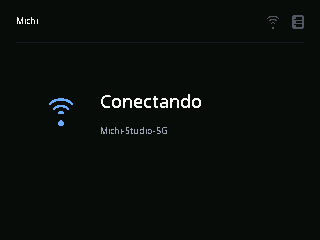 |
| **ui-05: Pairing Waiting** |  |
| **ui-06: Pairing PIN** | 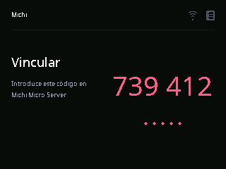 |
| **ui-07: Session Pending** |  |
| **ui-08: Buffering (Meta)** | 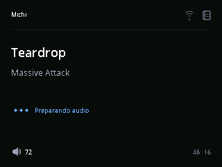 |
| **ui-09: Buffering (No Meta)** | 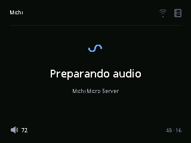 |
| **ui-10: Playing** | 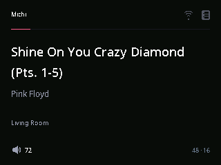 |
| **ui-11: Playing (UTF-8)** | 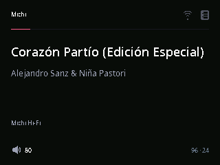 |
| **ui-13: Paused** | 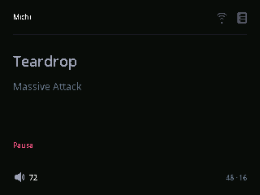 |
| **ui-15: Updating (Progress)** | 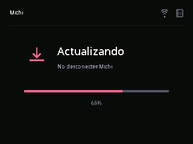 |
| **ui-15b: Updating (Indeterminate)** | 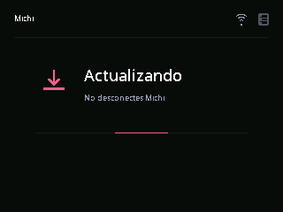 |
| **ui-16: Error (Audio)** | 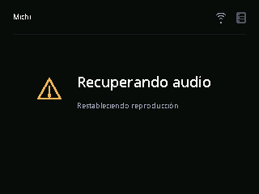 |
| **ui-17: Error (Network)** | 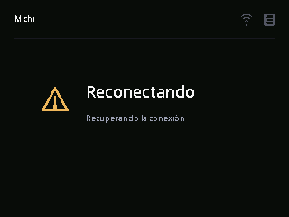 |
| **ui-18: Fatal Error** | 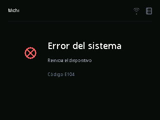 |
| **ui-19: Diagnostics (Connected)** | 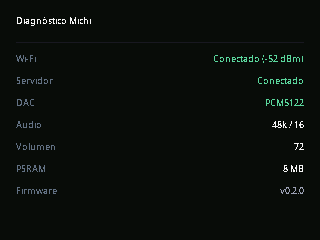 |
| **ui-19b: Diagnostics (DAC Absent)** | 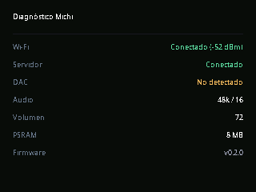 |
| **ui-20: Volume Overlay** | 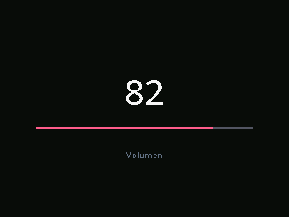 |
