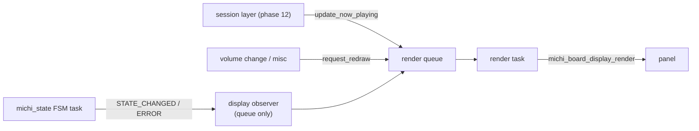
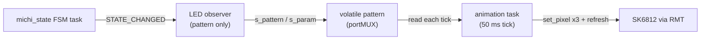
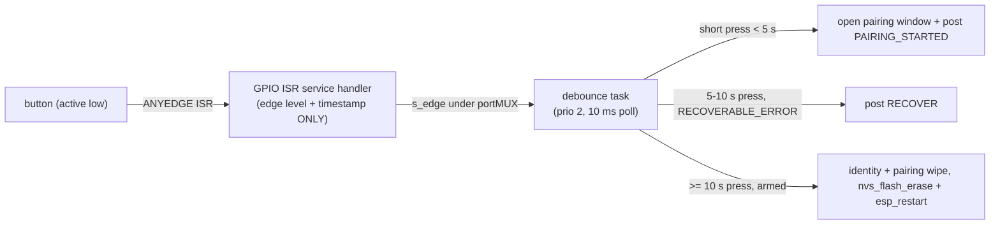
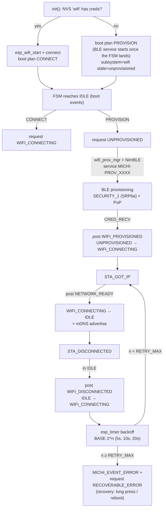
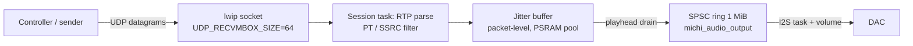
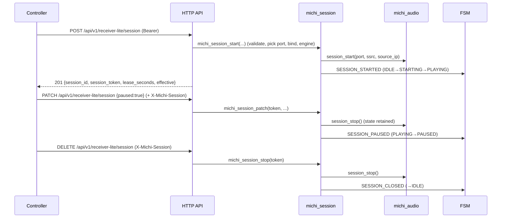
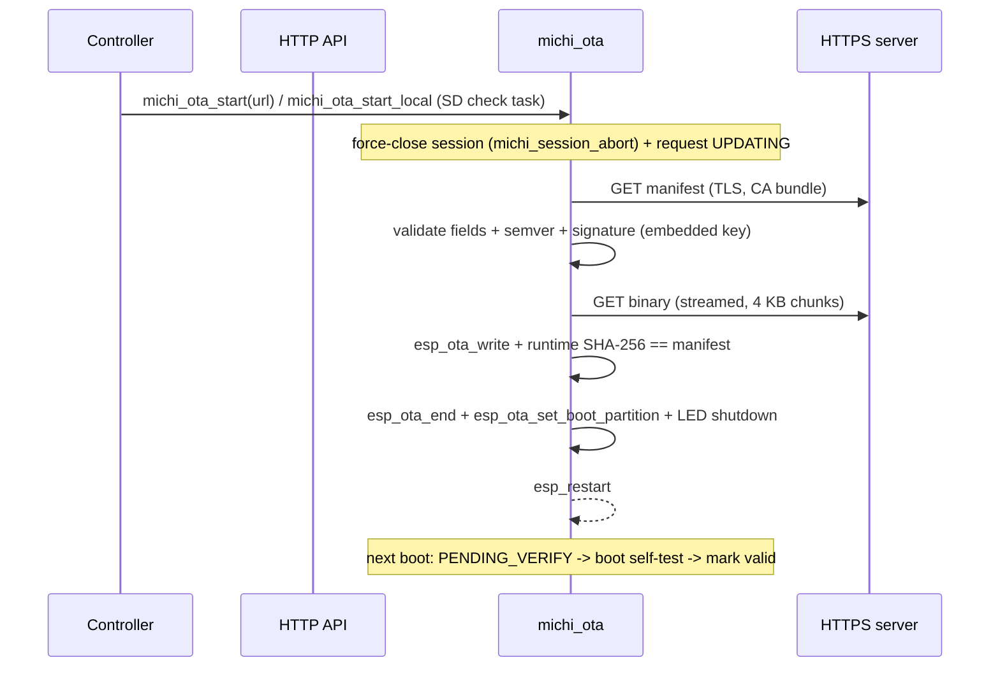
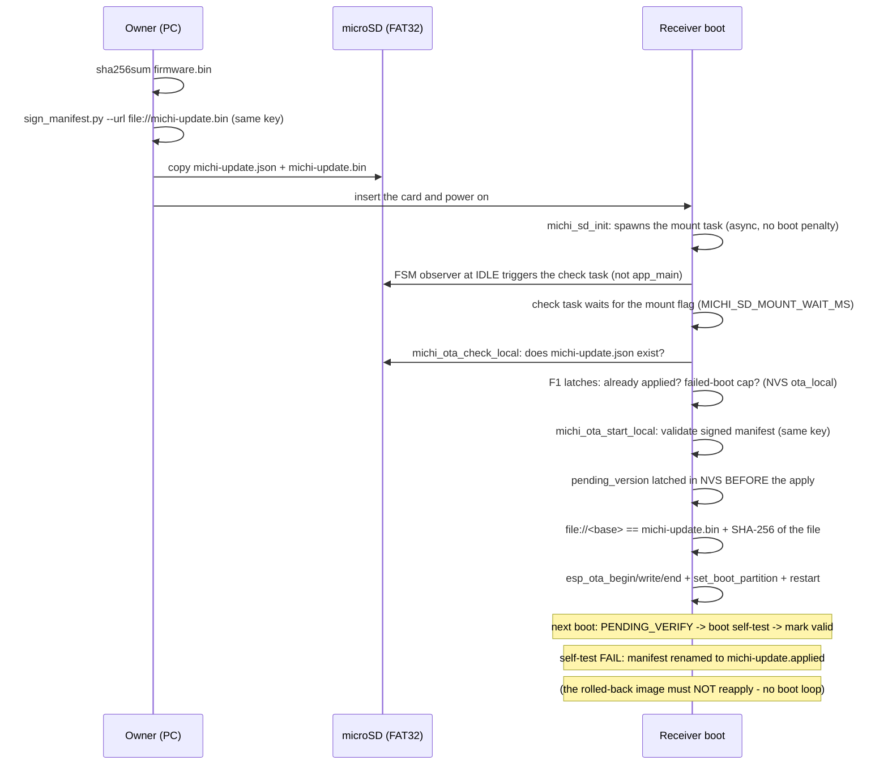

# Michi Music Stream — Firmware

ESP-IDF application for the Waveshare ESP32-S3-LCD-2 board (ESP32-S3, 16 MB flash, 8 MB octal PSRAM).

## Requirements

- ESP-IDF **v5.3 LTS** (CI builds inside `espressif/idf:release-v5.3`)
- Target: `esp32s3`

## Structure

```
firmware/
├── CMakeLists.txt
├── README.md
├── partitions.csv
├── sdkconfig.defaults
├── main/
│   ├── CMakeLists.txt
│   ├── Kconfig.projbuild          # External peripheral pin configuration
│   └── app_main.c
└── components/
    ├── michi_board/               # Board Support Package (BSP)
    │   ├── CMakeLists.txt
    │   ├── include/
    │   │   ├── michi_board.h      # Public BSP API
    │   │   └── michi_version.h    # Firmware version (single source of truth)
    │   └── waveshare_s3_lcd2/
    │       ├── board_waveshare_s3_lcd2.c
    │       └── font5x7.h          # Embedded 5x7 ASCII font for the boot screen
    └── michi_dac/                 # DAC register + detection (phase 2)
        ├── CMakeLists.txt
        ├── include/
        │   ├── michi_dac.h        # Public DAC API
        │   └── michi_dac_types.h  # Driver ops, caps, tier, status types
        ├── dac_manager.c          # Orchestration: detect -> init -> configure
        ├── dac_registry.c         # Static driver registry
        ├── dac_classifier.c       # Caps + product tier from real evidence
        └── drivers/
            ├── pcm512x.c          # PCM5122 I2C driver (self-detectable)
            ├── pcm5102a.c         # PCM5102A I2S-only DAC (profile-bound)
            └── mock_dac.c         # CI/test driver (MICHI_DAC_MOCK, default off)
    └── michi_product_profile/     # Dynamic product profile (phase 3)
        ├── CMakeLists.txt
        ├── include/
        │   └── michi_product_profile.h  # Profile struct + API
        └── michi_product_profile.c      # Derivation from caps + board
    ├── michi_http/                # HTTP API layer (phase 4)
    │   ├── CMakeLists.txt
    │   ├── include/
    │   │   └── michi_http.h       # Handler contract + checked JSON helpers
    │   └── http_server.c          # Canonical v1-lite routes: /api/v1/server/info,
    │                              # /api/v1/pair/*, /api/v1/receiver-lite/*
    ├── michi_state/               # Global state machine + event bus (phase 5)
    │   ├── CMakeLists.txt
    │   ├── Kconfig                # Queue len, FSM task stack, observer count
    │   ├── include/
    │   │   └── michi_state.h      # States, events, observer contract
    │   └── michi_state.c          # FSM task, transition table, broadcast
    ├── michi_display/             # Integrated display screens (phase 6)
    │   ├── CMakeLists.txt
    │   ├── Kconfig                # Render task stack, request queue len
    │   ├── include/
    │   │   └── michi_display.h    # init, now-playing update, redraw
    │   └── michi_display.c        # Observer -> queue -> render task
    ├── michi_led/                 # SK6812 status LEDs, M5Stack U003 (phase 7)
    │   ├── CMakeLists.txt
    │   ├── idf_component.yml      # espressif/led_strip ^2.4.0 (managed)
    │   ├── Kconfig                # LED count, brightness cap, task stack
    │   ├── include/
    │   │   └── michi_led.h        # init / shutdown
    │   └── michi_led.c            # Observer -> pattern -> animation task
    ├── michi_button/              # Physical pairing button (phase 8)
    │   ├── CMakeLists.txt
    │   ├── Kconfig                # Debounce, long press, task stack
    │   ├── include/
    │   │   └── michi_button.h     # init / shutdown
    │   └── michi_button.c         # Minimal ISR -> debounce task
    ├── michi_wifi/                # Wi-Fi STA + BLE provisioning + mDNS (phase 9)
    │   ├── CMakeLists.txt
    │   ├── idf_component.yml      # espressif/mdns ^1.0.3 (managed; no in-tree mdns in v5.3)
    │   ├── Kconfig                # Reconnect backoff, PoP, service prefix
    │   ├── include/
    │   │   └── michi_wifi.h       # init / provisioning / erase / shutdown
    │   └── michi_wifi.c           # Non-blocking handlers + esp_timer backoff + prov task
    ├── michi_pairing/             # Pairing & security (phase 10)
    │   ├── CMakeLists.txt
    │   ├── Kconfig                # Window seconds, max controllers, rate limits
    │   ├── include/
    │   │   └── michi_pairing.h    # Window/challenge/confirm/validate/revoke API
    │   └── michi_pairing.c        # Hashed-token registry + button-authorized window
    ├── michi_audio_output/        # I2S pipeline, SPSC ring (phase 4)
    │   ├── CMakeLists.txt
    │   ├── Kconfig                # MICHI_AUDIO_RING_BUFFER_KB (1 MB PSRAM)
    │   ├── include/
    │   │   └── michi_audio_output.h
    │   └── michi_audio_output.c
    ├── michi_volume/              # Volume 0-100 clamped (phase 4)
        ├── CMakeLists.txt
        ├── include/
        │   └── michi_volume.h
        └── michi_volume.c
    └── michi_audio/               # RTP/UDP audio engine (phase 11)
        ├── CMakeLists.txt
        ├── Kconfig                # RTP PTs, jitter capacity, prefill, rx buffer
        ├── include/
        │   └── michi_audio.h      # Session API, metrics, output ops abstraction
        └── michi_audio.c          # Session task: RTP -> jitter buffer -> pipeline
    └── michi_session/             # Single active session lifecycle (phase 12)
        ├── CMakeLists.txt
        ├── include/
        │   └── michi_session.h    # start/stop/abort/patch/info + session credential
        └── michi_session.c        # Contract validation, token, FSM events
    └── michi_ota/                 # Signed OTA + rollback (phase 13)
        ├── CMakeLists.txt
        ├── Kconfig                # Manifest/URL bounds, HTTP timeout, task stack
        ├── include/
        │   ├── michi_ota.h        # start/start_local/check_local/get_state/boot_selftest_done API
        │   └── michi_ota_pubkey.h # Embedded RSA-2048 public key (DER, dev key)
        └── michi_ota.c            # Manifest fetch + verify + streaming download (HTTPS + SD)
    └── michi_sd/                  # Onboard microSD, shared LCD SPI bus (phase 17)
        ├── CMakeLists.txt
        ├── Kconfig                # MICHI_SD_ENABLE, update manifest/file names
        ├── include/
        │   └── michi_sd.h         # init/mounted/get_info/shutdown
        └── michi_sd.c             # FAT mount at /sdcard (CS 41), degraded when absent
```

At boot, every subsystem that does not exist yet is logged honestly as
`subsystem=<name> state=pending phase=<N>` — no fake success.

## Build

```
idf.py set-target esp32s3
idf.py build
```

Build and flash configuration lives in `sdkconfig.defaults` (target, 16 MB flash, octal PSRAM,
custom partition table, bootloader app rollback, BT enabled with the
NimBLE host for the phase-9 BLE provisioning transport).

External peripheral pins (DAC I2C/I2S, LED, pairing button) are
configurable through `menuconfig` under **Michi Music Stream Hardware**
(`main/Kconfig.projbuild`). The device identity announced by
`GET /api/v1/server/info` (`server_id`, UUID v4 persisted in NVS) comes
from `michi_identity`, NOT from Kconfig (the legacy `MICHI_DEVICE_ID`
option still exists in `Kconfig.projbuild` but is not consumed by any
code). The defaults target free GPIOs that do not
collide with the board pinout; see
[Hardware validation pending](#hardware-validation-pending) before trusting
them.

## Partitions

16 MB OTA A/B layout without factory partition (see `partitions.csv`):

| Name      | Type | Offset   | Size     |
|-----------|------|----------|----------|
| nvs       | data | 0x9000   | 24 KB    |
| otadata   | data | 0xf000   | 8 KB     |
| phy_init  | data | 0x11000  | 4 KB     |
| ota_0     | app  | 0x20000  | 4 MB     |
| ota_1     | app  | 0x420000 | 4 MB     |
| storage   | data | 0x820000 | ~7.9 MB  |

App rollback is enabled (`CONFIG_BOOTLOADER_APP_ROLLBACK_ENABLE`), so OTA upgrades can roll
back to the previous image if the new one fails to boot.

## Hardware

### Board: Waveshare ESP32-S3-LCD-2 (no touch)

Pinout verified against the official Waveshare demo (phase 1 only brings up the display).

| Function               | GPIO | Status in phase 1              |
|------------------------|------|--------------------------------|
| LCD SCLK (SPI)         | 39   | initialized (SPI bus)          |
| LCD MOSI (SPI)         | 38   | initialized (SPI bus)          |
| LCD MISO (SPI)         | 40   | initialized (SPI bus)          |
| LCD DC                 | 42   | initialized (panel IO)         |
| LCD CS                 | 45   | initialized (panel IO)         |
| LCD RST                | -    | not wired (unused)             |
| LCD backlight          | 1    | initialized (active high, on)  |
| microSD CS             | 41   | reserved (shares LCD SPI bus)  |
| Board I2C SDA (IMU)    | 48   | reserved (QMI8658 IMU onboard; no driver in phase 1) |
| Board I2C SCL (IMU)    | 47   | reserved (QMI8658 IMU onboard; no driver in phase 1) |
| Camera (15 pins)       | 8,21,16,2,7,10,14,11,15,13,12,6,4,9,17 | 4 pins reused (21,16,4,17), see below — rest reserved, unused |
| USB D-/D+              | 19,20| reserved                       |
| UART console (bridge)  | 43,44| reserved                       |
| BOOT button            | 0    | reserved                       |
| PSRAM (octal)          | 33-37| in use (PSRAM + framebuffer)   |
| Flash                 | 26-32| in use                          |
| Free GPIOs             | 3,5,18 | external peripherals (below) |
| Camera pins reused (camera not populated) | 21,16,4,17 | external peripherals (below) |

### External peripherals (proposal — physical validation pending)

These pins are **defaults in Kconfig**, chosen on free GPIOs with no board collision. They
are **not initialized** in phase 1 (consumers arrive in later phases) and **must be
validated on the real unit** before use — see [Hardware validation pending](#hardware-validation-pending).

| Peripheral            | Signal        | Default GPIO | Kconfig symbol          |
|-----------------------|---------------|--------------|-------------------------|
| DAC PCM5122           | I2C SDA       | 21           | `MICHI_DAC_I2C_SDA`     |
| DAC PCM5122           | I2C SCL       | 16           | `MICHI_DAC_I2C_SCL`     |
| DAC PCM5122           | I2S BCLK      | 3            | `MICHI_I2S_BCLK`        |
| DAC PCM5122           | I2S LRCK      | 18           | `MICHI_I2S_LRCK`        |
| DAC PCM5122           | I2S DIN       | 5            | `MICHI_I2S_DIN`         |
| DAC PCM5122           | I2S MCLK      | -1 (not driven, PLL) | `MICHI_I2S_MCLK` |
| LED SK6812 (U003)     | Data          | 4            | `MICHI_LED_GPIO`        |
| Pairing button        | Input (low)   | 17           | `MICHI_BUTTON_GPIO`     |

Pins 21, 16, 4 and 17 are camera-interface pins (SCCB SDA/SCL, HREF, PWDN); the
camera is not populated on this unit, so reusing them forfeits the camera.

MCLK is optional: the PCM5122 has an internal PLL, so it can be left unconnected
(set `MICHI_I2S_MCLK` to `-1`).

## BSP: `components/michi_board`

The BSP owns everything specific to the board, so later phases never touch pin numbers.

What `michi_board_init()` brings up in phase 1:

- Backlight (GPIO 1, active high, on)
- SPI bus (SPI2_HOST) + ST7789 panel IO (DC=42, CS=45, 20 MHz PCLK)
- ST7789T3 panel, 240x320, 16 bpp, color data inverted (per Waveshare demo behavior)
- Framebuffer (240x320x2 = 153.6 KB) allocated **at runtime in PSRAM** — if PSRAM is
  missing or the allocation fails, the display is disabled with a clear log and the board
  keeps running degraded (no crash)

Public API (`michi_board.h`): `init`, `shutdown`, `get_info`, `get_external_pins`,
`self_test`, `display_boot_screen`, `display_clear`. The self test performs **real queries**
(`esp_chip_info`, `esp_flash_get_size`, `esp_psram_get_size`, panel/framebuffer state) and
never fakes results: the DAC fields (`dac_model`/`dac_ok`) are filled by `app_main` from
`michi_dac_get_caps()` and the BSP only renders them. `overall` passes only when chip +
flash + PSRAM + display + backlight all pass; the DAC is **not** counted.

The boot screen renders text rows (embedded 5x7 font, no LVGL) and reports the same
verdicts: `Flash: 16 MiB`, `PSRAM: 8 MiB`, `Display:`, `WiFi: supported`, `BLE: supported`,
`DAC: <model> [ok|FAIL]` (or `DAC: none` when no model is known), `Result: PASS | DEGRADED`.

## DAC subsystem: `components/michi_dac`

Phase 2 implements DAC **registration and detection**. The component owns the
driver registry, the I2C bus and the NVS profile; it never fakes a detection.

### Detection model

| Source | Priority | Effect |
|--------|----------|--------|
| NVS `dac_profile` (namespace `michi_dac`, string, max 63 chars) | 1 | Force-binds the driver with the matching `board_profile` (`pcm5122`, `pcm5102a`). No probing. |
| Hardware-ID callback (`michi_dac_register_hw_id_source`) | 2 | Extension point for boards with an EEPROM carrying the DAC identity. Not implemented (no such hardware exists). |
| Autodetection | 3 | Walks the registry and probes every `self_detectable` driver in order: `pcm512x` first, then `mock` (only when `MICHI_DAC_MOCK` is enabled). |

A successful PCM5122 probe is stable, so the firmware **never writes** the
profile back; the profile is only a manual override (e.g. PCM5102A boards,
which have no control bus and therefore cannot be auto-detected).

### PCM512x detection (probe)

There is no device-ID register, so identification is honest and multi-step:

1. **ACK scan** at the real PCM512x strap addresses `0x4D`, `0x4C`, `0x4E`,
   `0x4F` (datasheet SLAS763C Table 39: prefix `10011` + ADR1/ADR2 pins).
   `0x4D` is the most common strap on commercial modules and is probed first.
   (Note: `0x4A` is **not** a PCM512x address — earlier spec drafts listed it;
   the datasheet's range is `0x4C`–`0x4F`.)
2. **Reset-default sanity**: `GPIO_EN=0x00`, `DSP_PROGRAM=0x01`,
   `DAC_ROUTING=0x11` (all verified against Linux `sound/soc/codecs/pcm512x.c`
   reg_defaults and SLAS763C). Rule: registers the firmware itself may
   legitimately modify are **excluded from the exact match** so a
   previously-configured DAC still passes — `I2S_1` is validated by mask
   (AFMT must be I2S) and accepts any ALEN the family supports (`0x00`/`0x02`/
   `0x03`), since `configure()` writes the word length.
3. **Round-trip**: write/read `ANALOG_GAIN_CTRL` (page 1) and restore the
   **original** value in every path (success, mismatch, I2C error). Any
   current value is accepted; the round-trip only proves the register is
   writable/readable, not just ACKed.

Any mismatch → `ESP_ERR_NOT_FOUND`. Real bus errors (timeout, NACK mid-
transfer) are propagated, never masked as "not found".

### Clocking: no external MCLK

The PCM5122 runs from BCLK/LRCK alone: PLL reference = BCK (`PLL_REF`),
clock divider **autoset enabled** (the reset state, `DCAS=0`), and the SCK
missing/halt detections ignored (`ERROR_DETECT = 0x18`: IDCH|IDSK, the
no-MCLK design where SCK is absent, per SLAS763C Table 82). BCK/FS/PLL
errors are **not** ignored, so `CLOCK_STATUS.CERF` still reports a wrong
BCLK/LRCK ratio or a PLL unlock. The PLL coefficients are ignored in autoset
mode, so no coefficient programming is needed at 48 kHz.

**Honest init gate**: `michi_dac_start()` polls the PLL lock flag
(`PLL_EN.PLCK`, up to 500 ms, per SLAS763C 8.3.6.3), then verifies clock
status (`CLOCK_STATUS` register), the `ERROR_DETECT` readback and the volume
readback, and only then un-mutes. Without an I2S master driving BCLK/LRCK
the PLL cannot lock, so on real hardware init **fails with
`ESP_ERR_INVALID_STATE` until phase 11 starts the I2S clocks** — the boot log
says exactly that, and `audio_available=false`. This is by design: the DAC is
never claimed as usable without evidence. **Honest limitation**: the gate
verifies the total absence of clocks, PLL lock and ratio errors via CERF; it
does **not** verify the exact BCLK/LRCK ratio relationship — that is
validated in phase 11 with the I2S frame.

### NVS profile

`dac_profile` (string, max 63 chars) under the `michi_dac` namespace:

- empty / absent → autodetection
- `pcm5122` → force-bind the PCM512x driver
- `pcm5102a` → force-bind the PCM5102A driver (the only way without a
  hardware-ID source)
- unknown value → warned about and falls back to autodetection

A profile bind is an assertion, **not** verification: `board_verified=false`
(profile-asserted, unverified). Only a real I2C probe sets `board_verified`.
The bus runs at 100 kHz by default (`MICHI_DAC_I2C_SPEED_HZ`); raise it to
400 kHz only after measuring external pull-ups (2.2–4.7 kΩ) — the internal
~45 kΩ are marginal at 400 kHz. The bus is created lazily: a profile-only
non-I2C DAC (PCM5102A) never initializes the I2C bus.

`MICHI_DAC_MOCK` (tests/CI only, default off) registers a fake DAC driver;
a mock build logs a prominent boot warning and must never be used in
production.

### Boot screen and logs

The boot screen shows `DAC: <model> [ok|FAIL]` (model/ok filled by `app_main`
from `michi_dac_get_caps()`; the BSP only renders) or `DAC: none` when no
model is known. The title is `<product_name> v<version>` — the product name
comes from the dynamic product profile, never hardcoded in the BSP. The
single consolidated profile line and the `boot=ok mode=<tier>
audio_available=<true|false>` summary are logged by `app_main`; see
[Product profile](#product-profile-componentsmichi_product_profile).

## Product profile: `components/michi_product_profile`

Phase 3 introduces the dynamic product profile: the **single source of
truth** for everything the product announces — commercial name, tier, DAC,
formats, sample rates, bit depth, connectors, volume, OTA, display, lighting
and diagnostics. Later phases (API, mDNS/BLE, screens, sessions) must read
THIS profile; no subsystem may duplicate product strings.

### Derivation (runtime, from real evidence)

`michi_product_profile_init()` derives the profile from
`michi_dac_get_caps()` + `michi_board_get_info()` +
`michi_board_self_test()` and caches it; `refresh()` re-derives without
duplicated state. Nothing is asserted: every field traces back to evidence
collected at boot.

| Field | Rule |
|-------|------|
| `tier` | `caps.tier` as degraded by `michi_dac` (HiFi/Standard drop to `diagnostic` unless detected AND initialized) — never reimplemented here |
| `product_name` | `Michi Music Stream HiFi` when tier is `hifi`, else `Michi Music Stream` |
| `audio_available` | tier is `hifi`/`standard` AND `caps.initialized` (diagnostic → always false) |
| `codecs` | always `pcm_s16le`. `pcm_s24le` was **retired (MS-08)**: the DAC silicon accepts 24-bit samples (exposed only as the internal `max_bit_depth` capability), but no S24 path is implemented or announced |
| `sample_rates` | `{48000}` (system validation baseline); `max_sample_rate` is the silicon capability, exposed separately and **not** claimed as supported yet |
| `output_connector` | `differential_stereo` when `caps.differential_output`, else `single_ended_stereo`; the **physical** connector on the unit is pending hardware validation |
| `volume` | `volume_hardware` from caps; `volume_min=0`, `volume_max=100` |
| `ota_supported` | true: the partition table is OTA A/B (`ota_0`/`ota_1`); the OTA service lands in phase 13 |
| `display_present` | `self_test.display_ok`; `display_width/height` from board info |
| `lighting_status_rgb` | true (M5Stack U003 declared by the project owner; driver in phase 7) |
| `lighting_cat_contour` | **always false by project restriction**: the cat-contour LED strip is NOT implemented — no GPIO, channel or driver is reserved or announced, and the false field is the only mention |

### Examples

| Boot evidence | tier | name | audio_available |
|---------------|------|------|-----------------|
| PCM5122 detected AND initialized (PLL locked, clocks ok) | `hifi` | Michi Music Stream HiFi | true |
| PCM5102A bound by NVS profile and initialized | `standard` | Michi Music Stream | true |
| No DAC detected, or init failed (no I2S clocks yet) | `diagnostic` | Michi Music Stream | false |

At boot `app_main` logs the single consolidated key=value line
`profile: name=... tier=... audio_available=... dac=... codecs=...
sample_rates=... display=... lighting_rgb=... cat_contour=...` and the boot
summary becomes `boot=ok mode=<tier> audio_available=<true|false>` (the
phase-2 hardcoded `mode=diagnostic` is gone). The boot screen title renders
`<product_name> v<version>` from the profile.

## Phase 4 - P0 corrections

An audit of the legacy receiver prototype (the `firmware/common` +
`standard`/`hifi` trees, removed in the convergence cleanup) found 12 P0
risks. Phase 4 fixes them BY CONSTRUCTION in the new components that own
them; the legacy code was NOT touched (it was deleted during the
migration). Fixes that were already covered by earlier phases are
documented as such.

### P0 table

| # | P0 risk (legacy) | Fixed by | Status |
|---|------------------|----------|--------|
| 1 | Use-after-free in `pair_confirm_handler` (cJSON pointers used after `cJSON_Delete`) | `michi_http` handler contract: copy ALL values into local buffers BEFORE delete; returning tree pointers is PROHIBITED. Phase-10 pairing handlers use this pattern | fixed-by-construction |
| 2 | Use-after-free in `session_start_post_handler` | Same handler contract (phase-12 session handlers) | fixed-by-construction |
| 3 | Partial HTTP body reads (`httpd_req_recv` once, truncated bodies) | `michi_http_read_body()`: full `Content-Length`, caller buffer IS the limit, bounded stall retries | fixed |
| 4 | No JSON type/length validation (`->valuestring`/`->valueint` on anything) | Checked helpers `michi_http_json_get_string/int/bool()`: exact type + limit, fail-not-truncate | fixed |
| 5 | Errors swallowed by `audio_output` (malloc/bind/i2s) | `michi_audio_output` propagates EVERY error (init/start/stop) and cleans up on the way out; no `ESP_ERROR_CHECK` | fixed |
| 6 | Session marked active before audio started | `michi_audio_output_start()` returns an error; the phase-12 session layer only marks the session active when start returned `ESP_OK` | fixed |
| 7 | Forced `vTaskDelete` of tasks / leaked I2S channel | Cooperative shutdown: run flag + `xTaskNotify` + `i2s_channel_disable` (unblocks in-flight writes) + join with timeout; tasks self-delete AFTER releasing resources; channel created (disabled) at init, enabled at start, DISABLED (not deleted) at stop, deleted only at deinit once no task may be alive - `start()` after `stop()` re-enables the live channel; handles NULLed | fixed |
| 8 | Unsynchronized ring buffer (legacy 4 MB, no locking) | SPSC ring: one producer (session task) / one consumer (I2S task), ALL index updates under a portMUX critical section (choice documented in `michi_audio_output.h`); replaced by 1 MB PSRAM ring (`MICHI_AUDIO_RING_BUFFER_KB`) | fixed |
| 9 | Unvalidated GPIO usage | Covered by the BSP: pins are Kconfig-driven (`Michi Music Stream Hardware` menu) and `michi_audio_output` validates every pin/rate/depth/channel before use | covered-by-phase-1 |
| 10 | NVS without recovery | Covered by `app_main` (phase 0): `ESP_ERR_NVS_NO_FREE_PAGES`/`NEW_VERSION_FOUND` → erase + retry once, halt if still broken | covered-by-phase-0 |
| 11 | 3 s blocking in the Wi-Fi event loop | `michi_wifi` (phase 9): `esp_event` handlers MUST NOT block (`vTaskDelay` is prohibited there); the reconnect with exponential backoff runs on a one-shot `esp_timer` and the BLE bring-up in the provisioning task | fixed-by-construction (phase 9) |
| 12 | Volume response != applied value | `michi_volume` clamps 0-100 and the phase-12 handler MUST answer with `michi_volume_get()` (the real applied value, including the digital-gain fallback) | fixed |

### HTTP API: `components/michi_http`

`michi_http` serves the **canonical receiver v1-lite surface** (the
contract vendored in `contracts/michi-link/`) on port 80. The registered
routes are exactly:

- `GET /api/v1/server/info` — canonical profile (`service` =
  `michi-stream-standard` | `michi-stream-hifi`, `server_id`, `version`,
  `api_version=v1-lite`, `roles: ["audio_receiver"]`,
  `identity_scheme: ed25519-blake3-v1`, `michi_id`, `public_key`, `auth`,
  truthful `features`, `audio`) built from `michi_product_profile_get()`
  and `michi_identity`.
- `POST /api/v1/pair/start`, `GET /api/v1/pair/status`,
  `POST /api/v1/pair/confirm` — RECEIVER_BUTTON pairing (physical window,
  signed challenge, local PIN, receiver-issued token).
- `POST|GET|PATCH|DELETE /api/v1/receiver-lite/session` — the single RTP
  session lifecycle.
- `POST /api/v1/receiver-lite/heartbeat` — lease renewal.
- `PUT /api/v1/receiver-lite/now-playing`,
  `GET /api/v1/receiver-lite/diagnostics`,
  `GET|POST /api/v1/receiver-lite/firmware` — optional extensions; the
  now-playing and firmware handlers are registered but answer
  `501 NOT_IMPLEMENTED`, so their feature flags are `false` (a feature is
  only `true` when its handler is implemented with a positive test).

No legacy route is kept: every `/api/v1/receiver/*` and non-canonical
`/api/v1/receiver-lite/*` path returns the canonical 404 error envelope.
Every handler follows the contract in `michi_http.h`: parse → copy ALL
values to local buffers → delete → process → respond; cJSON pointers never
survive `cJSON_Delete` and no macro yields a cJSON pointer. Errors use the
single canonical `{error:{code,message,request_id,details}}` envelope with
UPPERCASE codes (`INVALID_REQUEST`, `UNAUTHORIZED`, `FORBIDDEN`,
`NOT_FOUND`, `CONFLICT`, `RATE_LIMITED`, `NOT_IMPLEMENTED`,
`INTERNAL_ERROR`). `michi_http_init()` propagates errors (boot continues,
logged). See the Receiver API section below for the full endpoint contract.

### Audio output: `components/michi_audio_output`

I2S master (standard mode) feeding the external DAC through a 1 MB PSRAM
SPSC ring (`MICHI_AUDIO_RING_BUFFER_KB`, default 1024 - the unsynchronized
4 MB legacy ring is replaced). NOT started at boot: a phase-12 session
calls `start()` and only becomes active on `ESP_OK` (P0-6). All P0
correctness patterns live here: full error propagation (P0-5), cooperative
shutdown (P0-7), SPSC + critical sections (P0-8), pin/rate/depth
 validation (P0-9), digital volume delegated to `michi_volume_apply()` in
 the consumer task (P0-12). Startup prefill of `buffer_ms` prevents the
 first underruns.

### Volume: `components/michi_volume`

0-100, clamped at the API boundary. Hardware path: `michi_dac_set_volume()`
when the bound DAC has hardware volume and is initialized; on failure it
falls back to digital gain so the value is STILL applied. Digital path:
`michi_volume_apply()` (16-bit Q15 / 24-bit Q23 on 3-byte packed samples
- the ESP32-S3 I2S 24-bit layout - integer math, no float).
`michi_volume_get()` always returns the real
applied value - the phase-12 handler must answer with it (P0-12).

### Phase 9 contract (Wi-Fi event loop)

`michi_wifi` handlers (phase 9) MUST NEVER block: `vTaskDelay` and
blocking I/O are prohibited inside `esp_event` handlers - use `esp_timer`
or a FreeRTOS queue to defer work. This is the P0-11 fix by construction.

## State machine: `components/michi_state`

Phase 5 introduces the **single global coordinator**: one state machine,
one event bus, one FSM task. The scattered booleans of the legacy firmware
(`is_provisioned`, `is_streaming`, `is_pairing`, `is_updating`, ...) are
replaced by this unique source of truth - no subsystem keeps its own
opinion about what the product is doing.

### States

| Enum | Meaning |
|------|---------|
| `MICHI_STATE_BOOTING` | Start-up until the boot events are processed |
| `MICHI_STATE_SELF_TEST` | Running the board self-test |
| `MICHI_STATE_UNPROVISIONED` | No network profile stored (network, phase 9) |
| `MICHI_STATE_PROVISIONING` | Provisioning flow active |
| `MICHI_STATE_WIFI_CONNECTING` | Connecting to the configured AP |
| `MICHI_STATE_IDLE` | Steady state: ready for pairing/session |
| `MICHI_STATE_PAIRING` | Pairing flow open (phase 10) |
| `MICHI_STATE_SESSION_PENDING` | Session negotiated, playback not started |
| `MICHI_STATE_BUFFERING` | Pre-filling before playback |
| `MICHI_STATE_PLAYING` | Audio flowing |
| `MICHI_STATE_PAUSED` | Session active, playback suspended |
| `MICHI_STATE_UPDATING` | OTA in progress (phase 13) |
| `MICHI_STATE_RECOVERABLE_ERROR` | Degraded but retryable |
| `MICHI_STATE_FATAL_ERROR` | Terminal: cannot continue |

### Transition table (single source of truth)

`michi_state.c` encodes it as one bitmask per source state; both
`michi_state_request()` and the event mapping validate against it. A
request to an invalid target is logged (`warn`) and rejected with
`ESP_ERR_INVALID_STATE` - no state change.

| From | To |
|------|----|
| BOOTING | SELF_TEST, FATAL_ERROR |
| SELF_TEST | IDLE, RECOVERABLE_ERROR, FATAL_ERROR |
| UNPROVISIONED | PROVISIONING, WIFI_CONNECTING, PAIRING, RECOVERABLE_ERROR, FATAL_ERROR |
| PROVISIONING | WIFI_CONNECTING, UNPROVISIONED, RECOVERABLE_ERROR, FATAL_ERROR |
| WIFI_CONNECTING | IDLE, UNPROVISIONED, RECOVERABLE_ERROR, FATAL_ERROR |
| IDLE | UNPROVISIONED, PROVISIONING, WIFI_CONNECTING, PAIRING, SESSION_PENDING, UPDATING, RECOVERABLE_ERROR, FATAL_ERROR |
| PAIRING | IDLE, RECOVERABLE_ERROR, FATAL_ERROR |
| SESSION_PENDING | BUFFERING, IDLE, RECOVERABLE_ERROR, FATAL_ERROR |
| BUFFERING | PLAYING, IDLE, RECOVERABLE_ERROR, FATAL_ERROR |
| PLAYING | PAUSED, BUFFERING, IDLE, UPDATING, RECOVERABLE_ERROR, FATAL_ERROR |
| PAUSED | PLAYING, IDLE, RECOVERABLE_ERROR, FATAL_ERROR |
| UPDATING | IDLE, RECOVERABLE_ERROR, FATAL_ERROR |
| RECOVERABLE_ERROR | IDLE, UNPROVISIONED, WIFI_CONNECTING, FATAL_ERROR |
| FATAL_ERROR | (terminal - no outgoing transitions) |

### Event mapping

Mapped events drive transitions; every other event is broadcast only (no
transition). `michi_event_t` carries `id`, `data` and `from` (for
`MICHI_EVENT_STATE_CHANGED`: the previous state; for other events: the
state current when the event was dispatched - stamped by the FSM task).

| Event | Condition | Transition |
|-------|-----------|------------|
| `MICHI_EVENT_BOOT_COMPLETE` | in BOOTING | BOOTING → SELF_TEST |
| `MICHI_EVENT_SELF_TEST_DONE` | in SELF_TEST (any data) | SELF_TEST → IDLE |
| `MICHI_EVENT_RECOVER` | in RECOVERABLE_ERROR | RECOVERABLE_ERROR → IDLE |
| `MICHI_EVENT_PAIRING_STARTED` | in IDLE | IDLE → PAIRING |
| `MICHI_EVENT_PAIRING_STARTED` | in UNPROVISIONED | UNPROVISIONED → PAIRING |
| `MICHI_EVENT_PAIRING_WINDOW_CLOSED` | in PAIRING | PAIRING → IDLE |
| `MICHI_EVENT_WIFI_PROVISIONED` | in UNPROVISIONED | UNPROVISIONED → WIFI_CONNECTING |
| `MICHI_EVENT_WIFI_DISCONNECTED` | in IDLE | IDLE → WIFI_CONNECTING |
| `MICHI_EVENT_NETWORK_READY` | in WIFI_CONNECTING | WIFI_CONNECTING → IDLE |
| `MICHI_EVENT_WIFI_PROV_FAILED` | in WIFI_CONNECTING | WIFI_CONNECTING → UNPROVISIONED |
| `MICHI_EVENT_SESSION_STARTED` | in IDLE | IDLE → SESSION_PENDING |
| `MICHI_EVENT_SESSION_STARTED` | in SESSION_PENDING | SESSION_PENDING → BUFFERING |
| `MICHI_EVENT_SESSION_STARTED` | in BUFFERING | BUFFERING → PLAYING |
| `MICHI_EVENT_SESSION_CLOSED` | in SESSION_PENDING / BUFFERING / PLAYING / PAUSED | → IDLE |
| `MICHI_EVENT_SESSION_PAUSED` | in PLAYING | PLAYING → PAUSED |
| `MICHI_EVENT_SESSION_RESUMED` | in PAUSED | PAUSED → PLAYING |

The lookup is keyed on **(event, data, from)**: an event only matches the
entry whose `from` equals the state current at dispatch time — that is why
`MICHI_EVENT_PAIRING_STARTED` has two entries (phase 8, physical button):
both are reachable from their own source state. An event with no entry for
the current state is still broadcast to observers, with a warn (no
transition).

`MICHI_EVENT_SELF_TEST_DONE` carries the self-test overall result as data
(1=ok, 0=degraded) for observers, but any data drives SELF_TEST → IDLE:
`RECOVERABLE_ERROR` is entered only by runtime producers from phase 9
onwards — no boot path enters it.

`michi_state_request()` enqueues an internal, not postable event
(`MICHI_EVENT_TRANSITION_REQUEST`, id 0x100) that the FSM re-validates and
applies; every applied transition emits `MICHI_EVENT_STATE_CHANGED`.

`MICHI_EVENT_ERROR` (data: `esp_err_t`), `MICHI_EVENT_STATE_CHANGED` and
the phase events (`MICHI_EVENT_WIFI_*` phase 9, `MICHI_EVENT_PAIRING_WINDOW_CLOSED`
phase 10, `MICHI_EVENT_SESSION_*` phase 12, `MICHI_EVENT_UPDATE_*`
phase 13 — the UPDATE events are BROADCAST-ONLY by design: OTA drives
the state with `michi_state_request(UPDATING)` directly, the events
exist for observers) are declared so consumers can register filters;
their mappings arrive with their phases. The session events are the exception
alongside the pairing ones: `MICHI_EVENT_SESSION_STARTED` is posted once
per lifecycle step (negotiated → engine starting → running) and the
from-keyed lookup advances the chain IDLE → SESSION_PENDING → BUFFERING →
PLAYING — the same pattern as `MICHI_EVENT_PAIRING_STARTED`.

Phase 14: the FSM captures the LAST error cause into a single slot
(`michi_state_get_last_error()`, exposed by
`GET /api/v1/receiver-lite/diagnostics` →
`last_error`). Producers of `MICHI_EVENT_ERROR` (data = `esp_err_t`):
michi_wifi when the retry chain exhausts
(`ESP_ERR_WIFI_NOT_CONNECT`, before requesting `RECOVERABLE_ERROR`) and
michi_audio when the RTP session self-ends (socket/bind failure,
pipeline write rejection — the session-ending failures). OTA posts its
own `MICHI_EVENT_UPDATE_FAILED` (same payload shape) which the same slot
captures — no duplicated error broadcast. A `RECOVERABLE_ERROR` /
`FATAL_ERROR` transition REQUEST without a preceding error event is
captured with data 0, and never overwrites a real error event.
`MICHI_EVENT_SESSION_CLOSED` ends the session from any session state
(four map entries), and `MICHI_EVENT_SESSION_PAUSED`/`RESUMED` switch
between PLAYING and PAUSED (pause also stops the ENGINE — see the
Sessions section).

### Boot flow

`state_init → display_init → led_init → button_init → nvs → wifi →
pairing → board → self_test → dac → profile → http → boot screen →
BOOT_COMPLETE (→ SELF_TEST) → SELF_TEST_DONE (→ IDLE)`.
The boot screen is rendered **before** the boot events so it covers
BOOTING/SELF_TEST and is never painted over by the dynamic display screens
(phase 6), which take over as soon as the FSM reaches a stable state.
`state_init` runs FIRST so the FSM is
live before NVS: on unusable NVS, `app_main` calls
`michi_state_request(MICHI_STATE_FATAL_ERROR)` — valid, BOOTING → FATAL_ERROR
is in the table — and halts; the halt loop keeps an explicit
`esp_task_wdt_reset()` call, which is a no-op (app_main is not subscribed to
the task watchdog) but documents the intent and survives if the subscription
changes. The SELF_TEST window is modeled retrospectively: the test already ran
before the events are posted, so observers must not expect to observe it. If
`michi_state_init()` fails, boot continues in degraded mode: `state bus
unavailable - all events will be dropped` is logged and no event reaches an
observer (`subsystem=state state=failed`). If `michi_display_init()` fails,
boot also continues degraded: no dynamic screens, the BSP boot screen still
shows (`subsystem=display state=failed phase=6`). If `michi_led_init()`
fails, boot also continues degraded: no status LEDs, everything else keeps
working (`subsystem=led state=failed phase=7`). If `michi_button_init()`
fails, boot also continues degraded: no pairing button, everything else
keeps working (`subsystem=button state=failed phase=8`). If
`michi_wifi_init()` fails, boot also continues degraded: no network,
everything else keeps working (`subsystem=wifi state=failed phase=9`).

### Observer contract

- Register with `michi_state_register_observer(filter, fn)`; `filter=0`
  receives ALL events, any other value receives only that event
  (`MICHI_EVENT_STATE_CHANGED` included - it is dispatched like any other
  event). Max 8 observers (`MICHI_STATE_MAX_OBSERVERS`).
- Observers are invoked **sequentially from the FSM task**, one event at a
  time, never concurrently. They MUST NOT block (no `vTaskDelay`, no
  blocking I/O) - the FSM must always be free to drain the queue.
- Consumers by phase: display (6), LED (7), network (9), audio (11),
  API (12). Transitions are logged by the FSM task itself; no observer slot
  is consumed for logging.
- `post()`/`post_from_isr()` never block: a full queue returns
  `ESP_ERR_TIMEOUT` and the event is dropped — drops are counted and logged
  by the FSM task periodically; producers log their own drop on task
  context.

## Display: `components/michi_display`

Phase 6 adds the integrated 2-inch screen: state-driven screens rendered on
top of the BSP framebuffer by a dedicated task. No LVGL, no cover art, no
images — only the BSP's embedded 5x7 font.

### Architecture: observer → queue → render task



The display observer runs on the FSM task, so it ONLY enqueues render
requests (`xQueueSend` timeout 0 — a full queue drops the request with a
warn). It NEVER renders: a full-frame flush takes ~65–80 ms, which would
violate the observer MUST-NOT-block contract and stall the event bus. The
render task is the **only** framebuffer/flush consumer (`michi_board` is not
thread-safe for the display); it coalesces pending requests and renders once
per drain with the latest state, so a state/redraw storm never stacks
flushes. A request dropped on a full queue sets a pending flag; the task
re-renders once more after the drain when the flag is set, so a dropped
request does not leave the screen stale (a drop racing that re-render is
covered by the next state change).

### Screens by state

Every screen carries the header (`product_name` from the product profile)
and the footer (`v<version>`); body text is centered with the BSP 5x7
renderer (`michi_board_display_draw_text`).

| State | Screen |
|-------|--------|
| BOOTING, SELF_TEST | none — covered by the BSP boot screen (division below) |
| IDLE | `IDLE` / `Ready to pair` |
| UNPROVISIONED | `Not configured` / `Press pairing button` |
| PROVISIONING, WIFI_CONNECTING | `Connecting...` |
| PAIRING | `Pairing...` / `Waiting for confirmation` |
| SESSION_PENDING, BUFFERING | `Buffering...` |
| PLAYING | playing info (below) |
| PAUSED | `Paused` + playing info dimmed |
| UPDATING | `Updating firmware...` |
| RECOVERABLE_ERROR | `Recovering...` / `Auto retry in progress` |
| FATAL_ERROR | `FATAL ERROR` + last `MICHI_EVENT_ERROR` name (or `See serial log`) |

### Playing info

`Source: <source|-->`, `Title: <title|-->` (wraps to a second line when
longer than 29 visible chars, max 2 lines), `Artist: <artist|-->`, then the
format line built from the **real** product-profile sample rate and the
initial applied bit depth
(`validated_sample_rate`/1000 → `48 kHz`, `MICHI_DISPLAY_APPLIED_BIT_DEPTH`
→ `16-bit`), the Wi-Fi placeholder and the volume:

- `48 kHz / 16-bit` — sample rate from `michi_product_profile_get()` (never
  hardcoded); bit depth from the initial applied format constant (48000/16/2
  validated at boot; the session layer drives the real value in phase 11/12);
- `Wi-Fi: --` — explicit placeholder: `michi_display` only renders the
  state; the network phase (9) fills the value;
- `Vol: <michi_volume_get()>` — always the real applied volume.

Metadata is fed by `michi_display_update_now_playing()` (session layer,
phase 12), copied into internal buffers (max 32/64/48 chars). **No cover
art**: the text-only framebuffer renderer is a deliberate scope cut; an
image pipeline is not planned.

### Division with the BSP boot screen

`app_main` renders the boot screen (board self-test results) **before**
posting the boot events, and the render task skips BOOTING/SELF_TEST: the
boot screen covers that window and is never painted over. The dynamic
screens take over as soon as the FSM reaches a stable state (IDLE at boot
with the current phase-5 routing; UNPROVISIONED once phase 9 routes it).

Init: `michi_display_init()` right after `michi_state_init()`; a failure
continues degraded (no dynamic screens, boot screen still shows,
`subsystem=display state=failed phase=6`). Success logs
`subsystem=display state=ok phase=6`. Kconfig: render task stack
(`MICHI_DISPLAY_TASK_STACK_BYTES`, 4096) and render queue length
(`MICHI_DISPLAY_QUEUE_LEN`, 4).

## LED: `components/michi_led`

Phase 7 drives the **three SK6812 status LEDs of the M5Stack U003** through
one RMT `led_strip` channel (managed component `espressif/led_strip`
`^2.4.0` in `idf_component.yml`; the build resolves **2.5.5**). Scope
restriction: **the cat-contour strip is NOT implemented** — no extra GPIO,
no second channel, no driver; the only mention anywhere is
`lighting_cat_contour=false` in the product profile.

### Architecture: observer → pattern → animation task



The LED observer runs on the FSM task, so it ONLY updates a volatile
pattern (pattern id + period param + base color) under a short portMUX
critical section. It NEVER touches the strip: RMT writes are slow, which
would violate the observer MUST-NOT-block contract (phase 5) and stall the
event bus. The animation task (priority 3, **50 ms tick**) is the **only**
strip consumer: it reads the pattern snapshot, computes the three pixel
colors from a **precomputed 64-entry sine LUT** (generated offline — no
`math.h` in the tick) and calls `led_strip_set_pixel` ×3 +
`led_strip_refresh` per tick; the refresh is **synchronous** (~0.25 ms per
tick), bounded and confined to the animation task — the observer (FSM task)
never blocks — and the only delay is the tick itself
(`ulTaskNotifyTake`, which a shutdown notification interrupts immediately).

### Patterns by state

Every pattern period is expressed in 50 ms ticks. All SOLID patterns use
the dim envelope (~35%); pulses and the sweep reach the full brightness
cap at their peak (all still software-capped, see below).

| State | Pattern | Color |
|-------|---------|-------|
| BOOTING, SELF_TEST | solid (dim) | white |
| UNPROVISIONED | slow pulse (2.4 s) | blue |
| PROVISIONING | fast pulse (0.8 s) | blue |
| WIFI_CONNECTING | pulse (1.6 s) | orange |
| IDLE | solid (dim) | blue |
| PAIRING | sweep — traveling brightness wave across the 3 LEDs (0.6 s per wave) | blue |
| SESSION_PENDING, BUFFERING | solid (dim) | yellow |
| PLAYING | solid (dim) | green |
| PAUSED | slow blink (1.2 s on / off) | green dim |
| UPDATING | rising brightness ramp, cyclic (3 s, OTA progress) | white |
| RECOVERABLE_ERROR, FATAL_ERROR | solid (dim) | red |
| unknown / out of range | off (defensive) | — |

### Brightness cap and shutdown

Every color is scaled in software by
`MICHI_LED_MAX_BRIGHTNESS_PCT/100` (default **25%**) before reaching the
strip — SK6812 at full output is blinding in a dark room, and the cap
applies to EVERY pattern (pulses included) with no hardware configuration.
`MICHI_LED_COUNT` (default 3) and `MICHI_LED_TASK_STACK_BYTES` (default
3072) complete the LED Kconfig menu.

`michi_led_shutdown()` is cooperative: flag + notification + join with
timeout; the task clears the strip (`led_strip_clear` + `refresh`) and
deletes itself, then shutdown releases the strip (`led_strip_del`). If the
join times out the strip is leaked rather than freed under a live task
(warn logged).

Init: `michi_led_init()` right after `michi_display_init()`; a failure
continues degraded — no status LEDs, everything else keeps working
(`subsystem=led state=failed phase=7`). Success logs
`subsystem=led state=ok phase=7`. **GPIO 4
(`MICHI_LED_GPIO`, camera HREF) is still pending physical validation** —
measure continuity between the SK6812 data input and GPIO4 with the unit
powered off before trusting it (camera interface forfeited — see below).

## Button: `components/michi_button`

Phase 8 adds the physical pairing button on `MICHI_BUTTON_GPIO` (default
**GPIO17**, camera PWDN — the camera is not populated on this unit, reuse
forfeits it). Active low to GND, internal pull-up enabled. Scope: the
component **posts events** (pairing / recovery) and executes the physical
factory reset — the pairing protocol itself is phase 10.

### Architecture: minimal ISR → debounce task



The ISR handler contains **NO logic**: it records the edge level and the
`esp_timer_get_time()` timestamp in a volatile struct under a portMUX
critical section, and returns. Everything else happens in the debounce
task (priority 2): it polls `gpio_get_level` every
`MICHI_BUTTON_POLL_MS` (10 ms) and confirms an edge only after N
consecutive equal samples, N = DEBOUNCE/POLL rounded up (2 here; the
stable window is (N-1) poll periods — a glitch shorter than one poll
period cannot confirm an edge (it can never fill N consecutive samples), and measures
the press duration edge-to-edge from the ISR timestamps (sub-tick
accuracy, debounce window excluded).

### Actions (task context, NEVER the ISR)

Deterministic gestures (contract in `michi_button_gesture.h`, pure and
host-tested with the exact boundaries — `tests/host/test_michi_button.c`):

| Press | Action |
|-------|--------|
| short (< `MICHI_BUTTON_RECOVERY_PRESS_MS`, 5000 ms) | `michi_pairing_open_window()` + `michi_state_post(MICHI_EVENT_PAIRING_STARTED, 0)` — only in **IDLE**, **UNPROVISIONED** or **PAIRING**; any other state logs the rejection (`state=...`, the FSM would drop the event anyway). `PAIRING_STARTED` is posted ONLY when the window actually opened (a failed open is logged `pairing window open failed err=...` and the press is a no-op: posting anyway would strand the FSM in PAIRING with no window to close it) |
| long (>= `MICHI_BUTTON_RECOVERY_PRESS_MS`, < `MICHI_BUTTON_FACTORY_RESET_PRESS_MS`) | recovery → `michi_state_post(MICHI_EVENT_RECOVER, 0)`, ONLY when the FSM is in **RECOVERABLE_ERROR** at the release; any other state logs the rejection (a press released after the FSM already recovered is a no-op). Recovery is NOT armed |
| very long (>= `MICHI_BUTTON_FACTORY_RESET_PRESS_MS`, 10000 ms) | factory reset → `michi_button_factory_reset_run()`: `michi_identity_factory_reset()` (own key + in-RAM keys) and `michi_pairing_erase_all()` (registry + RAM copy) FIRST, then `nvs_flash_erase()` (the whole partition: wifi credentials, DAC override, discovery server_id, boot_seq) and `esp_restart()` immediately (no log-flush delay: the log is already in the UART FIFO). Component wipes run before the full erase so the identity RAM wipe cannot be skipped by an already-empty key. If the full erase fails the reset aborts WITHOUT restarting (degraded but never bricked, logged). A corrupt identity does not change the FSM state, so this gesture stays available as the only physical recovery path for a corrupt identity store |
| factory-reset arm window | `MICHI_BUTTON_FACTORY_ARM_MS` (default 10000 ms): the factory reset runs only if the press **started** at least this long after boot (boot-hold / stuck-pin protection) — holding the button through power-on NEVER triggers it; recovery is NOT armed |

**Anti-accidental protection**: every action is ignored unless the FSM
was NOT in **BOOTING, SELF_TEST or UPDATING** at the press confirmation
AND is still outside those states at the release
(`button: action=ignored press_state=... release_state=...`) — a press
held through boot, or started during OTA, can never fire its action on
release (a factory reset during OTA could brick the unit). A factory reset
is additionally gated by the `MICHI_BUTTON_FACTORY_ARM_MS` arm window
(see table above). The FSM additionally rejects any
invalid transition by its own transition table; the button's state gates
(the IDLE/UNPROVISIONED/PAIRING pairing gate, the RECOVERABLE_ERROR
recovery gate) exist so the logs stay honest instead of showing
FSM-level rejects.

### Shutdown

`michi_button_shutdown()` removes the ISR handler, stops the debounce task
cooperatively (flag + notification + join with timeout — the same pattern
as the LED animation task) and uninstalls the GPIO ISR service **only if
this component installed it**: `gpio_install_isr_service()` is global — a
second installer gets `ESP_ERR_INVALID_STATE` and the service is shared,
so uninstalling it under another component would silently kill that
component's handlers.

Init: `michi_button_init()` right after `michi_led_init()`; a failure
continues degraded — no pairing button, everything else keeps working
(`subsystem=button state=failed phase=8`). Success logs
`subsystem=button state=ok phase=8`. Kconfig (component menu): debounce
window (20 ms), recovery press threshold (5000 ms), factory-reset press
threshold (10000 ms, always compiled — no choice can drop the physical
factory reset), factory-reset arm window (10000 ms), poll period (10 ms),
task stack (3072).

**GPIO17 (camera PWDN) is still pending physical validation** — measure
continuity between the button pin and GPIO17 (and to GND while pressed),
and confirm the pull-up, with the unit powered off before trusting it
(camera interface forfeited — see below).

## WiFi & provisioning: `components/michi_wifi`

Phase 9 brings the device onto the network: Wi-Fi STA with reconnect
backoff, **BLE provisioning** (no credentials ever compiled in) and mDNS
announcements. It is the implementation of the P0-11 contract (non-blocking
`esp_event` handlers).

### Hard rules

- **Credentials live ONLY in the NVS `wifi` namespace** (keys `ssid`,
  `password`, `device_name`, `region`). Kconfig has NO Wi-Fi credentials;
  the only compiled-in secret is the provisioning proof-of-possession
  `MICHI_PROV_POP` (see below). The password is **never logged, not
  partially**: every log carries only the SSID. Verified by grepping the
  build tree for `CONFIG_MICHI_WIFI_SSID`/`CONFIG_MICHI_WIFI_PASSWORD` —
  zero hits (the legacy `firmware/common`, `standard/`, `hifi/` trees
  that still carried them were removed in the convergence cleanup).
- **Non-blocking event handlers (P0-11)**: `esp_event` handlers only post
  FSM events and set flags. The reconnect with exponential backoff runs
  on a one-shot `esp_timer`; the blocking BLE bring-up
  (`esp_bt_controller_enable`) runs in the provisioning task
  (`MICHI_WIFI_TASK_STACK_BYTES`, default 6144).
- **FSM is the single state owner**: `michi_wifi` only posts the phase-9
  events or requests states, it never writes the state.

### Boot flow



`michi_wifi_init()` runs after `init_nvs()` (the credentials live in NVS)
and before the boot events, so the FSM is still BOOTING: the state
placement is deferred to a `MICHI_EVENT_STATE_CHANGED` observer that acts
when the FSM first reaches IDLE. A boot race (the client provisions before
the FSM settles) is covered by flag replay: the observer and the
`STA_GOT_IP` handler re-post `WIFI_PROVISIONED`/`NETWORK_READY` in order
from the `s_creds_received`/`s_network_ready` flags, so the queue always
orders UNPROVISIONED → WIFI_CONNECTING → IDLE.

### BLE provisioning (wifi_prov_mgr)

- Transport: **BLE with the NimBLE host** (`CONFIG_BT_ENABLED=y`,
  `CONFIG_BT_NIMBLE_ENABLED=y` in `sdkconfig.defaults`; the BTDM mode
  overrides of the official example are ESP32-classic only and do not
  exist for the ESP32-S3 controller — verified against
  `espressif/idf:release-v5.3`).
- Security: `WIFI_PROV_SECURITY_1` (SRP6a) with the
  `MICHI_PROV_POP` proof-of-possession — **honest warning**: the default
  `michi123` is a factory secret compiled into the firmware; change it
  before production (anyone on BLE range could otherwise provision the
  device).
- Service name: `MICHI_PROV_SERVICE_NAME_PREFIX` + the last 4 hex digits
  of the STA MAC (e.g. `MICHI-PROV_4CAB`); keep prefix + 4 ≤ 31 bytes
  (BLE name limit).
- Custom endpoint **`michi-device-info`** (JSON
  `{"device_name": ..., "region": ...}`): device identity delivered by
  the client, persisted with the credentials into the `wifi` namespace.
  API note: v5.3 removed the old `wifi_prov_mgr_set_custom_endpoint()` —
  the current API is `wifi_prov_mgr_endpoint_create()` +
  `wifi_prov_mgr_endpoint_register()` (`wifi_provisioning/manager.h`).
- Event semantics used (v5.3 `wifi_prov_cb_event_t`): `CRED_RECV` =
  credentials received and applied (FSM moves to WIFI_CONNECTING),
  `CRED_SUCCESS` = the device CONNECTED to the AP — only then the
  credentials are proven good and are **persisted** (the session stays
  open for client retries after `CRED_FAIL`).
- WiFi stack persistence: wifi_prov stores with `WIFI_STORAGE_FLASH`, so
  `michi_wifi_erase_credentials()` also calls `esp_wifi_restore()` —
  without it the manager would still see the old config and refuse a new
  provisioning (`wifi_prov_mgr_is_provisioned()` reads the driver
  config). The erase stops and joins an active provisioning session
  first (the wipe never races the persist) and restarts the automatic
  provisioning cycle afterwards. The factory reset (phase 8 button)
  erases ALL of NVS and restarts; the API-level erase only removes the
  network profile while the device keeps running.
- Automatic retry: after a failed provisioning session (10-min client
  timeout, bring-up error or NVS persist failure) the BLE service
  restarts after `MICHI_PROV_RETRY_MS` (default 30 s), max 3 retries;
  exhausted sessions log clearly and land on `unprovisioned` — the
  pairing button long press (recovery action) restarts the cycle.
  Phase 10 will coordinate its pairing flow with this provisioning.
- NVS margin: the `wifi` namespace shares the 24 KB `nvs` partition
  with every other subsystem; a full NVS makes the credential persist
  fail, which is treated as a real provisioning failure (credentials NOT
  marked as applied, automatic retry kicks in).

### Reconnect with backoff

`STA_DISCONNECTED` → `MDNS retire` → post `WIFI_DISCONNECTED` (only when
the FSM is in IDLE — the retry attempts already run in WIFI_CONNECTING) →
arm a one-shot `esp_timer` with `MICHI_WIFI_RECONNECT_BASE_MS · 2^attempt`
(5 s / 10 s / 20 s with the defaults, capped at 5 min). After
`MICHI_WIFI_RETRY_MAX` (default 3) failed attempts: `MICHI_EVENT_ERROR`
broadcast (data `ESP_ERR_WIFI_NOT_CONNECT`) + `RECOVERABLE_ERROR` request.
Recovery: physical button long press (`MICHI_EVENT_RECOVER`; the wifi
layer re-arms the connect on the next `RECOVER`, resetting the retry
counter) or reboot. The retry counter resets on every `STA_GOT_IP`. A
failed `esp_wifi_connect()` (no `DISCONNECTED` event follows) also
advances the backoff chain, so a stuck connect never dies silently; if
the chain exhausts while the FSM is still booting (BOOTING/SELF_TEST
cannot land on RECOVERABLE_ERROR, the request is dropped), the
STATE_CHANGED observer re-arms it when WIFI_CONNECTING is reached with no
pending attempt.

### mDNS

Advertised on `STA_GOT_IP`, retired on `STA_DISCONNECTED`:
`_michi-link._tcp` on the REAL HTTP port with TXT keys exactly
`device_id`, `service`, `api_version`, `roles` (the plain role string
`audio_receiver`, never JSON) and `michi_id` — `device_id` is the
persistent `server_id` UUID and `michi_id` comes from
`michi_identity_michi_id()` (contract section 2.2; no duplicated product
strings). Hostname: `michi-` + last 4 MAC hex digits. mdns is a **managed
component** (`espressif/mdns ^1.0.3` in `idf_component.yml`): the v5.3 IDF
tree no longer ships an in-tree mdns, and the registry version uses
`mdns_free()` instead of the old `mdns_stop()`. The legacy
`_michi-receiver._tcp` service type was removed with the convergence
cleanup.

### Logs

key=value, password-free. `subsystem=wifi` states in phase 9 (the real
set): `ok` (init done), `connecting` (STA connect), `connected` (IP
obtained), `provisioning` (BLE session up), `provisioned` (credentials
proven and persisted), `provisioning_failed` (client-side, retryable),
`unprovisioned` (boot without credentials / after erase), `failed` (init
failure or retry chain exhausted), `off` (shutdown) — always with
`phase=9`. Retry logs emit `retry=%u`: `wifi: state=connecting retry=%u`,
`wifi: ssid=%s retry=%u backoff_ms=%lld`, `wifi: ssid=%s ip=%s retry=0`,
`wifi: disconnected reason=%d`.

## Pairing & security: `components/michi_pairing`

The canonical RECEIVER_BUTTON pairing flow (contract section 2.3). The
physical button is the ONLY authority that opens the pairing window; the
protocol itself is a **from-scratch implementation** — the legacy
prototype pattern (predictable `rand()` nonces, plaintext tokens, a
window openable over HTTP) was removed with the legacy trees and is
deliberately NOT reproduced.

### Hard rules

1. **The physical button is the ONLY authority that opens the window.**
   `michi_pairing_open_window()` is called exclusively from the button
   path (`michi_button`, task context, in `handle_short_press`). There is
   NO network-visible API that opens it. Outside the window
   `POST /pair/start` answers `403 FORBIDDEN`.
2. **Window semantics**: 120 s on the MONOTONIC clock
   (`CONFIG_MICHI_PAIRING_WINDOW_SECONDS`). Rebooting closes the window;
   opening it again REPLACES the previous window and drops pending
   pairing sessions.
3. **Signed challenge**: `POST /pair/start` accepts a
   `pair-start.schema.json` body (`device_name`, `device_type: server`,
   `roles: ["music_server"]`, `auth_strategy`, `michi_id`, `public_key`,
   `challenge_nonce`, `challenge_signature`). The signature must verify
   the decoded `challenge_nonce` bytes against the declared Ed25519
   `public_key`, and `michi_id` must correspond to that key (blake3 of
   the key, base64url). Any failure → `400 INVALID_REQUEST`, no session.
4. **Local PIN**: success (`201`) draws a 6-digit PIN UNIFORMLY from
   `esp_fill_random` (rejection-sampled below a uniform bound — no modulo
   bias). The PIN is shown ONLY through the local PIN-display callback
   (screen); it is NEVER returned over HTTP and never logged.
5. **Five attempts, then lock**: a wrong PIN answers `401 UNAUTHORIZED`
   and consumes one attempt; the attempt that exceeds
   `MICHI_PAIRING_PIN_ATTEMPTS` (5) answers `429 RATE_LIMITED` and the
   session is consumed (locked). Identity/key mismatch on confirm → `400`.
6. **Receiver-issued token**: a correct PIN issues a 32-byte CSPRNG
   token, base64url WITHOUT padding, returned ONCE with `expires_in: 0`
   (valid until revocation or factory reset). Only the SHA-256 digest is
   persisted (NVS); the token is never re-transmitted, never logged and
   never stored in plaintext.
7. **Session consumption**: a confirmed session cannot be reused — a
   second confirm answers `409 CONFLICT`. The pairing registry records
   `device_id` (a UUID v4 issued at pairing), `michi_id`, `public_key`,
   token digest, permissions, creation time and last activity.
8. **Constant-time comparisons**: PINs and token digests are compared
   with a constant-time XOR loop with no data-dependent early exit
   (`michi_pairing_ct_equal`); digest validation scans every slot.
9. **Zero secrets in logs**: no log format string in the component
   contains `token`/`pin`/`nonce`/`hash` values — only outcomes and
   counters.

### Flow: button → window → pair/start → PIN → confirm

```mermaid
sequenceDiagram
    participant B as Button task
    participant P as michi_pairing
    participant F as FSM
    participant N as NVS
    participant C as Controller (michi_http)

    B->>P: michi_pairing_open_window()
    P-->>N: (timer armed, 120 s monotonic)
    B->>F: post PAIRING_STARTED (only if the window opened)
    F->>F: IDLE/UNPROVISIONED → PAIRING
    C->>P: pair/start (signed challenge) (window open?)
    P-->>P: verify signature + michi_id vs public_key
    P-->>C: 201 {session_id, expires_at, attempts_remaining, server keys}
    P-->>P: PIN drawn locally, shown on the display ONLY
    C->>P: pair/confirm (session_id, pin, michi_id, public_key)
    P-->>P: ct-compare PIN; identity must match pair/start
    P-->>N: nvs commit (device_id, michi_id, pubkey, digest, perms)
    P-->>C: 200 {token (once), expires_in: 0, device_id, server_id}
    P->>F: post WINDOW_CLOSED (paired)
    F->>F: PAIRING → IDLE
    Note over C,P: later: Bearer token → SHA-256 digest scan (constant time)
```

### Permissions

| Bit | Macro | Meaning | Granted by default |
|-----|-------|---------|--------------------|
| 0x1 | `MICHI_PERM_STATUS` | Read status/state | yes |
| 0x2 | `MICHI_PERM_PLAYBACK` | Start/stop/pause playback | yes |
| 0x4 | `MICHI_PERM_VOLUME` | Read/set volume | yes |
| 0x8 | `MICHI_PERM_SETTINGS` | Read/change device settings | yes |
| 0x10 | `MICHI_PERM_CONTROLLER_ADMIN` | Manage controllers (revoke, list) | **no** |
| 0x20 | `MICHI_PERM_OTA` | Trigger/authorize OTA | **no** |
| 0x40 | `MICHI_PERM_FACTORY_RESET` | Trigger factory reset | **no** |

`MICHI_PERM_DEFAULT` (STATUS|PLAYBACK|VOLUME|SETTINGS) is granted at
pairing time; the OTA bit is never granted by default (the canonical
`POST /receiver-lite/firmware` additionally answers `501 NOT_IMPLEMENTED`
today).

### Registry and persistence

The registry lives in the NVS `michi_pairing` namespace as ONE versioned
blob (key `controllers`, `MICHI_PAIRING_BLOB_VERSION = 1`): a 8-byte
header (u32 version + u32 count) followed by up to
`MICHI_PAIRING_MAX_CONTROLLERS` (8) fixed 80-byte entries, field order:
`{controller_id[32], digest[32], created_unix, permissions, reserved}`
(created_unix is an int64 — the header keeps it 8-aligned; `reserved` is
explicit tail padding so the persisted bytes are deterministic, no
uninitialized padding). Slots `[count..MAX)` are always zeroed before
persisting (no revoked digests retained on flash), and the layout is
`_Static_assert`-guarded in `michi_pairing.c`. Every mutation (confirm,
revoke) rewrites the whole blob with `nvs_set_blob` + `nvs_commit`,
propagates NVS errors, and only applies the in-RAM copy after the write
succeeds. A missing, truncated or foreign-version blob starts EMPTY
(warn logged) — a bad store never blocks boot; a single corrupt entry
(id not NUL-terminated within 31 chars) is dropped and logged without
rejecting the whole store. `created_unix` is uptime-seconds since boot
until a wall-clock source lands. The registry shares the 24 KB `nvs`
partition with the `wifi` and `dac` namespaces.

### Constant-time validation

`michi_pairing_validate_token()` digests the presented Bearer token
(SHA-256) and compares it with `michi_pairing_ct_equal` against **every
slot** with **no early return** — including empty slots (compared against
a fixed zero digest) — so the timing neither reveals which controller
matched nor how many are stored. Trade-off: O(MAX_CONTROLLERS)
comparisons per validation (8 × 32-byte comparisons: negligible).

### Rate limiting and expiry

- The window is a single one-shot `esp_timer` on the monotonic clock;
  `michi_pairing_is_window_open()` also reports false once the deadline
  passed but the one-shot timer has not fired yet. The expiry callback
  re-validates the deadline under the mutex before closing, so a stale
  callback never closes a fresh window.
- Per pairing session: max 5 failed PIN confirmations
  (`MICHI_PAIRING_PIN_ATTEMPTS`); exceeding the limit locks the session
  (`429 RATE_LIMITED`) and the session is consumed. A malformed body or
  identity mismatch is rejected with `400 INVALID_REQUEST` without
  creating a session.
- `pair/status?session_id=<uuid>` reports `pending` | `confirmed` |
  `expired` | `locked`; an unknown session answers `404 NOT_FOUND`.

### Logs

key=value, secret-free (verification: no log format string in the
component contains `token`/`pin`/`nonce`/`signature`/`hash` VALUES):

```
subsystem=pairing state=ok phase=10
pairing: init mutex_failed err=%s
pairing: init timer_failed err=%s
pairing: loaded controllers=%u
pairing: store_read_failed err=%s (starting empty)
pairing: store_corrupt controllers=0 (starting empty)
pairing: store_corrupt_entry slot=%u (dropped)
pairing: window=open seconds=%u
pairing: start_rejected reason=%s            (reason: signature|michi_id)
pairing: session=created session_id=%s
pairing: confirm_rejected reason=%s ...      (reason: pin|locked|already_confirmed|identity_mismatch)
pairing: session=locked session_id=%s
pairing: confirmed session_id=%s device_id=%s michi_id=%s
pairing: revoked device_id=%s remaining=%u
pairing: window=closed reason=%s starts=%u
subsystem=pairing state=off phase=10
```

### HTTP handlers

The pairing HTTP endpoints (`pair/start`, `pair/status`, `pair/confirm`)
live in `components/michi_http` and operate STRICTLY inside the
button-opened window for start/confirm; token validation runs at every
protected endpoint via the constant-time registry scan. Controllers
list/revoke were part of the legacy surface and are NOT part of the
canonical v1-lite contract (they were removed with the legacy dialect).

## Audio engine: `components/michi_audio`

Phase 11 delivers the RTP/UDP receiver: PCM S16LE 48 kHz stereo over RTP
(meta 1). The session engine does NOT start at boot — sessions arrive with
the phase-12 API layer (`michi_audio_session_start()`).

### Architecture



No unsynchronized 4 MB global buffer (legacy): resilience comes from a
bounded per-session jitter buffer (`MICHI_AUDIO_JITTER_MAX_MS`, 500 ms = 50
packets of 10 ms), the SPSC ring of `michi_audio_output` and lwip's UDP
receive mailbox (raised to 64 in `sdkconfig.defaults` so bursts land in the
jitter buffer instead of the socket — drops at the socket are invisible to
the engine metrics).

### RTP receiver

Datagram → RTP header (v=2; CC/CSRC skipped; X extension skipped via its
16-bit length; P padding trimmed). **Canonical guard (MS-07)**: payload
type must be exactly the negotiated `97` (PCM S16LE, little-endian, 10 ms
= 480 frames = 1920 bytes per packet); the SSRC must be exactly the one
negotiated at session start — the legacy "first packet wins" behavior is
gone (`ssrc: 0` is rejected at session creation); the IPv4 source must be
exactly the HTTP request peer; any mismatch (PT, SSRC, source, size) is
rejected and counted per class (`drops_pt_other`, `drops_ssrc_filtered`,
`drops_source_ip`, `drops_payload_geometry`). The legacy PT 10 mapping
and the declared PT 96 (S24LE) slot were retired with the convergence
cleanup.

> **Exposure note**: the RTP guard is source REGISTRATION, not
> authentication: the negotiated source is fixed per session, but there
> is no cryptographic proof of sender identity. TLS/PAKE transport
> security is declared future work (MS-12) — the engine assumes a
> trusted LAN.

### Jitter buffer policies (16-bit seq, wrap-aware int16 diff)

| Situation | Policy | Metric |
|---|---|---|
| Seq already queued / behind playhead within the window | drop | `duplicate` |
| Out-of-order but still ahead of the playhead | insert sorted | `reordered` |
| Behind the playhead by more than the window | drop | `late` |
| Received seq gap > 1 | silence at playback | `lost += gap-1` |
| Buffer full at insert | drop-oldest | `overrun` |
| Ahead of the playhead by more than the window (sender restart without SSRC change) | flush + resync | logged |

### Playback

Prefill (`MICHI_AUDIO_PREFILL_MS`, 80 ms) before the first write, with a
deadline: on expiry the session starts with whatever arrived (logged).
Real-time pacing comes from the ring: a blocking write returns when the I2S
consumer drained it. Gaps and underruns write **explicit zero samples** —
continuous BCLK/LRCK keeps the PCM5122 PLL locked. Underrun = one packet of
silence + a brief re-prefill that resyncs the playhead to the next
available packet.

### Timestamps and jitter (RTCP limitation)

RTP timestamps size the gap silence (delta vs the last played packet,
sanity-bounded; packet-count fallback) and feed a local EWMA jitter
estimate (expected = first arrival + ts delta / rate, RFC 3550-style 15/16
smoothing). Without RTCP the local clock is not mapped to the sender clock:
**drift is NOT corrected** in this phase — a faster/slower sender eventually
overruns (drop-oldest) or underruns (silence). RTCP and drift correction
are declared future metas.

### Metrics

Counters updated by the session task under a short portMUX critical
section, copied by `michi_audio_get_metrics()` (exposed by
`GET /api/v1/receiver-lite/diagnostics`):
`received`, `lost`, `late`, `duplicate`, `reordered`, `underruns` (one per
contiguous stall; a slow-but-active sender may count one per recovered
gap), `overruns`, `drops_malformed`, `drops_pt_other`,
`drops_ssrc_filtered`, `drops_source_ip`, `drops_payload_geometry`
(datagram-level rejects, counted per class), `jitter_us`, `buffer_ms`,
`packets_in_buffer`, `last_seq`, `last_timestamp`.

### Cooperative shutdown

`michi_audio_session_stop()`: run flag + join on a done flag with timeout.
The session task wakes within its 100 ms socket timeout (or after the
completed blocking ring write), closes the socket, frees the buffers and
self-deletes — no external `vTaskDelete`, no dangling handles. The
`michi_audio_output` pipeline itself keeps running between sessions
(started once at boot by `michi_audio_boot_dac()`); session_start flushes
stale ring audio via a stop+start of the pipeline.

### DAC integration

`michi_audio_boot_dac()` (called from app_main after
`michi_audio_init()`, only when the DAC is detected-but-uninitialized):
starts the I2S clocks (silence, ring auto-clears) → re-runs
`michi_dac_start(48000,16,2)` with BCLK/LRCK running so the PCM5122 PLL can
lock → `michi_product_profile_refresh()` → tier logged. Honest: no DAC
detected = clocks not started, profile stays DIAGNOSTIC; a DAC that still
refuses to initialize is logged, the profile stays diagnostic and the
clocks are left running for a retry. With a DAC present the boot screen and
profile log reflect the real `audio_available` state.

### Declared future metas (NOT implemented)

The following are declared but NOT implemented and NOT announced (a
capability is only announced when it has a schema, a vector, an engine
path and evidence): S24LE payloads, 44.1–96 kHz sample rates, Opus, RTCP
reception quality, clock drift correction, source authentication and
multiroom sync. All are documented in `michi_audio.h` with the
rejection/limitation behavior; none are faked. TLS/PAKE transport
security belongs to the production hardening package (MS-12).

### Canonical session integration (MS-07/MS-08)

The session engine is idle at boot. `components/michi_session` starts and
stops sessions through `michi_audio_session_start(port, ssrc, source_ip)`:
the session layer picks a free UDP port in 49152..65535 (0 = pick a
port), passes the negotiated SSRC (1..2^32-1; 0 is invalid) and the
dotted IPv4 of the HTTP request peer (the ONLY accepted RTP source).
`michi_audio_session_stop()` tears the engine down; metrics feed
`GET /api/v1/receiver-lite/diagnostics`; the session layer posts the
`MICHI_EVENT_SESSION_*` events (the engine itself does not post them).
The engine reports the negotiated SSRC via `michi_audio_session_get_ssrc()`.

## Sessions: `components/michi_session`

The session layer owns the SINGLE active session the receiver can hold
(contract sections 2.5 and 2.6). It sits between the HTTP API and the RTP
engine:

- **One session at a time.** A `michi_session_start` while one is active
  fails; the HTTP API answers `409 CONFLICT`. There is exactly one
  `michi_session` state owner — HTTP never duplicates state and audio
  never decides auth.
- **Exact canonical validation.** `transport=rtp_udp`, `codec=pcm_s16le`,
  `sample_rate=48000`, `bit_depth=16`, `channels=2`, `packet_ms=10`,
  `payload_type=97`, `ssrc` in 1..4294967295, `buffer_ms` integer
  50..500, `volume` integer 0..100 — every field required, no rounding,
  no clamping, no "helpful" correction: an invalid value answers
  `400 INVALID_REQUEST` with `details.field`. `pcm_s24le`, 96 kHz and
  Opus are rejected as declared-but-not-implemented futures.
- **All-or-nothing start.** The receiver picks a free UDP port in
  49152..65535, reserves the socket, the buffer and the engine, and only
  then transitions `idle → starting → playing`. On partial failure
  EVERYTHING is released and the layer rolls back to idle — a phantom
  session can never exist.
- **The session credential.** `michi_session_start` issues a 32-byte
  CSPRNG session token encoded base64url WITHOUT padding (43 chars),
  distinct from the pairing token. It lives ONLY in RAM, is returned to
  the controller ONCE (in the 201 response), is never logged, never
  persisted and never re-exposed (GET returns no token). Mutations
  (PATCH/DELETE/heartbeat/now-playing) require it via the
  `X-Michi-Session` header, validated in CONSTANT TIME. The `session_id`
  (UUID v4) is NOT a credential.
- **Lifecycle → FSM events.** Start posts `SESSION_STARTED`, driving
  IDLE → SESSION_PENDING → BUFFERING → PLAYING (BUFFERING is modeled
  retrospectively: the engine's real prefill is internal). Pause posts
  `SESSION_PAUSED` (PLAYING → PAUSED) AND stops the engine (silence keeps
  the DAC clocks running, session state retained); resume restarts the
  engine with the same negotiated SSRC and source IP and posts
  `SESSION_RESUMED`. Stop posts `SESSION_CLOSED` from any session state.
  Event posts are best-effort (warn on failure): the session layer is the
  API's source of truth, the FSM follows as far as the bus allows.
- **Lease (MS-08).** Every valid heartbeat (`sequence` strictly
  increasing, monotonic clock) renews the lease to 30 s. A one-shot
  watchdog on the MONOTONIC clock runs ONLY while a session is active;
  at 30 s without a valid heartbeat it executes the same safe teardown as
  DELETE, increments `lease_expirations` and returns the state to idle —
  even if RTP keeps arriving. An invalid heartbeat (replay/older)
  answers `409 CONFLICT` and does NOT renew.
- **Dead-engine reconciliation.** The engine task can self-terminate
  (socket/bind failure, pipeline write rejection) with the session layer
  still believing the session is active. `get_info()` and `start()`
  detect it, clean the session (SESSION_CLOSED posted) and recover:
  `start()` proceeds with the new session, `get_info()` reports "no
  session".
- **Honesty rules.** The response reports the REAL applied values: the
  assigned `stream_port`, the negotiated SSRC, the applied volume.
- **No persistence.** Sessions, tokens and heartbeat sequences live in
  RAM; a reboot ends them. Only `lease_expirations` accumulates
  (reset by reboot).
- **OTA gate.** `start()` rejects while the FSM is `UPDATING`; the
  update path force-closes the active session with
  `michi_session_abort(reason)` — a PRIVILEGED internal call that does
  NOT require the session token (the credential is never persisted, so
  OTA cannot present it; the HTTP handlers always go through `stop()`
  with the token).
- **Threading.** All calls run in task context (the httpd task); a mutex
  serializes. `stop()` — and `pause()` inside PATCH — may block up to
  the engine's cooperative join window (~2 s) by design (single session,
  single server task).



## Receiver API: `components/michi_http`

The **canonical Michi Link receiver v1-lite surface** (contract section
2; the vendored bundle in `contracts/michi-link/` is the authority). All
routes live under `/api/v1`, all bodies are JSON `snake_case` UTF-8, and
every failure — except `204` responses — uses the single canonical
`{error:{code,message,request_id,details}}` envelope with UPPERCASE codes
mapped exactly from the HTTP status (section 2.7): `INVALID_REQUEST`
(400), `UNAUTHORIZED` (401), `FORBIDDEN` (403), `NOT_FOUND` (404),
`CONFLICT` (409), `RATE_LIMITED` (429), `NOT_IMPLEMENTED` (501),
`INTERNAL_ERROR` (500). Every protected endpoint runs the Bearer gate
first (`michi_pairing_validate_token` — constant-time digest scan across
ALL registry slots) and never logs the token VALUE.

### Endpoints

| Endpoint | Method | Auth | Status | Notes |
|---|---|---|---|---|
| `/api/v1/server/info` | GET | — | 200 | Canonical profile; identity from `michi_identity` |
| `/api/v1/pair/start` | POST | physical window | 201 | Signed challenge; PIN drawn locally, never returned |
| `/api/v1/pair/status` | GET | `session_id` query | 200 | `pending`/`confirmed`/`expired`/`locked`; unknown → 404 |
| `/api/v1/pair/confirm` | POST | pairing session | 200 | PIN + exact identity; receiver issues the token (once) |
| `/api/v1/receiver-lite/session` | POST | Bearer | 201 | Exact body (PT 97, 48/16/2, 10 ms); port 49152–65535 chosen by receiver; source IP = HTTP peer |
| `/api/v1/receiver-lite/session` | GET | Bearer | 200 | State + metrics; NEVER the session token |
| `/api/v1/receiver-lite/session` | PATCH | Bearer + `X-Michi-Session` | 200 | `volume` 0–100 and/or `paused` only |
| `/api/v1/receiver-lite/session` | DELETE | Bearer + `X-Michi-Session` | 204 | Full teardown: stop RTP, silence, release socket/buffer/token |
| `/api/v1/receiver-lite/heartbeat` | POST | Bearer + `X-Michi-Session` | 200 | `sequence` strictly increasing; renews lease to 30 s; replay/older → 409 |
| `/api/v1/receiver-lite/now-playing` | PUT | Bearer + session | 501 | Registered but NOT implemented → feature `false` |
| `/api/v1/receiver-lite/diagnostics` | GET | Bearer | 200 | Uptime, reset reason, heap/PSRAM, wifi, audio/RTP metrics, DAC, session, SD, OTA, last error, firmware |
| `/api/v1/receiver-lite/firmware` | GET | Bearer | 501 | Deferred — NOT implemented → feature `false` |
| `/api/v1/receiver-lite/firmware` | POST | Bearer + OTA permission | 501 | Deferred — NOT implemented → feature `false` |

Feature flags in `server/info` are truthful: `session`, `heartbeat` and
`volume` are `true` (implemented with positive tests); `now_playing` and
`ota` are `false` (their handlers answer `501 NOT_IMPLEMENTED`);
`diagnostics` is `true`.

### Retired routes (historical)

The legacy dialect was removed in the convergence cleanup. These routes
are NOT registered anymore and answer `404 NOT_FOUND` with the canonical
error envelope (verified by contract tests):

- `GET /api/v1/receiver/info`, `GET /api/v1/receiver/firmware`
- `GET /api/v1/receiver/status`
- `POST /api/v1/receiver/pairing/challenge`, `POST /api/v1/receiver/pairing/confirm`
- `GET /api/v1/receiver/controllers`, `DELETE /api/v1/receiver/controllers/{id}`
- `POST /api/v1/receiver/sessions`, `GET|PATCH|DELETE /api/v1/receiver/sessions/current`
- `POST /api/v1/receiver/heartbeat`, `POST /api/v1/receiver/volume`
- `PUT /api/v1/receiver/now-playing`, `GET /api/v1/receiver/diagnostics`
- `GET /api/v1/receiver/logs`, `POST /api/v1/receiver/updates`
- `GET /api/v1/receiver-lite/info`, `POST /api/v1/receiver-lite/volume`,
  `GET /api/v1/receiver-lite/config`

The old `/api/v1/receiver/*` behavior (challenge alias `nonce`, client
tokens echoed back, 90-second heartbeat timeout, client-supplied
`session_id`, `stream_port` in the request, lowercase error codes) is
gone with them — no aliases, no transition layer, no weaker path.

### Session contract

- **Start** (`POST /receiver-lite/session`): ALL fields required and
  exact — `transport=rtp_udp`, `codec=pcm_s16le`, `sample_rate=48000`,
  `bit_depth=16`, `channels=2`, `packet_ms=10`, `payload_type=97`,
  `ssrc` 1..4294967295, `buffer_ms` 50..500, `volume` 0..100;
  `additionalProperties: false`. Invalid values answer
  `400 INVALID_REQUEST` with `details.field` — never rounded or
  corrected. A second start while a session is active answers
  `409 CONFLICT`. The receiver picks the free UDP port (49152..65535),
  the RTP source IP is the HTTP request peer, and audio only starts
  after socket + buffer + engine are reserved (all-or-nothing). Response
  `201`: `session_id`, `session_token` (ONCE), `lease_seconds: 30`,
  `effective{...}` with the assigned `stream_port`.
- **GET** returns `session_id`, `state` (`starting`/`playing`/`paused`/
  `stopping`), `lease_remaining_ms`, `volume`, `paused`, `stream_port`,
  `ssrc`, `packets_received`, `packets_rejected`, `packets_lost`,
  `underruns` — NEVER the session token. No session → `404 NOT_FOUND`.
- **PATCH** accepts ONLY `volume` (0–100) and/or `paused` (boolean) and
  answers the same body as GET after applying. Wrong/missing session
  token → `401 UNAUTHORIZED`; no session → `404 NOT_FOUND`.
- **DELETE** is idempotent per authenticated session (`204`), with the
  session token in `X-Michi-Session`. Teardown: stop accepting RTP,
  silence, stop the engine, release buffers/socket and wipe the RAM
  token.
- **Heartbeat** (`POST /receiver-lite/heartbeat`): body `{session_id,
  sequence, sent_at_ms}`; `sequence` strictly increasing within the
  session; valid → `200 {session_id, status: alive, lease_seconds: 30,
  receiver_uptime_ms}`. Replay or older → `409 CONFLICT`, no renew.
  The watchdog (monotonic clock, active only with a session) closes the
  session at 30 s regardless of RTP traffic.

### Notes

- **Pairing only via button**: no network call opens the pairing window;
  `pair/start` outside the window → `403 FORBIDDEN`.
- **Now-playing** is deferred: the handler answers `501 NOT_IMPLEMENTED`
  and the feature flag is `false`.
- **Firmware/OTA** is deferred: both firmware handlers answer
  `501 NOT_IMPLEMENTED`; the `michi_ota` component still implements the
  signed-manifest flow for LOCAL SD updates (see OTA section below).
- **Diagnostics**: full field reference below.

## Diagnostics: `GET /api/v1/receiver-lite/diagnostics`

Bearer STATUS. One-shot snapshot of the whole subsystem state for support
engineers — diagnostic data only, NO secrets: the session token is never
included, OTA error text is a failure description, and `wifi.ssid`
exposes the network NAME only (never the password) — intentional, the
endpoint is Bearer-gated (STATUS).

Field contract (the RTP metrics keep living under `audio`, not `rtp`):

| Field | Source | Notes |
|---|---|---|
| `uptime_seconds` | `esp_timer_get_time()` | Seconds since boot |
| `reset_reason` | `esp_reset_reason()` | `POWERON` \| `SW` \| `OWDT` \| `TWDT` \| `INT_WDT` \| `PANIC` \| `DEEPSLEEP` \| `BROWNOUT` \| `EXT` \| `SDIO` \| `USB_UART` \| `USB_JTAG` \| `EFUSE` \| `PWR_GLITCH` \| `CPU_LOCKUP` \| `UNKNOWN` |
| `heap_free` | `esp_get_free_heap_size()` | Free internal heap (PSRAM excluded) |
| `heap_min_free` | `esp_get_minimum_free_heap_size()` | All-time low since boot — the value that matters for leak diagnosis |
| `psram_free` / `psram_size` | `heap_caps_get_*_size(MALLOC_CAP_SPIRAM)` | Free / total PSRAM |
| `wifi.connected` | `michi_wifi_get_rssi()` result | `true` = an AP link is measurable |
| `wifi.ssid` | `michi_wifi_get_ssid()` | Network NAME only (intentional exposure, see above); `""` when unprovisioned |
| `wifi.rssi_dbm` | `michi_wifi_get_rssi()` | Omitted when not connected |
| `wifi.reconnects` | `michi_wifi_get_reconnect_count()` | Backoff attempts armed this boot (monotonic, not reset on link-up) |
| `audio.*` | `michi_audio_get_metrics()` | RTP engine counters (received/lost/late/duplicate/reordered/underruns/overruns/drops_*/jitter_us/buffer_ms/packets_in_buffer/last_seq/last_timestamp) + `session_active`, `ssrc`; keep name for phase 11/12 clients |
| `session` | `michi_session_get_info()` | `{active:false}` when no session; else `session_id`, `codec`, `sample_rate`, `bit_depth`, `channels`, `stream_port`, `buffer_ms` (clamped), `volume` (applied), `paused`, `ssrc`, `source_addr`. The session TOKEN is never exposed |
| `i2s_errors` | `michi_audio_output_get_error_count()` | `i2s_channel_write` (transient drop) + `i2s_channel_disable` failures |
| `dac.model` / `detected` / `initialized` | `michi_dac_get_caps()` | |
| `dac.tier` | `michi_product_profile_tier_name()` | `standard` \| `hifi` \| `diagnostic` |
| `dac.sample_rate` / `bit_depth` | Product profile validated baseline | 48000 / 16 — the format the DAC is CONFIGURED with (not the silicon maximum; that is `audio`-independent and lives in the profile as capability) |
| `ota` | `michi_ota_get_state()` | `{state, percent}`; `error` only on `failed` (failure description, never a credential) |
| `sd` | `michi_sd_mounted()` + `michi_sd_get_info()` | `{mounted, total_bytes, free_bytes}` (FAT volume sizes via `esp_vfs_fat_info`); `0/0` when absent — no file listing, no contents |
| `last_error` | `michi_state_get_last_error()` | `{event, data}`: `event` = `error` (MICHI_EVENT_ERROR: wifi retries exhausted, audio session self-end) or `update_failed` (OTA); `data` = the `esp_err_t`. `event: null` when nothing was captured this boot. A transition REQUEST to an error state without a preceding error event is captured with `data: 0` |
| `firmware` | Product profile | `version`, `build_date`, `board` |

## Log registry: `components/michi_log`

Hybrid log registry: a volatile tail that captures EVERY `ESP_LOG*` line
plus a durable event journal. The `storage` SPIFFS partition (~8.25 MB,
reserved since phase 0) is mounted ONLY by this component.

> **No HTTP endpoint (canonical surface).** The legacy
> `GET /api/v1/receiver/logs` endpoint was removed with the legacy
> dialect; the canonical v1-lite contract does not expose logs over HTTP.
> The tail remains available on the serial console and the journal on the
> SPIFFS volume (crash dumps included). Re-exposing them is future work
> and would require a contract extension.

### Three layers

1. **Tail (volatile, PSRAM).** `michi_log_init()` (very early in
   `app_main`, before NVS and before any other PSRAM user) replaces the
   vprintf used by `esp_log` with a callback that writes every rendered
   line `[t_ms u32][level u8][len u16][payload]` into a ring of 512-byte
   slots (`MICHI_LOG_TAIL_SIZE_KB`, default 128 KB = 255 entries)
   allocated from PSRAM. The callback never logs, never mallocs, holds a
   short spinlock and drops instead of failing; the console output is
   preserved by chaining the previous vprintf (returned by
   `esp_log_set_vprintf`, called exactly once).
2. **Journal (durable, SPIFFS).** `michi_log_start_journal()` (after
   `init_nvs`) mounts SPIFFS on `storage` (`format_if_mount_failed =
   false` — a failed mount logs clearly and degrades to tail-only),
   reads/increments `boot_seq` (NVS namespace `michi_log`, key
   `boot_seq`, saturated at `UINT32_MAX` — no wrap, documented) and
   starts the journal task (priority 3). A single FSM observer (filter
   0) forwards ONLY `STATE_CHANGED` / `ERROR` / `UPDATE_FAILED` to the
   queue (non-blocking send; a full queue drops the event and counts
   it). `michi_state_report_error()` posts the same events to the bus,
   so errors reported that way are journaled too — the source is the
   OBSERVED EVENTS, not the FSM last-error slot. Each event becomes one
   text line in `/spiffs/logs/journal.1`:
   `<boot_seq> <t_ms> STATE_CHANGED target=<state> from=<state>` or
   `<boot_seq> <t_ms> ERROR err=<esp_err_t name>`. The task
   opens/appends/closes the file per event — intentional at this rate
   (tens of events per day; the SPIFFS write cost is irrelevant and the
   tail is unaffected).
3. **Exposure.** No HTTP endpoint in the canonical surface (see note
   above); the tail is console-only and the journal lives on SPIFFS.

### Rotation and wear

When `journal.1` grows past `MICHI_LOG_JOURNAL_MAX_KB` (default 256 KB)
the rename chain shifts (`journal.1 → journal.2`, the oldest file is
dropped; `MICHI_LOG_JOURNAL_FILES` selects the chain length; with
`files = 1` rotation truncates `journal.1` in place). Storage
consumption is bounded by `files × max` (default 2 × 256 KB) plus
`MICHI_LOG_CRASH_DUMP_KEEP` (default 4) crash dumps on the ~8.25 MB
partition — SPIFFS wear is spread over the whole partition by its own
wear leveling, and the journal write rate (events only, not log lines)
keeps erase cycles negligible.

### Crash dump

On a crash reset (`PANIC`/`INT_WDT`/`TASK_WDT`/`WDT`), `michi_log_init()`
checks the PSRAM ring BEFORE writing to it: same address (the ring is
the first PSRAM allocation of every boot of the same build), magic
`0x4D4C5247`, matching slot size, sane ring geometry and non-empty
content → the last `MICHI_LOG_CRASH_DUMP_KB` (default 8 KB) are staged
and written to `/spiffs/logs/crash_<boot_seq_prev>.txt` when the journal
starts. The dump keeps the NEWEST lines that fit the budget — the ones
just before the crash are the most valuable. Any mismatch (cold PSRAM,
different build, PSRAM not first allocation, corrupt header) skips with
a log line — a dump is never invented. The previous boot's entries are
treated as untrusted (a crash may have interrupted a ring write or the
header): every header field and payload is validated and bounded-copied
before printing. Only `MICHI_LOG_CRASH_DUMP_KEEP` (default 4) dumps are
retained; when a new one is written the oldest beyond the cap are
deleted (the `boot_seq` in the file name orders them).

### Registry formats (the HTTP endpoint was removed)

The legacy `GET /api/v1/receiver/logs` endpoint and its query contract
(`source`, `count`, `offset`) were removed with the legacy dialect — they
are NOT part of the canonical v1-lite surface. The on-device registry
formats are unchanged for future re-exposure:

- `tail`: the raw ESP_LOG payload (tag + key=value), level letter and
  uptime ms; entries are single-line by construction (the ring sanitizes
  embedded newlines); payloads longer than 504 bytes are truncated in
  the tail only — the console is not. `level` is `I|W|E|D|V`, or `?`
  for non-esp_log lines (e.g. bare `printf` routed through the global
  vprintf hook). `t_ms` is uptime in ms as a u32:
  it wraps at 2^32 ms ≈ 49.7 days of uptime (documented; clients must
  not assume monotonicity across reboots).
- `journal`: one text line per event,
  `<boot_seq> <t_ms> STATE_CHANGED target=<state> from=<state>` or
  `<boot_seq> <t_ms> ERROR err=<esp_err_t name>`, rotated with
  `journal.1` as the NEWEST file (chronological order is `journal.N`
  first).

### Zero-secret guarantee

No token, challenge, nonce, password or session-token VALUE is ever part
of a log format string in the firmware (the only token-bearing logs are
outcomes, e.g. `token_mismatch rejected=1`; verified by grep at review
time). The tail serves exactly what ESP_LOG produces, so it cannot leak
a credential that was never logged; the journal stores event ids and
`esp_err_t` codes only.

### Limitations

- The tail is VOLATILE: it lives in PSRAM, survives soft resets (the
  crash dump uses that) and is lost on power cycle.
- The journal is EVENT-ONLY: it records state changes and errors, not
  the full log stream — that is the tail's job.
- SPIFFS is NOT formatted on mount failure (by design): the first boot
  with an unformatted `storage` partition (or a corrupt one) degrades
  to tail-only until the partition is formatted by a maintenance path.

## OTA updates: `components/michi_ota`

Signed OTA with A/B partitions and boot-time rollback. The trust model:
the receiver NEVER applies a binary directly — it verifies a **signed
manifest** whose fields (version, board, binary URL, SHA-256) are
RSA-2048/PKCS#1 v1.5/SHA-256 verified with an embedded public key; the
binary digest lives INSIDE the signed manifest, so a tampered binary is
rejected before it is ever staged or booted.

> **HTTP surface (canonical)**: `GET|POST /api/v1/receiver-lite/firmware`
> are registered but answer `501 NOT_IMPLEMENTED` and the `ota` feature
> flag is `false` — the canonical HTTP OTA flow is deferred. The wired
> path today is LOCAL OTA from the microSD (see below); the legacy
> `POST /api/v1/receiver/updates` endpoint was removed with the legacy
> dialect.

### Flow (engine, reachable today via local SD)



1. **URL validation** (`michi_ota_start`, synchronous): `https://` only
   (http/ftp/arbitrary rejected), no userinfo (`user@host` rejected),
   host non-empty, length ≤ `MICHI_OTA_URL_MAX` (256). While an update
   runs, a new start is rejected (`ota_in_progress`).
2. **Signed manifest** (JSON, ≤ `MICHI_OTA_MANIFEST_MAX_BYTES` — the
   buffer reserves one byte for the NUL, so JSON content ≤ 2047 bytes
   with the default 2048 bound):
   `version`, `board`, `min_version`, `url`, `sha256`, `signature`.
   The signature covers the canonical payload
   `version|board|min_version|url|sha256` (verbatim strings, `|`
   separator). Validation order: board EXACT match with the profile
   `board_model` → strict semver (`version` > current — downgrade
   prevention; `version` ≥ `min_version` — the manifest's own floor) →
   binary URL re-validated (`https://`, no userinfo) → `sha256` exactly
   64 hex → signature (base64-decoded, 256 bytes, `mbedtls_pk_verify`
   with `michi_ota_pubkey_der`). Any failure → `MICHI_OTA_FAILED` with
   the error text in `GET /api/v1/receiver-lite/diagnostics` → FSM
   returns to IDLE.
3. **Download**: `esp_http_client` with `esp_crt_bundle_attach` (CA
   bundle verified; `skip_cert_common_name_check` NEVER set) →
   `esp_ota_begin(esp_ota_get_next_update_partition(NULL),
   OTA_SIZE_UNKNOWN)` → `esp_ota_write` in 4 KB chunks with the runtime
   SHA-256 fed in parallel → digest compared with the manifest →
   `esp_ota_end` → `esp_ota_set_boot_partition` → `michi_led_shutdown()`
   (clean LED power-off before restart) → `esp_restart`. On any
   mid-stream error `esp_ota_abort`; the partition is never marked
   bootable without a verified digest.
4. **Rollback / self-test**: the OTA'd image boots in `PENDING_VERIFY`
   (CONFIG_BOOTLOADER_APP_ROLLBACK_ENABLE=y). After the board self-test
   + profile build, `app_main` calls
   `michi_ota_boot_selftest_done(st.overall)`. Criterion: the BOARD
   self-test overall (chip/flash/psram/display/backlight); a DIAGNOSTIC
   profile (no DAC) is a legitimate hardware option and does NOT block
   the mark. Pass → `esp_ota_mark_app_valid_cancel_rollback()`; fail →
   log + `esp_restart()` so the bootloader rolls back to the previous
   partition. The function checks the running partition state first
   (`esp_ota_get_state_partition`) and only acts when `PENDING_VERIFY`
    — a normal boot is a no-op. `michi_ota_start` additionally refuses to
    start while the running image is still `PENDING_VERIFY` (the mark
    must come from the boot self-test; the API answers 409
    `pending_verify`).
    **A/B without factory (accepted limitation):** two consecutive failed
    updates can invalidate BOTH slots — each rollback marks the discarded
    slot `INVALID`, so after failure N+2 the bootloader may find no valid
    image; recovery then requires a serial reflash.
5. **Blocked sessions**: starting an update force-closes the active
   session via `michi_session_abort()` (privileged internal path — the
   RAM-only session credential is never persisted, so OTA cannot present
   it; the HTTP handlers never use it) and requests
   `MICHI_STATE_UPDATING` (valid from IDLE/PLAYING/PAUSED; the
   SESSION_CLOSED event is queued first so the FSM lands IDLE → UPDATING
   in order). A session start during an update is rejected
   (`ota_in_progress`, checked in the handler before the body is read,
   plus a defensive gate in `michi_session_start`). The display shows
   "Updating firmware..." and the LED runs the UPDATING progress ramp.
6. **Progress**: `michi_ota_get_state` reports state + percent — 5
   manifest fetched, 10 validating, 10-85 download (by bytes), 90
   verifying, 95 applying, 100 done. With a chunked transfer (no
   content-length) the percent stays at 10 from the download anchor until
   the verify step — there is no total to compute progress against.
   `GET /api/v1/receiver-lite/diagnostics` exposes `ota.state` /
   `ota.percent`
   / `ota.error` (chosen over `/status`: diagnostics is the Bearer-gated
   machine-readable surface; `/status` stays human/product focused).
7. **Logs**: key=value; URLs are logged as `host=... path_len=...`
   only — the URL is not a secret, but query strings may carry tokens
   and are never logged.

### Security

- TLS: `https://` enforced at both ends (manifest URL and the SIGNED
  binary URL are re-validated identically); CA bundle attached, CN
  checked.
- Integrity: binary SHA-256 inside the signed manifest; runtime digest
  compared before `esp_ota_end` — a tampered binary never becomes
  bootable.
- Authenticity: RSA-2048 PKCS#1 v1.5 SHA-256, public key embedded in
  `michi_ota_pubkey.h` (DER, 294 bytes). The private key NEVER lives in
  the repository.
- Upgrade policy: strict semver — no downgrades, `min_version` floor.

### Signing and key management

**Development (phase 13 bring-up)** — a DEV key pair was generated
outside the repo (`/tmp/opencode/ota-dev-key/`, not committed; only the
PUBLIC half is embedded in `michi_ota_pubkey.h`):

```bash
# generate (once, outside the repo)
openssl genrsa -out ota_dev_private.pem 2048
openssl rsa -in ota_dev_private.pem -pubout -outform DER -out ota_dev_public.der

# sign a manifest for a release binary (cryptography or openssl backend)
python3 scripts/sign_manifest.py \
    --key /path/to/ota_dev_private.pem \
    --version 0.3.0 \
    --board "Waveshare ESP32-S3-LCD-2" \
    --min-version 0.2.0 \
    --url "https://dl.example.com/michi/fw-0.3.0.bin" \
    --sha256 "$(sha256sum fw-0.3.0.bin | cut -d' ' -f1)" \
    --out manifest.json

# The canonical HTTP trigger is DEFERRED today:
#   POST /api/v1/receiver-lite/firmware  ->  501 NOT_IMPLEMENTED
# The wired update path is LOCAL OTA from the microSD (see below);
# the legacy POST /api/v1/receiver/updates endpoint was removed.
```

`scripts/sign_manifest.py` takes the private key as an INPUT ONLY (never
embeds, logs or stores it) and reproduces the exact canonical payload the
firmware verifies. The manifest's `board` must equal the receiver's
`board_model` exactly ("Waveshare ESP32-S3-LCD-2").

**Production** — generate a FRESH key pair per release channel, keep the
private key in the release pipeline's secrets vault (never in the repo,
never on a CI runner that builds artifacts), embed the new public key in
`michi_ota_pubkey.h`, and sign manifests only in the release step. CI
does NOT sign. Rotation: embed the new public key in an app update that
is signed with the CURRENT key (the new key is exercised at runtime by
the next update).

### Kconfig

| Symbol | Default | Meaning |
|---|---|---|
| `MICHI_OTA_MANIFEST_MAX_BYTES` | 2048 | Signed manifest size bound |
| `MICHI_OTA_URL_MAX` | 256 | Manifest URL length bound |
| `MICHI_OTA_HTTP_TIMEOUT_MS` | 10000 | Per-read HTTP timeout (manifest + binary) |
| `MICHI_OTA_STACK_BYTES` | 10240 | OTA task stack (mbedTLS + HTTP frames; transfer buffers are heap-allocated) |

## microSD & local OTA: `components/michi_sd`

Onboard microSD (phase 17) + local OTA from the card, for field updates
without USB. **The ESP32-S3 does NOT boot from SD** — the card is update
transport only: the owner copies the signed firmware onto the card,
inserts it, and the receiver applies it as a normal OTA (A/B + rollback
included).

### Hardware: the SD shares the LCD SPI bus

| Signal | GPIO | Notes |
|---|---|---|
| SCLK | 39 | SPI2_HOST, initialized by `michi_board` |
| MOSI | 38 | Same bus as the ST7789 (CS 45) |
| MISO | 40 | |
| CS_SD | 41 | Reserved in the BSP; the card is an ADDITIONAL device on the bus |

`michi_sd_init()` does NOT initialize the bus: it runs after
`michi_board_init()` and `esp_vfs_fat_sdspi_mount()` attaches the card to
the existing bus via `sdspi_host_init_device()` internally (verified in
the IDF 5.3 sources, `vfs_fat_sdmmc.c`). The mount is ASYNC (review F3):
`michi_sd_init()` spawns a mount task (priority 2) and returns
immediately, so a boot without a card is not penalized — the mount runs
in parallel with the DAC/WiFi bring-up and its outcome is published via
`michi_sd_mounted()` + the mount task logs. The SPI driver serializes
per device: an SD transaction briefly pauses LCD flushes (order of ms
for the 4 KB chunks — no long locks). The card is FAT, mounted at
`/sdcard` with `format_if_mount_failed=false` — a card that needs
formatting is reported as absent, never formatted behind the owner's
back.

Honest degradation: no card or failed mount → the mount task logs
`sd: not mounted (ok - updates fall back to HTTPS OTA)` and the system
continues — HTTPS OTA is always the fallback path.
`GET /api/v1/receiver-lite/diagnostics` exposes `sd.mounted` (the real
mount flag) /
`sd.total_bytes` / `sd.free_bytes` (sizes via `esp_vfs_fat_info`; the
IDF 5.3 VFS has no `statvfs` — verified against the installed sources).
The sizes are cached for `MICHI_SD_INFO_TTL_MS` (review F4) so the
diagnostics polling does not hammer the card; a failed read reports
0/0 without conflating stats with the mount state (review F6).

### Flow: generate the update, copy it to the SD, insert, verify



1. **Generate the signed update** (the SAME key and the SAME canonical
   payload as HTTPS OTA — `version|board|min_version|url|sha256`):

```bash
python3 scripts/sign_manifest.py \
    --key /path/to/ota_dev_private.pem \
    --version 0.3.0 \
    --board "Waveshare ESP32-S3-LCD-2" \
    --min-version 0.2.0 \
    --url "file://michi-update.bin" \
    --sha256 "$(sha256sum fw-0.3.0.bin | cut -d' ' -f1)" \
    --out michi-update.json
```

   The `url` MUST be `file://<base-name>`: the script (and the firmware)
   reject path separators, `..` and names longer than 64 chars. The base
   name must match `MICHI_SD_UPDATE_FILE` EXACTLY (default
   `michi-update.bin`) — the signed manifest "binds" the file that gets
   applied.

2. **Copy to the SD** (FAT32): `michi-update.json` + `michi-update.bin`
   in the root. **Rename the built binary to `michi-update.bin`** — the
   name must match the signed `file://` base name exactly, or the update
   is rejected with `binary_name_mismatch`. Insert the card into the
   board.

3. **Power on**: `michi_sd_init` spawns the mount task (async — the boot
   is not penalized without a card), and the FSM observer registered by
   `michi_ota_init` triggers the check task when the FSM reaches IDLE.
   The check task waits for the mount flag (`MICHI_SD_MOUNT_WAIT_MS`,
   default 3000 ms — a safety bound, the mount usually completes while
   the DAC/WiFi bring-up runs in parallel), runs the F1 latches and
   launches `michi_ota_start_local`. The FSM lands on UPDATING (LED ramp
   + "Updating firmware..." + `ota.state=UPDATING` in diagnostics); if
   the wifi flow moved the FSM off IDLE first, the update still runs and
   the observer re-arms UPDATING as soon as the FSM is IDLE again. On
   the UART monitor the sequence is `ota_local: check=present ...
   starting` → `state=validating board=... version=... sig=ok` →
   `state=downloading size=...` → `state=verifying sha256=ok` →
   `state=done source=sd booting_next`. All shared-pipeline log lines
   carry `source=sd` so the operator can filter the local flow. The
   restart boots the new slot in PENDING_VERIFY; a passing self-test
   marks it valid — a failing one makes the bootloader roll back to the
   previous slot (rollback identical to HTTPS).

4. **What if something fails**: `MICHI_OTA_FAILED` with the error text
   in `/diagnostics` (`ota.error`) and the FSM returns to IDLE. Missing
   valid signature, corrupt binary (SHA-256 mismatch), wrong board,
   downgrade or unmet `min_version` → rejection with log, NOTHING is
   applied. Local OTA never accepts an unsigned file.

### Anti boot-loop latch (review F1): the user never removes the card

An applied local update is a two-boot transaction (apply → new image →
self-test → mark valid), and without protection a FAILING self-test
would make the previous image reapply the same update on every boot
(apply → rollback → reapply → …). The latch in the NVS namespace
`ota_local` breaks that loop:

- **Before the apply**, `pending_version` = the manifest version is
  written to NVS (truncated to 15 chars; errors logged, never blocking).
- **Successful apply**: `applied_version` (the NVS key for the last
  applied version) is recorded and the
  manifest is renamed to `michi-update.applied` on the card — the next
  boot skips it (`ota_local: check=skipped reason=already_applied
  version=...`) and the card can stay inserted. If the rename failed,
  the `applied_version` skip is the belt.
- **Failed self-test of the new image**: the manifest is renamed to
  `michi-update.applied` BEFORE the rollback restart
  (`ota_local: update <version> failed N times, manifest disabled`) — the
  rolled-back image finds no manifest and does not reapply. The rename
  happens on the FIRST failure (a transient brownout costs the update;
  that is the accepted policy — retry requires a BUMPED version). The
  `MICHI_OTA_LOCAL_MAX_FAILED_BOOTS` counter (hardcoded to 3, internal
  constant) is the defensive belt when the rename cannot run (e.g. the card is unreadable
  at that exact point): the boot-time check refuses to reapply once the
  cap is hit (`check=skipped reason=failed_boot_limit`) and re-attempts
  the rename.

To retry after a failed update: copy a manifest with a **bumped version**
(the failed version stays suppressed via the `applied_version` latch).

### Security (identical to HTTPS)

- Same embedded RSA-2048 key, same signed canonical payload
  (`verify_signature` is SHARED — no duplicated crypto).
- `file://` strictly validated (no path traversal); the signed base name
  must be the configured file.
- Runtime SHA-256 of the file compared with the manifest BEFORE
  `esp_ota_end`.
- Boot gate: a local update never starts while the running image is in
  PENDING_VERIFY (the self-test must mark it valid first) — reuses the
  `michi_ota_start` gate.

### Kconfig

| Symbol | Default | Meaning |
|---|---|---|
| `MICHI_SD_ENABLE` | y | Mount + local OTA from the card (LCD SPI bus, CS 41); when n the SD code is compiled out of `app_main`/diagnostics |
| `MICHI_SD_UPDATE_FILE` | `michi-update.bin` | Signed binary on the card (must be the base-name of the signed `url`) |
| `MICHI_SD_UPDATE_MANIFEST` | `michi-update.json` | Signed manifest on the card |
| `MICHI_SD_MOUNT_WAIT_MS` | 3000 | Max wait for the async mount flag (boot-time local check, review F3) |
| `MICHI_SD_INFO_TTL_MS` | 30000 | `michi_sd_get_info` cache TTL — `esp_vfs_fat_info` SD I/O runs at most once per TTL (review F4) |
| `MICHI_OTA_LOCAL_MAX_FAILED_BOOTS` | hardcoded to 3 (internal constant) | Failed self-test boots before the boot-time check force-disables a local update (belt when the manifest rename cannot run, review F1) |

`michi_ota` depends on `michi_sd` ONLY for the mount flag
(`michi_sd_mounted`, review F3 — the boot-time check waits on it with a
bounded timeout). The update files themselves are still read through the
VFS (`/sdcard/...` with `fopen`/`fread`): when the card is not mounted,
`fopen` fails with `ENOENT` and the flow treats it as "no local update".

## Testing & CI (phase 15)

Every push/PR runs the full suite in GitHub Actions (`.github/workflows/ci.yml`).
**No release may be cut while any job fails** — the firmware has no release
workflow; the rule is manual: CI green is the gate, a failed stage blocks any
new OTA-signed binary.

### CI jobs

| Job | Runner | Runs |
|---|---|---|
| `test` | ubuntu-latest | Contract tests (`tests/contract/test_contract.py`), JSON schema validation (`tests/contract/test_schema.py`), simulator unit tests + behavior scenarios (`simulator/tests/test_simulator.py`, `test_scenarios.py`), HTTP integration (pytest), smoke launch (`scripts/test_receiver_simulator.sh`) |
| `host-tests` | ubuntu-latest | C unit tests of the REAL firmware logic compiled host-side (`make -C tests/host test`); installs `libcjson-dev` first |
| `static-analysis` | ubuntu-latest | `cppcheck --enable=warning,performance,portability` on `components` + `main` with `--error-exitcode=1` (no suppressions needed today; if a false positive appears, suppress BY ID — never `--suppress=*`) |
| `firmware` | espressif/idf:release-v5.3 container | Build (ESP32-S3), binary size ≤ 4 MiB, sdkconfig defaults greps, artifact upload (`firmware-esp32s3`: app, bootloader, partition table, ota_data_initial) |

The IDF build runs with `-Werror` by default (`CONFIG_COMPILER_WARNINGS` is
on): a single compiler warning fails the `firmware` job.

### Host-side C tests (tests/host/)

The tests compile the **same** `.c` files the components build — no
reimplementation, no duplication:

- `test_semver.c` → `components/michi_ota/semver.c` (strict semver parse/compare);
- `test_pairing_validators.c` → `components/michi_pairing/validators.c`
  (id/charset, hex decode/encode, constant-time `token_matches` with the
  no-early-return sweep);
- `test_json_helpers.c` → `components/michi_http/json_helpers.c` (checked
  cJSON accessors) against the system cJSON — CI installs `libcjson-dev`.
- `test_michi_button.c` → `components/michi_button/michi_button_gesture.c`
  (the deterministic gesture contract: exact 4999/5000/9999/10000 ms
  boundaries, protected states, arm window) + the REAL identity component
  (corrupt store → factory reset → fresh working identity).

Run locally (needs `cc`; `test_json_helpers` additionally needs
`libcjson-dev`, otherwise it is skipped with a message):

```bash
make -C tests/host test
```

### Python suites

```bash
# Suite completa (sync + simulador + contrato + E2E) — 86 tests
./scripts/run_tests.sh
python3 -m pytest -q                       # 86 tests (simulator 57, contract 22, E2E 7)

python3 tests/contract/test_contract.py    # 13 conformance cases vs the vendored bundle
python3 tests/contract/test_schema.py      # 9 JSON Schema draft-07 checks
python3 simulator/tests/test_simulator.py  # 29 simulator unit tests (canonical contract)
python3 simulator/tests/test_scenarios.py  # 10 wifi/RTP/pairing/OTA behavior scenarios
bash scripts/test_receiver_simulator.sh    # smoke: launch + GET /api/v1/server/info
```

### What lives where (firmware vs simulator)

- **Pure logic** (semver, pairing validators, JSON helpers) is tested
  host-side against the real firmware sources.
- **Hardware-mockable behavior**: the only firmware mock is the mock DAC
  driver (`MICHI_DAC_MOCK` in `main/Kconfig.projbuild`, probe outcome via
  `MICHI_DAC_MOCK_PROBE_OK`) — for CI/board-bringup, never a substitute for
  the real probe.
- **Network/RTP/OTA scenarios live in the SIMULATOR** (`receiver_sim.py`
  behavior models + `tests/test_scenarios.py`): wifi loss → reconnect with
  exponential backoff, RTP loss/reorder/duplicates → metrics + silence,
  pairing window expiry → window closed, OTA failure → `failed` state. The
  simulator models the firmware's behavior; the REAL device is validated on
  hardware (next section).

## Hardware validation pending

Phase 1 assigns default pins from free GPIOs, but **no cable was measured**. Before
enabling any consumer (DAC in phase 2, LED in phase 7, button in phase 8), validate
with a multimeter in continuity mode (unit powered off):

1. **DAC I2C**: probe the DAC `SDA` line against GPIO21 and the DAC `SCL` line
   against GPIO16. Both must beep. If your DAC board was pre-wired to other pins,
   update `MICHI_DAC_I2C_SDA`/`MICHI_DAC_I2C_SCL` in `menuconfig`. GPIO21/16 are
   camera-interface pins (SCCB SDA/SCL); the camera is not populated on this unit,
   so reusing them forfeits the camera — confirm continuity on your unit first.
2. **DAC I2C pull-ups**: measure the SDA/SCL line voltage with the unit powered
   on: both must sit near 3.3 V with the DAC connected. The bus defaults to
   **100 kHz** (`MICHI_DAC_I2C_SPEED_HZ`); internal ESP32 pull-ups (~45 kOhm)
   are enabled as a fallback but are **too weak for reliable 400 kHz
   operation** — the DAC board must provide its own pull-ups (typically
   2.2–4.7 kOhm) before raising the speed to 400 kHz.
3. **Definitive detection test**: with the firmware booted, the log lines
   `PCM512x detected at I2C 0x..` / `no DAC detected` are the ground truth. The
   firmware scans `0x4D` first, then `0x4C/0x4E/0x4F`; if your board straps ADR1/ADR2
   differently, the scan still finds it. An I2C scan of `0x4D`–`0x4F` with an
   external tool is the definitive physical test.
4. **DAC I2S**: probe DAC `BCLK`→GPIO3, `LRCK`→GPIO18, `DIN`→GPIO5. Each must beep.
   MCLK: not driven. GPIO46 is input-only on the ESP32-S3 and cannot output a
   clock, so keep `-1` and let the PCM5122 PLL synthesize clocks from BCK/LRCK.
5. **LED**: probe the SK6812 data input → GPIO4 (camera HREF pin; camera not
   populated, reuse forfeits the camera). Must beep.
6. **Pairing button**: probe the button pin → GPIO17 (camera PWDN pin; camera not
   populated, reuse forfeits the camera) and verify continuity to GND when pressed
   (active low). The pin needs a pull-up.
7. **Display sanity (visual)**: on first boot the screen must show the boot screen
   with white text on black; if colors look inverted, flip the
   `esp_lcd_panel_invert_color` call in `board_waveshare_s3_lcd2.c`.
8. **PSRAM/Flash**: the self test logs detected sizes; a unit with different flash
   or PSRAM reports `FAIL` (expected 16 MiB / 8 MiB).

## Legacy firmware (removed)

The legacy prototype trees `firmware/common/`, `firmware/standard/` and
`firmware/hifi/` were **removed** in the convergence cleanup (MS-10). They
had zero references in the build, tests or release paths: the firmware is
built from `firmware/main` + `firmware/components` only, host tests
compile `firmware/components` sources, and CI never referenced the legacy
trees. The legacy `firmware/Kconfig` (Wi-Fi credentials, stream type) was
removed earlier in phase 1 — the universal firmware defines no Wi-Fi
credentials or stream type.
