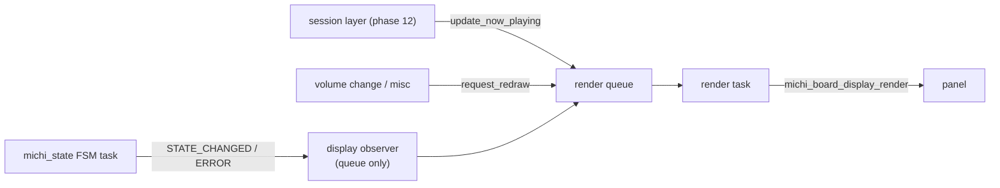
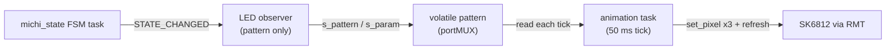
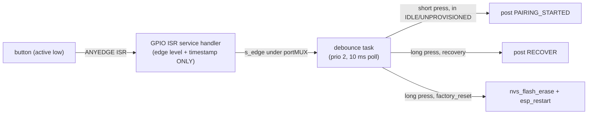
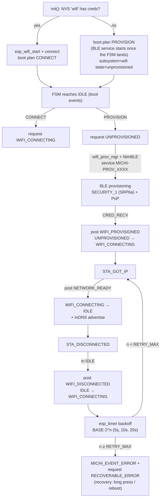
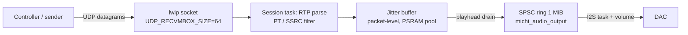
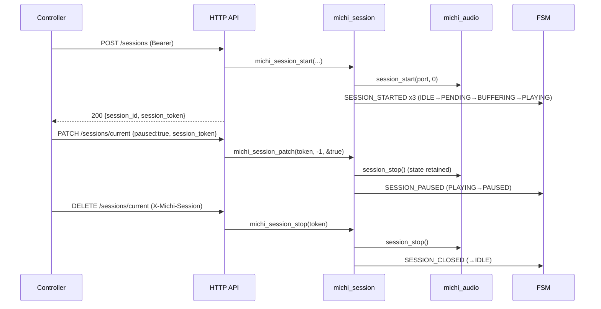
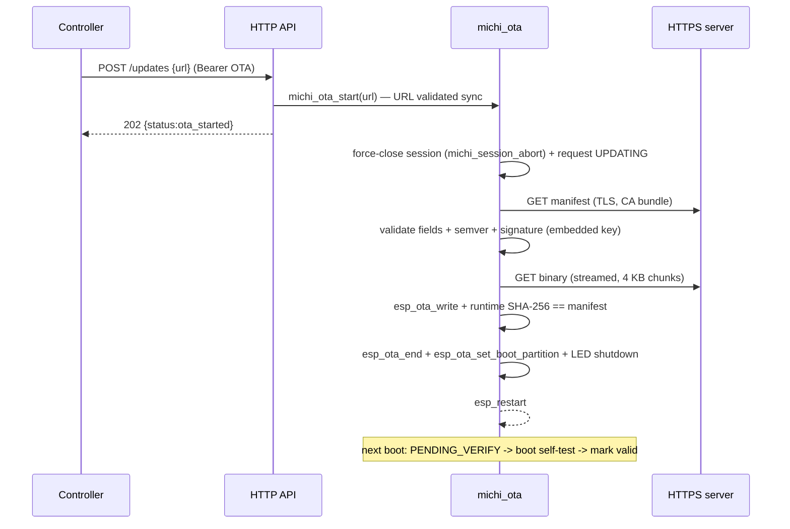

# Michi Music Stream — Firmware

ESP-IDF application for the Waveshare ESP32-S3-LCD-2 board (ESP32-S3, 16 MB flash, 8 MB octal PSRAM).

## Requirements

- ESP-IDF **v5.3 LTS** (CI builds inside `espressif/idf:release-v5.3`)
- Target: `esp32s3`

## Structure

```
firmware/
├── CMakeLists.txt
├── README.md
├── partitions.csv
├── sdkconfig.defaults
├── main/
│   ├── CMakeLists.txt
│   ├── Kconfig.projbuild          # External peripheral pin configuration
│   └── app_main.c
└── components/
    ├── michi_board/               # Board Support Package (BSP)
    │   ├── CMakeLists.txt
    │   ├── include/
    │   │   ├── michi_board.h      # Public BSP API
    │   │   └── michi_version.h    # Firmware version (single source of truth)
    │   └── waveshare_s3_lcd2/
    │       ├── board_waveshare_s3_lcd2.c
    │       └── font5x7.h          # Embedded 5x7 ASCII font for the boot screen
    └── michi_dac/                 # DAC register + detection (phase 2)
        ├── CMakeLists.txt
        ├── include/
        │   ├── michi_dac.h        # Public DAC API
        │   └── michi_dac_types.h  # Driver ops, caps, tier, status types
        ├── dac_manager.c          # Orchestration: detect -> init -> configure
        ├── dac_registry.c         # Static driver registry
        ├── dac_classifier.c       # Caps + product tier from real evidence
        └── drivers/
            ├── pcm512x.c          # PCM5122 I2C driver (self-detectable)
            ├── pcm5102a.c         # PCM5102A I2S-only DAC (profile-bound)
            └── mock_dac.c         # CI/test driver (MICHI_DAC_MOCK, default off)
    └── michi_product_profile/     # Dynamic product profile (phase 3)
        ├── CMakeLists.txt
        ├── include/
        │   └── michi_product_profile.h  # Profile struct + API
        └── michi_product_profile.c      # Derivation from caps + board
    ├── michi_http/                # HTTP API layer (phase 4)
    │   ├── CMakeLists.txt
    │   ├── include/
    │   │   └── michi_http.h       # Handler contract + checked JSON helpers
    │   └── http_server.c          # /api/v1/receiver/info + /firmware
    ├── michi_state/               # Global state machine + event bus (phase 5)
    │   ├── CMakeLists.txt
    │   ├── Kconfig                # Queue len, FSM task stack, observer count
    │   ├── include/
    │   │   └── michi_state.h      # States, events, observer contract
    │   └── michi_state.c          # FSM task, transition table, broadcast
    ├── michi_display/             # Integrated display screens (phase 6)
    │   ├── CMakeLists.txt
    │   ├── Kconfig                # Render task stack, request queue len
    │   ├── include/
    │   │   └── michi_display.h    # init, now-playing update, redraw
    │   └── michi_display.c        # Observer -> queue -> render task
    ├── michi_led/                 # SK6812 status LEDs, M5Stack U003 (phase 7)
    │   ├── CMakeLists.txt
    │   ├── idf_component.yml      # espressif/led_strip ^2.4.0 (managed)
    │   ├── Kconfig                # LED count, brightness cap, task stack
    │   ├── include/
    │   │   └── michi_led.h        # init / shutdown
    │   └── michi_led.c            # Observer -> pattern -> animation task
    ├── michi_button/              # Physical pairing button (phase 8)
    │   ├── CMakeLists.txt
    │   ├── Kconfig                # Debounce, long press, task stack
    │   ├── include/
    │   │   └── michi_button.h     # init / shutdown
    │   └── michi_button.c         # Minimal ISR -> debounce task
    ├── michi_wifi/                # Wi-Fi STA + BLE provisioning + mDNS (phase 9)
    │   ├── CMakeLists.txt
    │   ├── idf_component.yml      # espressif/mdns ^1.0.3 (managed; no in-tree mdns in v5.3)
    │   ├── Kconfig                # Reconnect backoff, PoP, service prefix
    │   ├── include/
    │   │   └── michi_wifi.h       # init / provisioning / erase / shutdown
    │   └── michi_wifi.c           # Non-blocking handlers + esp_timer backoff + prov task
    ├── michi_pairing/             # Pairing & security (phase 10)
    │   ├── CMakeLists.txt
    │   ├── Kconfig                # Window seconds, max controllers, rate limits
    │   ├── include/
    │   │   └── michi_pairing.h    # Window/challenge/confirm/validate/revoke API
    │   └── michi_pairing.c        # Hashed-token registry + button-authorized window
    ├── michi_audio_output/        # I2S pipeline, SPSC ring (phase 4)
    │   ├── CMakeLists.txt
    │   ├── Kconfig                # MICHI_AUDIO_RING_BUFFER_KB (1 MB PSRAM)
    │   ├── include/
    │   │   └── michi_audio_output.h
    │   └── michi_audio_output.c
    ├── michi_volume/              # Volume 0-100 clamped (phase 4)
        ├── CMakeLists.txt
        ├── include/
        │   └── michi_volume.h
        └── michi_volume.c
    └── michi_audio/               # RTP/UDP audio engine (phase 11)
        ├── CMakeLists.txt
        ├── Kconfig                # RTP PTs, jitter capacity, prefill, rx buffer
        ├── include/
        │   └── michi_audio.h      # Session API, metrics, output ops abstraction
        └── michi_audio.c          # Session task: RTP -> jitter buffer -> pipeline
    └── michi_session/             # Single active session lifecycle (phase 12)
        ├── CMakeLists.txt
        ├── include/
        │   └── michi_session.h    # start/stop/abort/patch/info + session credential
        └── michi_session.c        # Contract validation, token, FSM events
    └── michi_ota/                 # Signed OTA + rollback (phase 13)
        ├── CMakeLists.txt
        ├── Kconfig                # Manifest/URL bounds, HTTP timeout, task stack
        ├── include/
        │   ├── michi_ota.h        # start/get_state/boot_selftest_done API
        │   └── michi_ota_pubkey.h # Embedded RSA-2048 public key (DER, dev key)
        └── michi_ota.c            # Manifest fetch + verify + streaming download
```

At boot, every subsystem that does not exist yet is logged honestly as
`subsystem=<name> state=pending phase=<N>` — no fake success.

## Build

```
idf.py set-target esp32s3
idf.py build
```

Build and flash configuration lives in `sdkconfig.defaults` (target, 16 MB flash, octal PSRAM,
custom partition table, bootloader app rollback, BT enabled with the
NimBLE host for the phase-9 BLE provisioning transport).

External peripheral pins (DAC I2C/I2S, LED, pairing button) and the
`device_id` announced by the API (`MICHI_DEVICE_ID`) are configurable
through `menuconfig` under **Michi Music Stream Hardware**
(`main/Kconfig.projbuild`). The defaults target free GPIOs that do not
collide with the board pinout; see
[Hardware validation pending](#hardware-validation-pending) before trusting
them.

## Partitions

16 MB OTA A/B layout without factory partition (see `partitions.csv`):

| Name      | Type | Offset   | Size     |
|-----------|------|----------|----------|
| nvs       | data | 0x9000   | 24 KB    |
| otadata   | data | 0xf000   | 8 KB     |
| phy_init  | data | 0x11000  | 4 KB     |
| ota_0     | app  | 0x20000  | 4 MB     |
| ota_1     | app  | 0x420000 | 4 MB     |
| storage   | data | 0x820000 | ~7.9 MB  |

App rollback is enabled (`CONFIG_BOOTLOADER_APP_ROLLBACK_ENABLE`), so OTA upgrades can roll
back to the previous image if the new one fails to boot.

## Hardware

### Board: Waveshare ESP32-S3-LCD-2 (no touch)

Pinout verified against the official Waveshare demo (phase 1 only brings up the display).

| Function               | GPIO | Status in phase 1              |
|------------------------|------|--------------------------------|
| LCD SCLK (SPI)         | 39   | initialized (SPI bus)          |
| LCD MOSI (SPI)         | 38   | initialized (SPI bus)          |
| LCD MISO (SPI)         | 40   | initialized (SPI bus)          |
| LCD DC                 | 42   | initialized (panel IO)         |
| LCD CS                 | 45   | initialized (panel IO)         |
| LCD RST                | -    | not wired (unused)             |
| LCD backlight          | 1    | initialized (active high, on)  |
| microSD CS             | 41   | reserved (shares LCD SPI bus)  |
| Board I2C SDA (IMU)    | 48   | reserved (QMI8658 IMU onboard; no driver in phase 1) |
| Board I2C SCL (IMU)    | 47   | reserved (QMI8658 IMU onboard; no driver in phase 1) |
| Camera (15 pins)       | 8,21,16,2,7,10,14,11,15,13,12,6,4,9,17 | 4 pins reused (21,16,4,17), see below — rest reserved, unused |
| USB D-/D+              | 19,20| reserved                       |
| UART console (bridge)  | 43,44| reserved                       |
| BOOT button            | 0    | reserved                       |
| PSRAM (octal)          | 33-37| in use (PSRAM + framebuffer)   |
| Flash                 | 26-32| in use                          |
| Free GPIOs             | 3,5,18 | external peripherals (below) |
| Camera pins reused (camera not populated) | 21,16,4,17 | external peripherals (below) |

### External peripherals (proposal — physical validation pending)

These pins are **defaults in Kconfig**, chosen on free GPIOs with no board collision. They
are **not initialized** in phase 1 (consumers arrive in later phases) and **must be
validated on the real unit** before use — see [Hardware validation pending](#hardware-validation-pending).

| Peripheral            | Signal        | Default GPIO | Kconfig symbol          |
|-----------------------|---------------|--------------|-------------------------|
| DAC PCM5122           | I2C SDA       | 21           | `MICHI_DAC_I2C_SDA`     |
| DAC PCM5122           | I2C SCL       | 16           | `MICHI_DAC_I2C_SCL`     |
| DAC PCM5122           | I2S BCLK      | 3            | `MICHI_I2S_BCLK`        |
| DAC PCM5122           | I2S LRCK      | 18           | `MICHI_I2S_LRCK`        |
| DAC PCM5122           | I2S DIN       | 5            | `MICHI_I2S_DIN`         |
| DAC PCM5122           | I2S MCLK      | -1 (not driven, PLL) | `MICHI_I2S_MCLK` |
| LED SK6812 (U003)     | Data          | 4            | `MICHI_LED_GPIO`        |
| Pairing button        | Input (low)   | 17           | `MICHI_BUTTON_GPIO`     |

Pins 21, 16, 4 and 17 are camera-interface pins (SCCB SDA/SCL, HREF, PWDN); the
camera is not populated on this unit, so reusing them forfeits the camera.

MCLK is optional: the PCM5122 has an internal PLL, so it can be left unconnected
(set `MICHI_I2S_MCLK` to `-1`).

## BSP: `components/michi_board`

The BSP owns everything specific to the board, so later phases never touch pin numbers.

What `michi_board_init()` brings up in phase 1:

- Backlight (GPIO 1, active high, on)
- SPI bus (SPI2_HOST) + ST7789 panel IO (DC=42, CS=45, 20 MHz PCLK)
- ST7789T3 panel, 240x320, 16 bpp, color data inverted (per Waveshare demo behavior)
- Framebuffer (240x320x2 = 153.6 KB) allocated **at runtime in PSRAM** — if PSRAM is
  missing or the allocation fails, the display is disabled with a clear log and the board
  keeps running degraded (no crash)

Public API (`michi_board.h`): `init`, `shutdown`, `get_info`, `get_external_pins`,
`self_test`, `display_boot_screen`, `display_clear`. The self test performs **real queries**
(`esp_chip_info`, `esp_flash_get_size`, `esp_psram_get_size`, panel/framebuffer state) and
never fakes results: the DAC fields (`dac_model`/`dac_ok`) are filled by `app_main` from
`michi_dac_get_caps()` and the BSP only renders them. `overall` passes only when chip +
flash + PSRAM + display + backlight all pass; the DAC is **not** counted.

The boot screen renders text rows (embedded 5x7 font, no LVGL) and reports the same
verdicts: `Flash: 16 MiB`, `PSRAM: 8 MiB`, `Display:`, `WiFi: supported`, `BLE: supported`,
`DAC: <model> [ok|FAIL]` (or `DAC: none` when no model is known), `Result: PASS | DEGRADED`.

## DAC subsystem: `components/michi_dac`

Phase 2 implements DAC **registration and detection**. The component owns the
driver registry, the I2C bus and the NVS profile; it never fakes a detection.

### Detection model

| Source | Priority | Effect |
|--------|----------|--------|
| NVS `dac_profile` (namespace `michi_dac`, string, max 63 chars) | 1 | Force-binds the driver with the matching `board_profile` (`pcm5122`, `pcm5102a`). No probing. |
| Hardware-ID callback (`michi_dac_register_hw_id_source`) | 2 | Extension point for boards with an EEPROM carrying the DAC identity. Not implemented (no such hardware exists). |
| Autodetection | 3 | Walks the registry and probes every `self_detectable` driver in order: `pcm512x` first, then `mock` (only when `MICHI_DAC_MOCK` is enabled). |

A successful PCM5122 probe is stable, so the firmware **never writes** the
profile back; the profile is only a manual override (e.g. PCM5102A boards,
which have no control bus and therefore cannot be auto-detected).

### PCM512x detection (probe)

There is no device-ID register, so identification is honest and multi-step:

1. **ACK scan** at the real PCM512x strap addresses `0x4D`, `0x4C`, `0x4E`,
   `0x4F` (datasheet SLAS763C Table 39: prefix `10011` + ADR1/ADR2 pins).
   `0x4D` is the most common strap on commercial modules and is probed first.
   (Note: `0x4A` is **not** a PCM512x address — earlier spec drafts listed it;
   the datasheet's range is `0x4C`–`0x4F`.)
2. **Reset-default sanity**: `GPIO_EN=0x00`, `DSP_PROGRAM=0x01`,
   `DAC_ROUTING=0x11` (all verified against Linux `sound/soc/codecs/pcm512x.c`
   reg_defaults and SLAS763C). Rule: registers the firmware itself may
   legitimately modify are **excluded from the exact match** so a
   previously-configured DAC still passes — `I2S_1` is validated by mask
   (AFMT must be I2S) and accepts any ALEN the family supports (`0x00`/`0x02`/
   `0x03`), since `configure()` writes the word length.
3. **Round-trip**: write/read `ANALOG_GAIN_CTRL` (page 1) and restore the
   **original** value in every path (success, mismatch, I2C error). Any
   current value is accepted; the round-trip only proves the register is
   writable/readable, not just ACKed.

Any mismatch → `ESP_ERR_NOT_FOUND`. Real bus errors (timeout, NACK mid-
transfer) are propagated, never masked as "not found".

### Clocking: no external MCLK

The PCM5122 runs from BCLK/LRCK alone: PLL reference = BCK (`PLL_REF`),
clock divider **autoset enabled** (the reset state, `DCAS=0`), and the SCK
missing/halt detections ignored (`ERROR_DETECT = 0x18`: IDCH|IDSK, the
no-MCLK design where SCK is absent, per SLAS763C Table 82). BCK/FS/PLL
errors are **not** ignored, so `CLOCK_STATUS.CERF` still reports a wrong
BCLK/LRCK ratio or a PLL unlock. The PLL coefficients are ignored in autoset
mode, so no coefficient programming is needed at 48 kHz.

**Honest init gate**: `michi_dac_start()` polls the PLL lock flag
(`PLL_EN.PLCK`, up to 500 ms, per SLAS763C 8.3.6.3), then verifies clock
status (`CLOCK_STATUS` register), the `ERROR_DETECT` readback and the volume
readback, and only then un-mutes. Without an I2S master driving BCLK/LRCK
the PLL cannot lock, so on real hardware init **fails with
`ESP_ERR_INVALID_STATE` until phase 11 starts the I2S clocks** — the boot log
says exactly that, and `audio_available=false`. This is by design: the DAC is
never claimed as usable without evidence. **Honest limitation**: the gate
verifies the total absence of clocks, PLL lock and ratio errors via CERF; it
does **not** verify the exact BCLK/LRCK ratio relationship — that is
validated in phase 11 with the I2S frame.

### NVS profile

`dac_profile` (string, max 63 chars) under the `michi_dac` namespace:

- empty / absent → autodetection
- `pcm5122` → force-bind the PCM512x driver
- `pcm5102a` → force-bind the PCM5102A driver (the only way without a
  hardware-ID source)
- unknown value → warned about and falls back to autodetection

A profile bind is an assertion, **not** verification: `board_verified=false`
(profile-asserted, unverified). Only a real I2C probe sets `board_verified`.
The bus runs at 100 kHz by default (`MICHI_DAC_I2C_SPEED_HZ`); raise it to
400 kHz only after measuring external pull-ups (2.2–4.7 kΩ) — the internal
~45 kΩ are marginal at 400 kHz. The bus is created lazily: a profile-only
non-I2C DAC (PCM5102A) never initializes the I2C bus.

`MICHI_DAC_MOCK` (tests/CI only, default off) registers a fake DAC driver;
a mock build logs a prominent boot warning and must never be used in
production.

### Boot screen and logs

The boot screen shows `DAC: <model> [ok|FAIL]` (model/ok filled by `app_main`
from `michi_dac_get_caps()`; the BSP only renders) or `DAC: none` when no
model is known. The title is `<product_name> v<version>` — the product name
comes from the dynamic product profile, never hardcoded in the BSP. The
single consolidated profile line and the `boot=ok mode=<tier>
audio_available=<true|false>` summary are logged by `app_main`; see
[Product profile](#product-profile-componentsmichi_product_profile).

## Product profile: `components/michi_product_profile`

Phase 3 introduces the dynamic product profile: the **single source of
truth** for everything the product announces — commercial name, tier, DAC,
formats, sample rates, bit depth, connectors, volume, OTA, display, lighting
and diagnostics. Later phases (API, mDNS/BLE, screens, sessions) must read
THIS profile; no subsystem may duplicate product strings.

### Derivation (runtime, from real evidence)

`michi_product_profile_init()` derives the profile from
`michi_dac_get_caps()` + `michi_board_get_info()` +
`michi_board_self_test()` and caches it; `refresh()` re-derives without
duplicated state. Nothing is asserted: every field traces back to evidence
collected at boot.

| Field | Rule |
|-------|------|
| `tier` | `caps.tier` as degraded by `michi_dac` (HiFi/Standard drop to `diagnostic` unless detected AND initialized) — never reimplemented here |
| `product_name` | `Michi Music Stream HiFi` when tier is `hifi`, else `Michi Music Stream` |
| `audio_available` | tier is `hifi`/`standard` AND `caps.initialized` (diagnostic → always false) |
| `codecs` | always `pcm_s16le`; `pcm_s24le` added only on the HiFi tier |
| `sample_rates` | `{48000}` (system validation baseline); `max_sample_rate` is the silicon capability, exposed separately and **not** claimed as supported yet |
| `output_connector` | `differential_stereo` when `caps.differential_output`, else `single_ended_stereo`; the **physical** connector on the unit is pending hardware validation |
| `volume` | `volume_hardware` from caps; `volume_min=0`, `volume_max=100` |
| `ota_supported` | true: the partition table is OTA A/B (`ota_0`/`ota_1`); the OTA service lands in phase 13 |
| `display_present` | `self_test.display_ok`; `display_width/height` from board info |
| `lighting_status_rgb` | true (M5Stack U003 declared by the project owner; driver in phase 7) |
| `lighting_cat_contour` | **always false by project restriction**: the cat-contour LED strip is NOT implemented — no GPIO, channel or driver is reserved or announced, and the false field is the only mention |

### Examples

| Boot evidence | tier | name | audio_available |
|---------------|------|------|-----------------|
| PCM5122 detected AND initialized (PLL locked, clocks ok) | `hifi` | Michi Music Stream HiFi | true |
| PCM5102A bound by NVS profile and initialized | `standard` | Michi Music Stream | true |
| No DAC detected, or init failed (no I2S clocks yet) | `diagnostic` | Michi Music Stream | false |

At boot `app_main` logs the single consolidated key=value line
`profile: name=... tier=... audio_available=... dac=... codecs=...
sample_rates=... display=... lighting_rgb=... cat_contour=...` and the boot
summary becomes `boot=ok mode=<tier> audio_available=<true|false>` (the
phase-2 hardcoded `mode=diagnostic` is gone). The boot screen title renders
`<product_name> v<version>` from the profile.

## Phase 4 - P0 corrections

The legacy prototype audit (`firmware/common`) found 12 P0 risks. Phase 4
fixes them BY CONSTRUCTION in the new components that own them; the legacy
code is NOT touched (it is deleted during the migration). Fixes that were
already covered by earlier phases are documented as such.

### P0 table

| # | P0 risk (legacy) | Fixed by | Status |
|---|------------------|----------|--------|
| 1 | Use-after-free in `pair_confirm_handler` (cJSON pointers used after `cJSON_Delete`) | `michi_http` handler contract: copy ALL values into local buffers BEFORE delete; returning tree pointers is PROHIBITED. Phase-10 pairing handlers use this pattern | fixed-by-construction |
| 2 | Use-after-free in `session_start_post_handler` | Same handler contract (phase-12 session handlers) | fixed-by-construction |
| 3 | Partial HTTP body reads (`httpd_req_recv` once, truncated bodies) | `michi_http_read_body()`: full `Content-Length`, caller buffer IS the limit, bounded stall retries | fixed |
| 4 | No JSON type/length validation (`->valuestring`/`->valueint` on anything) | Checked helpers `michi_http_json_get_string/int/bool()`: exact type + limit, fail-not-truncate | fixed |
| 5 | Errors swallowed by `audio_output` (malloc/bind/i2s) | `michi_audio_output` propagates EVERY error (init/start/stop) and cleans up on the way out; no `ESP_ERROR_CHECK` | fixed |
| 6 | Session marked active before audio started | `michi_audio_output_start()` returns an error; the phase-12 session layer only marks the session active when start returned `ESP_OK` | fixed |
| 7 | Forced `vTaskDelete` of tasks / leaked I2S channel | Cooperative shutdown: run flag + `xTaskNotify` + `i2s_channel_disable` (unblocks in-flight writes) + join with timeout; tasks self-delete AFTER releasing resources; channel created (disabled) at init, enabled at start, DISABLED (not deleted) at stop, deleted only at deinit once no task may be alive - `start()` after `stop()` re-enables the live channel; handles NULLed | fixed |
| 8 | Unsynchronized ring buffer (legacy 4 MB, no locking) | SPSC ring: one producer (session task) / one consumer (I2S task), ALL index updates under a portMUX critical section (choice documented in `michi_audio_output.h`); replaced by 1 MB PSRAM ring (`MICHI_AUDIO_RING_BUFFER_KB`) | fixed |
| 9 | Unvalidated GPIO usage | Covered by the BSP: pins are Kconfig-driven (`Michi Music Stream Hardware` menu) and `michi_audio_output` validates every pin/rate/depth/channel before use | covered-by-phase-1 |
| 10 | NVS without recovery | Covered by `app_main` (phase 0): `ESP_ERR_NVS_NO_FREE_PAGES`/`NEW_VERSION_FOUND` → erase + retry once, halt if still broken | covered-by-phase-0 |
| 11 | 3 s blocking in the Wi-Fi event loop | `michi_wifi` (phase 9): `esp_event` handlers MUST NOT block (`vTaskDelay` is prohibited there); the reconnect with exponential backoff runs on a one-shot `esp_timer` and the BLE bring-up in the provisioning task | fixed-by-construction (phase 9) |
| 12 | Volume response != applied value | `michi_volume` clamps 0-100 and the phase-12 handler MUST answer with `michi_volume_get()` (the real applied value, including the digital-gain fallback) | fixed |

### HTTP API: `components/michi_http`

Phase 4 serves the migrated read-only endpoints on port 80, no auth (same
surface as the legacy prototype): `GET /api/v1/receiver/info` and
`GET /api/v1/receiver/firmware`. `/info` is built entirely from
`michi_product_profile_get()` (`service=michi-link`, `name`, `device_id`
from `MICHI_DEVICE_ID`, `api_version=v1-lite` for compatibility - phase 12
aligns it, `firmware{version,build_date}`, `type`=tier, `output{...}`,
`supported_codecs`, `features`); the profile gained a `build_date` field
from the single version source `michi_version.h`. `michi_http_init()`
propagates errors (boot continues, logged). Phase 12 adds the full
receiver API on the same server (Bearer auth + permissions, sessions,
pairing, diagnostics — see the Receiver API section below). Every
handler follows the contract in `michi_http.h`: parse → copy ALL values
to local buffers → delete → process → respond; cJSON pointers never
survive `cJSON_Delete` and no macro yields a cJSON pointer.

### Audio output: `components/michi_audio_output`

I2S master (standard mode) feeding the external DAC through a 1 MB PSRAM
SPSC ring (`MICHI_AUDIO_RING_BUFFER_KB`, default 1024 - the unsynchronized
4 MB legacy ring is replaced). NOT started at boot: a phase-12 session
calls `start()` and only becomes active on `ESP_OK` (P0-6). All P0
correctness patterns live here: full error propagation (P0-5), cooperative
shutdown (P0-7), SPSC + critical sections (P0-8), pin/rate/depth
 validation (P0-9), digital volume delegated to `michi_volume_apply()` in
 the consumer task (P0-12). Startup prefill of `buffer_ms` prevents the
 first underruns.

### Volume: `components/michi_volume`

0-100, clamped at the API boundary. Hardware path: `michi_dac_set_volume()`
when the bound DAC has hardware volume and is initialized; on failure it
falls back to digital gain so the value is STILL applied. Digital path:
`michi_volume_apply()` (16-bit Q15 / 24-bit Q23 on 3-byte packed samples
- the ESP32-S3 I2S 24-bit layout - integer math, no float).
`michi_volume_get()` always returns the real
applied value - the phase-12 handler must answer with it (P0-12).

### Phase 9 contract (Wi-Fi event loop)

`michi_wifi` handlers (phase 9) MUST NEVER block: `vTaskDelay` and
blocking I/O are prohibited inside `esp_event` handlers - use `esp_timer`
or a FreeRTOS queue to defer work. This is the P0-11 fix by construction.

## State machine: `components/michi_state`

Phase 5 introduces the **single global coordinator**: one state machine,
one event bus, one FSM task. The scattered booleans of the legacy firmware
(`is_provisioned`, `is_streaming`, `is_pairing`, `is_updating`, ...) are
replaced by this unique source of truth - no subsystem keeps its own
opinion about what the product is doing.

### States

| Enum | Meaning |
|------|---------|
| `MICHI_STATE_BOOTING` | Start-up until the boot events are processed |
| `MICHI_STATE_SELF_TEST` | Running the board self-test |
| `MICHI_STATE_UNPROVISIONED` | No network profile stored (network, phase 9) |
| `MICHI_STATE_PROVISIONING` | Provisioning flow active |
| `MICHI_STATE_WIFI_CONNECTING` | Connecting to the configured AP |
| `MICHI_STATE_IDLE` | Steady state: ready for pairing/session |
| `MICHI_STATE_PAIRING` | Pairing flow open (phase 10) |
| `MICHI_STATE_SESSION_PENDING` | Session negotiated, playback not started |
| `MICHI_STATE_BUFFERING` | Pre-filling before playback |
| `MICHI_STATE_PLAYING` | Audio flowing |
| `MICHI_STATE_PAUSED` | Session active, playback suspended |
| `MICHI_STATE_UPDATING` | OTA in progress (phase 13) |
| `MICHI_STATE_RECOVERABLE_ERROR` | Degraded but retryable |
| `MICHI_STATE_FATAL_ERROR` | Terminal: cannot continue |

### Transition table (single source of truth)

`michi_state.c` encodes it as one bitmask per source state; both
`michi_state_request()` and the event mapping validate against it. A
request to an invalid target is logged (`warn`) and rejected with
`ESP_ERR_INVALID_STATE` - no state change.

| From | To |
|------|----|
| BOOTING | SELF_TEST, FATAL_ERROR |
| SELF_TEST | IDLE, RECOVERABLE_ERROR, FATAL_ERROR |
| UNPROVISIONED | PROVISIONING, WIFI_CONNECTING, PAIRING, RECOVERABLE_ERROR, FATAL_ERROR |
| PROVISIONING | WIFI_CONNECTING, UNPROVISIONED, RECOVERABLE_ERROR, FATAL_ERROR |
| WIFI_CONNECTING | IDLE, UNPROVISIONED, RECOVERABLE_ERROR, FATAL_ERROR |
| IDLE | UNPROVISIONED, PROVISIONING, WIFI_CONNECTING, PAIRING, SESSION_PENDING, UPDATING, RECOVERABLE_ERROR, FATAL_ERROR |
| PAIRING | IDLE, RECOVERABLE_ERROR, FATAL_ERROR |
| SESSION_PENDING | BUFFERING, IDLE, RECOVERABLE_ERROR, FATAL_ERROR |
| BUFFERING | PLAYING, IDLE, RECOVERABLE_ERROR, FATAL_ERROR |
| PLAYING | PAUSED, BUFFERING, IDLE, UPDATING, RECOVERABLE_ERROR, FATAL_ERROR |
| PAUSED | PLAYING, IDLE, RECOVERABLE_ERROR, FATAL_ERROR |
| UPDATING | IDLE, RECOVERABLE_ERROR, FATAL_ERROR |
| RECOVERABLE_ERROR | IDLE, UNPROVISIONED, WIFI_CONNECTING, FATAL_ERROR |
| FATAL_ERROR | (terminal - no outgoing transitions) |

### Event mapping

Mapped events drive transitions; every other event is broadcast only (no
transition). `michi_event_t` carries `id`, `data` and `from` (for
`MICHI_EVENT_STATE_CHANGED`: the previous state; for other events: the
state current when the event was dispatched - stamped by the FSM task).

| Event | Condition | Transition |
|-------|-----------|------------|
| `MICHI_EVENT_BOOT_COMPLETE` | in BOOTING | BOOTING → SELF_TEST |
| `MICHI_EVENT_SELF_TEST_DONE` | in SELF_TEST (any data) | SELF_TEST → IDLE |
| `MICHI_EVENT_RECOVER` | in RECOVERABLE_ERROR | RECOVERABLE_ERROR → IDLE |
| `MICHI_EVENT_PAIRING_STARTED` | in IDLE | IDLE → PAIRING |
| `MICHI_EVENT_PAIRING_STARTED` | in UNPROVISIONED | UNPROVISIONED → PAIRING |
| `MICHI_EVENT_PAIRING_WINDOW_CLOSED` | in PAIRING | PAIRING → IDLE |
| `MICHI_EVENT_WIFI_PROVISIONED` | in UNPROVISIONED | UNPROVISIONED → WIFI_CONNECTING |
| `MICHI_EVENT_WIFI_DISCONNECTED` | in IDLE | IDLE → WIFI_CONNECTING |
| `MICHI_EVENT_NETWORK_READY` | in WIFI_CONNECTING | WIFI_CONNECTING → IDLE |
| `MICHI_EVENT_WIFI_PROV_FAILED` | in WIFI_CONNECTING | WIFI_CONNECTING → UNPROVISIONED |
| `MICHI_EVENT_SESSION_STARTED` | in IDLE | IDLE → SESSION_PENDING |
| `MICHI_EVENT_SESSION_STARTED` | in SESSION_PENDING | SESSION_PENDING → BUFFERING |
| `MICHI_EVENT_SESSION_STARTED` | in BUFFERING | BUFFERING → PLAYING |
| `MICHI_EVENT_SESSION_CLOSED` | in SESSION_PENDING / BUFFERING / PLAYING / PAUSED | → IDLE |
| `MICHI_EVENT_SESSION_PAUSED` | in PLAYING | PLAYING → PAUSED |
| `MICHI_EVENT_SESSION_RESUMED` | in PAUSED | PAUSED → PLAYING |

The lookup is keyed on **(event, data, from)**: an event only matches the
entry whose `from` equals the state current at dispatch time — that is why
`MICHI_EVENT_PAIRING_STARTED` has two entries (phase 8, physical button):
both are reachable from their own source state. An event with no entry for
the current state is still broadcast to observers, with a warn (no
transition).

`MICHI_EVENT_SELF_TEST_DONE` carries the self-test overall result as data
(1=ok, 0=degraded) for observers, but any data drives SELF_TEST → IDLE:
`RECOVERABLE_ERROR` is entered only by runtime producers from phase 9
onwards — no boot path enters it.

`michi_state_request()` enqueues an internal, not postable event
(`MICHI_EVENT_TRANSITION_REQUEST`, id 0x100) that the FSM re-validates and
applies; every applied transition emits `MICHI_EVENT_STATE_CHANGED`.

`MICHI_EVENT_ERROR` (data: `esp_err_t`), `MICHI_EVENT_STATE_CHANGED` and
the phase events (`MICHI_EVENT_WIFI_*` phase 9, `MICHI_EVENT_PAIRING_WINDOW_CLOSED`
phase 10, `MICHI_EVENT_SESSION_*` phase 12, `MICHI_EVENT_UPDATE_*`
phase 13 — the UPDATE events are BROADCAST-ONLY by design: OTA drives
the state with `michi_state_request(UPDATING)` directly, the events
exist for observers) are declared so consumers can register filters;
their mappings arrive with their phases. The session events are the exception
alongside the pairing ones: `MICHI_EVENT_SESSION_STARTED` is posted once
per lifecycle step (negotiated → engine starting → running) and the
from-keyed lookup advances the chain IDLE → SESSION_PENDING → BUFFERING →
PLAYING — the same pattern as `MICHI_EVENT_PAIRING_STARTED`.

Phase 14: the FSM captures the LAST error cause into a single slot
(`michi_state_get_last_error()`, exposed by `GET /diagnostics` →
`last_error`). Producers of `MICHI_EVENT_ERROR` (data = `esp_err_t`):
michi_wifi when the retry chain exhausts
(`ESP_ERR_WIFI_NOT_CONNECT`, before requesting `RECOVERABLE_ERROR`) and
michi_audio when the RTP session self-ends (socket/bind failure,
pipeline write rejection — the session-ending failures). OTA posts its
own `MICHI_EVENT_UPDATE_FAILED` (same payload shape) which the same slot
captures — no duplicated error broadcast. A `RECOVERABLE_ERROR` /
`FATAL_ERROR` transition REQUEST without a preceding error event is
captured with data 0, and never overwrites a real error event.
`MICHI_EVENT_SESSION_CLOSED` ends the session from any session state
(four map entries), and `MICHI_EVENT_SESSION_PAUSED`/`RESUMED` switch
between PLAYING and PAUSED (pause also stops the ENGINE — see the
Sessions section).

### Boot flow

`state_init → display_init → led_init → button_init → nvs → wifi →
pairing → board → self_test → dac → profile → http → boot screen →
BOOT_COMPLETE (→ SELF_TEST) → SELF_TEST_DONE (→ IDLE)`.
The boot screen is rendered **before** the boot events so it covers
BOOTING/SELF_TEST and is never painted over by the dynamic display screens
(phase 6), which take over as soon as the FSM reaches a stable state.
`state_init` runs FIRST so the FSM is
live before NVS: on unusable NVS, `app_main` calls
`michi_state_request(MICHI_STATE_FATAL_ERROR)` — valid, BOOTING → FATAL_ERROR
is in the table — and halts; the halt loop keeps an explicit
`esp_task_wdt_reset()` call, which is a no-op (app_main is not subscribed to
the task watchdog) but documents the intent and survives if the subscription
changes. The SELF_TEST window is modeled retrospectively: the test already ran
before the events are posted, so observers must not expect to observe it. If
`michi_state_init()` fails, boot continues in degraded mode: `state bus
unavailable - all events will be dropped` is logged and no event reaches an
observer (`subsystem=state state=failed`). If `michi_display_init()` fails,
boot also continues degraded: no dynamic screens, the BSP boot screen still
shows (`subsystem=display state=failed phase=6`). If `michi_led_init()`
fails, boot also continues degraded: no status LEDs, everything else keeps
working (`subsystem=led state=failed phase=7`). If `michi_button_init()`
fails, boot also continues degraded: no pairing button, everything else
keeps working (`subsystem=button state=failed phase=8`). If
`michi_wifi_init()` fails, boot also continues degraded: no network,
everything else keeps working (`subsystem=wifi state=failed phase=9`).

### Observer contract

- Register with `michi_state_register_observer(filter, fn)`; `filter=0`
  receives ALL events, any other value receives only that event
  (`MICHI_EVENT_STATE_CHANGED` included - it is dispatched like any other
  event). Max 8 observers (`MICHI_STATE_MAX_OBSERVERS`).
- Observers are invoked **sequentially from the FSM task**, one event at a
  time, never concurrently. They MUST NOT block (no `vTaskDelay`, no
  blocking I/O) - the FSM must always be free to drain the queue.
- Consumers by phase: display (6), LED (7), network (9), audio (11),
  API (12). Transitions are logged by the FSM task itself; no observer slot
  is consumed for logging.
- `post()`/`post_from_isr()` never block: a full queue returns
  `ESP_ERR_TIMEOUT` and the event is dropped — drops are counted and logged
  by the FSM task periodically; producers log their own drop on task
  context.

## Display: `components/michi_display`

Phase 6 adds the integrated 2-inch screen: state-driven screens rendered on
top of the BSP framebuffer by a dedicated task. No LVGL, no cover art, no
images — only the BSP's embedded 5x7 font.

### Architecture: observer → queue → render task



The display observer runs on the FSM task, so it ONLY enqueues render
requests (`xQueueSend` timeout 0 — a full queue drops the request with a
warn). It NEVER renders: a full-frame flush takes ~65–80 ms, which would
violate the observer MUST-NOT-block contract and stall the event bus. The
render task is the **only** framebuffer/flush consumer (`michi_board` is not
thread-safe for the display); it coalesces pending requests and renders once
per drain with the latest state, so a state/redraw storm never stacks
flushes. A request dropped on a full queue sets a pending flag; the task
re-renders once more after the drain when the flag is set, so a dropped
request does not leave the screen stale (a drop racing that re-render is
covered by the next state change).

### Screens by state

Every screen carries the header (`product_name` from the product profile)
and the footer (`v<version>`); body text is centered with the BSP 5x7
renderer (`michi_board_display_draw_text`).

| State | Screen |
|-------|--------|
| BOOTING, SELF_TEST | none — covered by the BSP boot screen (division below) |
| IDLE | `IDLE` / `Ready to pair` |
| UNPROVISIONED | `Not configured` / `Press pairing button` |
| PROVISIONING, WIFI_CONNECTING | `Connecting...` |
| PAIRING | `Pairing...` / `Waiting for confirmation` |
| SESSION_PENDING, BUFFERING | `Buffering...` |
| PLAYING | playing info (below) |
| PAUSED | `Paused` + playing info dimmed |
| UPDATING | `Updating firmware...` |
| RECOVERABLE_ERROR | `Recovering...` / `Auto retry in progress` |
| FATAL_ERROR | `FATAL ERROR` + last `MICHI_EVENT_ERROR` name (or `See serial log`) |

### Playing info

`Source: <source|-->`, `Title: <title|-->` (wraps to a second line when
longer than 29 visible chars, max 2 lines), `Artist: <artist|-->`, then the
format line built from the **real** product-profile sample rate and the
initial applied bit depth
(`validated_sample_rate`/1000 → `48 kHz`, `MICHI_DISPLAY_APPLIED_BIT_DEPTH`
→ `16-bit`), the Wi-Fi placeholder and the volume:

- `48 kHz / 16-bit` — sample rate from `michi_product_profile_get()` (never
  hardcoded); bit depth from the initial applied format constant (48000/16/2
  validated at boot; the session layer drives the real value in phase 11/12);
- `Wi-Fi: --` — explicit placeholder: `michi_display` only renders the
  state; the network phase (9) fills the value;
- `Vol: <michi_volume_get()>` — always the real applied volume.

Metadata is fed by `michi_display_update_now_playing()` (session layer,
phase 12), copied into internal buffers (max 32/64/48 chars). **No cover
art**: the text-only framebuffer renderer is a deliberate scope cut; an
image pipeline is not planned.

### Division with the BSP boot screen

`app_main` renders the boot screen (board self-test results) **before**
posting the boot events, and the render task skips BOOTING/SELF_TEST: the
boot screen covers that window and is never painted over. The dynamic
screens take over as soon as the FSM reaches a stable state (IDLE at boot
with the current phase-5 routing; UNPROVISIONED once phase 9 routes it).

Init: `michi_display_init()` right after `michi_state_init()`; a failure
continues degraded (no dynamic screens, boot screen still shows,
`subsystem=display state=failed phase=6`). Success logs
`subsystem=display state=ok phase=6`. Kconfig: render task stack
(`MICHI_DISPLAY_TASK_STACK_BYTES`, 4096) and render queue length
(`MICHI_DISPLAY_QUEUE_LEN`, 4).

## LED: `components/michi_led`

Phase 7 drives the **three SK6812 status LEDs of the M5Stack U003** through
one RMT `led_strip` channel (managed component `espressif/led_strip`
`^2.4.0` in `idf_component.yml`; the build resolves **2.5.5**). Scope
restriction: **the cat-contour strip is NOT implemented** — no extra GPIO,
no second channel, no driver; the only mention anywhere is
`lighting_cat_contour=false` in the product profile.

### Architecture: observer → pattern → animation task



The LED observer runs on the FSM task, so it ONLY updates a volatile
pattern (pattern id + period param + base color) under a short portMUX
critical section. It NEVER touches the strip: RMT writes are slow, which
would violate the observer MUST-NOT-block contract (phase 5) and stall the
event bus. The animation task (priority 3, **50 ms tick**) is the **only**
strip consumer: it reads the pattern snapshot, computes the three pixel
colors from a **precomputed 64-entry sine LUT** (generated offline — no
`math.h` in the tick) and calls `led_strip_set_pixel` ×3 +
`led_strip_refresh` per tick; the refresh is **synchronous** (~0.25 ms per
tick), bounded and confined to the animation task — the observer (FSM task)
never blocks — and the only delay is the tick itself
(`ulTaskNotifyTake`, which a shutdown notification interrupts immediately).

### Patterns by state

Every pattern period is expressed in 50 ms ticks. All SOLID patterns use
the dim envelope (~35%); pulses and the sweep reach the full brightness
cap at their peak (all still software-capped, see below).

| State | Pattern | Color |
|-------|---------|-------|
| BOOTING, SELF_TEST | solid (dim) | white |
| UNPROVISIONED | slow pulse (2.4 s) | blue |
| PROVISIONING | fast pulse (0.8 s) | blue |
| WIFI_CONNECTING | pulse (1.6 s) | orange |
| IDLE | solid (dim) | blue |
| PAIRING | sweep — traveling brightness wave across the 3 LEDs (0.6 s per wave) | blue |
| SESSION_PENDING, BUFFERING | solid (dim) | yellow |
| PLAYING | solid (dim) | green |
| PAUSED | slow blink (1.2 s on / off) | green dim |
| UPDATING | rising brightness ramp, cyclic (3 s, OTA progress) | white |
| RECOVERABLE_ERROR, FATAL_ERROR | solid (dim) | red |
| unknown / out of range | off (defensive) | — |

### Brightness cap and shutdown

Every color is scaled in software by
`MICHI_LED_MAX_BRIGHTNESS_PCT/100` (default **25%**) before reaching the
strip — SK6812 at full output is blinding in a dark room, and the cap
applies to EVERY pattern (pulses included) with no hardware configuration.
`MICHI_LED_COUNT` (default 3) and `MICHI_LED_TASK_STACK_BYTES` (default
3072) complete the LED Kconfig menu.

`michi_led_shutdown()` is cooperative: flag + notification + join with
timeout; the task clears the strip (`led_strip_clear` + `refresh`) and
deletes itself, then shutdown releases the strip (`led_strip_del`). If the
join times out the strip is leaked rather than freed under a live task
(warn logged).

Init: `michi_led_init()` right after `michi_display_init()`; a failure
continues degraded — no status LEDs, everything else keeps working
(`subsystem=led state=failed phase=7`). Success logs
`subsystem=led state=ok phase=7`. **GPIO 4
(`MICHI_LED_GPIO`, camera HREF) is still pending physical validation** —
measure continuity between the SK6812 data input and GPIO4 with the unit
powered off before trusting it (camera interface forfeited — see below).

## Button: `components/michi_button`

Phase 8 adds the physical pairing button on `MICHI_BUTTON_GPIO` (default
**GPIO17**, camera PWDN — the camera is not populated on this unit, reuse
forfeits it). Active low to GND, internal pull-up enabled. Scope: the
component **only posts events** — the pairing protocol itself is phase 10.

### Architecture: minimal ISR → debounce task



The ISR handler contains **NO logic**: it records the edge level and the
`esp_timer_get_time()` timestamp in a volatile struct under a portMUX
critical section, and returns. Everything else happens in the debounce
task (priority 2): it polls `gpio_get_level` every
`MICHI_BUTTON_POLL_MS` (10 ms) and confirms an edge only after N
consecutive equal samples, N = DEBOUNCE/POLL rounded up (2 here; the
stable window is (N-1) poll periods — a glitch shorter than one poll
period cannot confirm an edge (it can never fill N consecutive samples), and measures
the press duration edge-to-edge from the ISR timestamps (sub-tick
accuracy, debounce window excluded).

### Actions (task context, NEVER the ISR)

| Press | Action |
|-------|--------|
| short (< `MICHI_BUTTON_LONG_PRESS_MS`) | `michi_pairing_open_window()` + `michi_state_post(MICHI_EVENT_PAIRING_STARTED, 0)` — only in **IDLE** or **UNPROVISIONED**; any other state logs the rejection (`state=...`, the FSM would drop the event anyway). `PAIRING_STARTED` is posted ONLY when the window actually opened (a failed open is logged `pairing window open failed err=...` and the press is a no-op: posting anyway would strand the FSM in PAIRING with no window to close it) |
| long (>= `MICHI_BUTTON_LONG_PRESS_MS`) | `MICHI_BUTTON_LONG_PRESS_ACTION`: `recovery` (default) → `michi_state_post(MICHI_EVENT_RECOVER, 0)` (only from RECOVERABLE_ERROR); `factory_reset` → `nvs_flash_erase()` + `esp_restart()` immediately (no log-flush delay: the log is already in the UART FIFO) |
| factory-reset arm window | `MICHI_BUTTON_FACTORY_ARM_MS` (default 10000 ms): the factory reset runs only if the press **started** at least this long after boot (boot-hold / stuck-pin protection); recovery is NOT armed |

**Anti-accidental protection**: both actions are ignored unless the FSM
was NOT in **BOOTING, SELF_TEST or UPDATING** at the press confirmation
AND is still outside those states at the release
(`button: action=ignored press_state=... release_state=...`) — a press
held through boot, or started during OTA, can never fire its action on
release (a factory reset during OTA could brick the unit). A factory reset
is additionally gated by the `MICHI_BUTTON_FACTORY_ARM_MS` arm window
(see table above). The FSM additionally rejects any
invalid transition by its own transition table; the button's state gates
(the IDLE/UNPROVISIONED pairing gate, the RECOVERABLE_ERROR recovery gate)
exist so the logs stay honest instead of showing FSM-level rejects.

### Shutdown

`michi_button_shutdown()` removes the ISR handler, stops the debounce task
cooperatively (flag + notification + join with timeout — the same pattern
as the LED animation task) and uninstalls the GPIO ISR service **only if
this component installed it**: `gpio_install_isr_service()` is global — a
second installer gets `ESP_ERR_INVALID_STATE` and the service is shared,
so uninstalling it under another component would silently kill that
component's handlers.

Init: `michi_button_init()` right after `michi_led_init()`; a failure
continues degraded — no pairing button, everything else keeps working
(`subsystem=button state=failed phase=8`). Success logs
`subsystem=button state=ok phase=8`. Kconfig (component menu): debounce
window (20 ms), long-press threshold (5000 ms), long-press action choice
(recovery | factory_reset), factory-reset arm window (10000 ms), poll
period (10 ms), task stack (3072).

**GPIO17 (camera PWDN) is still pending physical validation** — measure
continuity between the button pin and GPIO17 (and to GND while pressed),
and confirm the pull-up, with the unit powered off before trusting it
(camera interface forfeited — see below).

## WiFi & provisioning: `components/michi_wifi`

Phase 9 brings the device onto the network: Wi-Fi STA with reconnect
backoff, **BLE provisioning** (no credentials ever compiled in) and mDNS
announcements. It is the implementation of the P0-11 contract (non-blocking
`esp_event` handlers).

### Hard rules

- **Credentials live ONLY in the NVS `wifi` namespace** (keys `ssid`,
  `password`, `device_name`, `region`). Kconfig has NO Wi-Fi credentials;
  the only compiled-in secret is the provisioning proof-of-possession
  `MICHI_PROV_POP` (see below). The password is **never logged, not
  partially**: every log carries only the SSID. Verified by grepping the
  build tree for `CONFIG_MICHI_WIFI_SSID`/`CONFIG_MICHI_WIFI_PASSWORD` —
  zero hits (the legacy `firmware/common`, `standard/`, `hifi/` builds
  still carry them and are untouched, out of scope).
- **Non-blocking event handlers (P0-11)**: `esp_event` handlers only post
  FSM events and set flags. The reconnect with exponential backoff runs
  on a one-shot `esp_timer`; the blocking BLE bring-up
  (`esp_bt_controller_enable`) runs in the provisioning task
  (`MICHI_WIFI_TASK_STACK_BYTES`, default 6144).
- **FSM is the single state owner**: `michi_wifi` only posts the phase-9
  events or requests states, it never writes the state.

### Boot flow



`michi_wifi_init()` runs after `init_nvs()` (the credentials live in NVS)
and before the boot events, so the FSM is still BOOTING: the state
placement is deferred to a `MICHI_EVENT_STATE_CHANGED` observer that acts
when the FSM first reaches IDLE. A boot race (the client provisions before
the FSM settles) is covered by flag replay: the observer and the
`STA_GOT_IP` handler re-post `WIFI_PROVISIONED`/`NETWORK_READY` in order
from the `s_creds_received`/`s_network_ready` flags, so the queue always
orders UNPROVISIONED → WIFI_CONNECTING → IDLE.

### BLE provisioning (wifi_prov_mgr)

- Transport: **BLE with the NimBLE host** (`CONFIG_BT_ENABLED=y`,
  `CONFIG_BT_NIMBLE_ENABLED=y` in `sdkconfig.defaults`; the BTDM mode
  overrides of the official example are ESP32-classic only and do not
  exist for the ESP32-S3 controller — verified against
  `espressif/idf:release-v5.3`).
- Security: `WIFI_PROV_SECURITY_1` (SRP6a) with the
  `MICHI_PROV_POP` proof-of-possession — **honest warning**: the default
  `michi123` is a factory secret compiled into the firmware; change it
  before production (anyone on BLE range could otherwise provision the
  device).
- Service name: `MICHI_PROV_SERVICE_NAME_PREFIX` + the last 4 hex digits
  of the STA MAC (e.g. `MICHI-PROV_4CAB`); keep prefix + 4 ≤ 31 bytes
  (BLE name limit).
- Custom endpoint **`michi-device-info`** (JSON
  `{"device_name": ..., "region": ...}`): device identity delivered by
  the client, persisted with the credentials into the `wifi` namespace.
  API note: v5.3 removed the old `wifi_prov_mgr_set_custom_endpoint()` —
  the current API is `wifi_prov_mgr_endpoint_create()` +
  `wifi_prov_mgr_endpoint_register()` (`wifi_provisioning/manager.h`).
- Event semantics used (v5.3 `wifi_prov_cb_event_t`): `CRED_RECV` =
  credentials received and applied (FSM moves to WIFI_CONNECTING),
  `CRED_SUCCESS` = the device CONNECTED to the AP — only then the
  credentials are proven good and are **persisted** (the session stays
  open for client retries after `CRED_FAIL`).
- WiFi stack persistence: wifi_prov stores with `WIFI_STORAGE_FLASH`, so
  `michi_wifi_erase_credentials()` also calls `esp_wifi_restore()` —
  without it the manager would still see the old config and refuse a new
  provisioning (`wifi_prov_mgr_is_provisioned()` reads the driver
  config). The erase stops and joins an active provisioning session
  first (the wipe never races the persist) and restarts the automatic
  provisioning cycle afterwards. The factory reset (phase 8 button)
  erases ALL of NVS and restarts; the API-level erase only removes the
  network profile while the device keeps running.
- Automatic retry: after a failed provisioning session (10-min client
  timeout, bring-up error or NVS persist failure) the BLE service
  restarts after `MICHI_PROV_RETRY_MS` (default 30 s), max 3 retries;
  exhausted sessions log clearly and land on `unprovisioned` — the
  pairing button long press (recovery action) restarts the cycle.
  Phase 10 will coordinate its pairing flow with this provisioning.
- NVS margin: the `wifi` namespace shares the 24 KB `nvs` partition
  with every other subsystem; a full NVS makes the credential persist
  fail, which is treated as a real provisioning failure (credentials NOT
  marked as applied, automatic retry kicks in).

### Reconnect with backoff

`STA_DISCONNECTED` → `MDNS retire` → post `WIFI_DISCONNECTED` (only when
the FSM is in IDLE — the retry attempts already run in WIFI_CONNECTING) →
arm a one-shot `esp_timer` with `MICHI_WIFI_RECONNECT_BASE_MS · 2^attempt`
(5 s / 10 s / 20 s with the defaults, capped at 5 min). After
`MICHI_WIFI_RETRY_MAX` (default 3) failed attempts: `MICHI_EVENT_ERROR`
broadcast (data `ESP_ERR_WIFI_NOT_CONNECT`) + `RECOVERABLE_ERROR` request.
Recovery: physical button long press (`MICHI_EVENT_RECOVER`; the wifi
layer re-arms the connect on the next `RECOVER`, resetting the retry
counter) or reboot. The retry counter resets on every `STA_GOT_IP`. A
failed `esp_wifi_connect()` (no `DISCONNECTED` event follows) also
advances the backoff chain, so a stuck connect never dies silently; if
the chain exhausts while the FSM is still booting (BOOTING/SELF_TEST
cannot land on RECOVERABLE_ERROR, the request is dropped), the
STATE_CHANGED observer re-arms it when WIFI_CONNECTING is reached with no
pending attempt.

### mDNS

Advertised on `STA_GOT_IP`, retired on `STA_DISCONNECTED`:
`_michi-receiver._tcp` on port 80 with TXT keys `name`, `tier`,
`api_version`, `fw_version`, `board` — every value read FROM
`michi_product_profile_get()` (no duplicated product strings; the profile
gained the `api_version` field mirroring the HTTP contract "v1-lite").
Hostname: `michi-` + last 4 MAC hex digits. mdns is a **managed
component** (`espressif/mdns ^1.0.3` in `idf_component.yml`): the v5.3 IDF
tree no longer ships an in-tree mdns, and the registry version uses
`mdns_free()` instead of the old `mdns_stop()`.

### Logs

key=value, password-free. `subsystem=wifi` states in phase 9 (the real
set): `ok` (init done), `connecting` (STA connect), `connected` (IP
obtained), `provisioning` (BLE session up), `provisioned` (credentials
proven and persisted), `provisioning_failed` (client-side, retryable),
`unprovisioned` (boot without credentials / after erase), `failed` (init
failure or retry chain exhausted), `off` (shutdown) — always with
`phase=9`. Retry logs emit `retry=%u`: `wifi: state=connecting retry=%u`,
`wifi: ssid=%s retry=%u backoff_ms=%lld`, `wifi: ssid=%s ip=%s retry=0`,
`wifi: disconnected reason=%d`.

## Pairing & security: `components/michi_pairing`

Phase 10 adds the controller registry and the pairing window: the
protocol that lets a controller (app/remote) authenticate with the
device. It is a **from-scratch implementation** — the legacy
`firmware/common/pairing.c` pattern (predictable `rand()` nonces, tokens
stored in plaintext, window openable over HTTP) is deliberately NOT
copied.

### Hard rules

1. **The physical button is the ONLY authority that opens the window.**
   `michi_pairing_open_window()` is called exclusively from the button
   path (`michi_button`, task context, in `handle_short_press`). There is
   NO network-visible API that opens it; the phase-12 HTTP handlers can
   only request/confirm challenges INSIDE a window already opened by the
   button. (The legacy window-open-over-HTTP hole cannot recur.)
2. **Cryptographic challenges**: 16 bytes from `esp_fill_random()` encoded
   as 32 hex chars, bound to the current window AND to the initiator id
   that requested it (single-slot: one active challenge per window; a new
   `get_challenge` overwrites the previous challenge+owner pair, and
   `confirm` only accepts the id that issued it). The challenge dies with
   the window.
3. **Tokens are stored as SHA-256 digests only** (`mbedtls_sha256`,
   mbedTLS 3.6 of IDF 5.3): the receiver never sees a recoverable
   credential. Validation = digest of the presented token compared in
   constant time against the stored digest.
4. **Constant-time comparisons** via `mbedtls_ct_memcmp`
   (`mbedtls/constant_time.h`, available and unguarded in IDF 5.3 —
   verified) for both the challenge and the token digests.
5. **Per-controller permission bitmask** (see table below); new pairings
   get `STATUS|PLAYBACK|VOLUME|SETTINGS`. The elevated bits are
   documented as NOT granted by default — a grant-management flow is a
   future phase.
6. **Rate limiting per window**: max `MICHI_PAIRING_MAX_CHALLENGES_PER_WINDOW`
   (3) challenge issues and max `MICHI_PAIRING_MAX_CONFIRM_ATTEMPTS` (5)
   failed confirmations; exceeding the confirm limit CLOSES the window
   (log + `MICHI_EVENT_PAIRING_WINDOW_CLOSED`, FSM PAIRING → IDLE) —
   anti brute force. Attempts contract: every failed confirmation
   consumes one attempt EXCEPT a malformed initiator id and
   no-proof-issued (no challenge issued for the window), which are
   rejected without consuming — they are not authentication attempts.
7. **Zero secrets in logs**: challenge, token and digest VALUES are never
   logged — only controller ids (not secret) and counters. Enforced by
   design: no log format string in the component contains
   `token`/`challenge`/`nonce`/`hash` (the verification grep passes; the
   spec-proposed `challenge_count`/`confirm_failures` fields were renamed
   `issued`/`failed` for exactly this reason).
8. **Individual revocation**: `michi_pairing_revoke(controller_id)`.
9. **Expiration**: `MICHI_PAIRING_WINDOW_SECONDS` (default 120) enforced
   by a one-shot `esp_timer`; expiry, success, exhaustion and explicit
   close all post `MICHI_EVENT_PAIRING_WINDOW_CLOSED` (PAIRING → IDLE).

### Flow: button → window → challenge → confirm

```mermaid
sequenceDiagram
    participant B as Button task
    participant P as michi_pairing
    participant F as FSM
    participant N as NVS
    participant C as Controller (phase 12 HTTP)

    B->>P: michi_pairing_open_window()
    P-->>N: (timer armed, 120 s)
    B->>F: post PAIRING_STARTED (only if the window opened)
    F->>F: IDLE/UNPROVISIONED → PAIRING
    C->>P: get_challenge(initiator_id) (window open?)
    P-->>C: 32-hex challenge bound to initiator_id (esp_fill_random, max 3/window)
    C->>P: confirm(challenge, initiator_id, token)
    P->>P: ct-compare challenge; id == challenge owner; digest token (SHA-256)
    P-->>N: nvs_set_blob + commit (digest, perms, created)
    P-->>C: controller_id + MICHI_PERM_DEFAULT
    P->>F: post WINDOW_CLOSED (window closed)
    F->>F: PAIRING → IDLE
    Note over C,P: later: validate_token(token) → constant-time<br/>digest scan → controller + permissions
```

### Permissions

| Bit | Macro | Meaning | Granted by default |
|-----|-------|---------|--------------------|
| 0x1 | `MICHI_PERM_STATUS` | Read status/state | yes |
| 0x2 | `MICHI_PERM_PLAYBACK` | Start/stop/pause playback | yes |
| 0x4 | `MICHI_PERM_VOLUME` | Read/set volume | yes |
| 0x8 | `MICHI_PERM_SETTINGS` | Read/change device settings | yes |
| 0x10 | `MICHI_PERM_CONTROLLER_ADMIN` | Manage controllers (revoke, list) | **no** |
| 0x20 | `MICHI_PERM_OTA` | Trigger/authorize OTA | **no** |
| 0x40 | `MICHI_PERM_FACTORY_RESET` | Trigger factory reset | **no** |

`MICHI_PERM_DEFAULT` (STATUS|PLAYBACK|VOLUME|SETTINGS) is granted at
pairing time; re-pairing an existing controller id rotates its credential
and re-grants the default set.

### Registry and persistence

The registry lives in the NVS `michi_pairing` namespace as ONE versioned
blob (key `controllers`, `MICHI_PAIRING_BLOB_VERSION = 1`): a 8-byte
header (u32 version + u32 count) followed by up to
`MICHI_PAIRING_MAX_CONTROLLERS` (8) fixed 80-byte entries, field order:
`{controller_id[32], digest[32], created_unix, permissions, reserved}`
(created_unix is an int64 — the header keeps it 8-aligned; `reserved` is
explicit tail padding so the persisted bytes are deterministic, no
uninitialized padding). Slots `[count..MAX)` are always zeroed before
persisting (no revoked digests retained on flash), and the layout is
`_Static_assert`-guarded in `michi_pairing.c`. Every mutation (confirm,
revoke) rewrites the whole blob with `nvs_set_blob` + `nvs_commit`,
propagates NVS errors, and only applies the in-RAM copy after the write
succeeds. A missing, truncated or foreign-version blob starts EMPTY
(warn logged) — a bad store never blocks boot; a single corrupt entry
(id not NUL-terminated within 31 chars) is dropped and logged without
rejecting the whole store. `created_unix` is uptime-seconds since boot
until a wall-clock source lands. The registry shares the 24 KB `nvs`
partition with the `wifi` and `dac` namespaces.

### Constant-time validation

`michi_pairing_validate_token()` digests the presented token and compares
it with `mbedtls_ct_memcmp` against **every slot** with **no early
return** — including empty slots (compared against a fixed zero digest) —
so the timing neither reveals which controller matched nor how many are
stored. Trade-off: O(MAX_CONTROLLERS) comparisons per validation
(8 × 32-byte comparisons: negligible).

### Rate limiting and expiry

- Per window: 3 challenge issues max (`issued_limit_reached` warn);
  5 failed confirmations max. Every failed confirmation — wrong
  challenge (constant-time mismatch), id vs. challenge-owner mismatch,
  malformed credentials — consumes one attempt EXCEPT a malformed
  initiator id and no-proof-issued, which are rejected without consuming
  (they are not authentication attempts); the attempt that EXCEEDS the
  limit closes the window (`window=closed reason=attempts_exhausted`,
  `ESP_ERR_TIMEOUT`).
- `michi_pairing_is_window_open()` also reports false once the deadline
  passed but the one-shot timer has not fired yet; the timer owns the
  close + FSM event, so there is exactly one close path per window. The
  expiry callback re-validates the deadline under the mutex before
  closing, so a stale callback (timer fired, window re-opened before the
  callback ran — `esp_timer_stop` on a fired one-shot is a no-op) never
  closes the fresh window.

### Logs

key=value, secret-free (verification: no log format string in the
component contains `token`/`challenge`/`nonce`/`hash`):

```
subsystem=pairing state=ok phase=10
pairing: init mutex_failed err=%s
pairing: init timer_failed err=%s
pairing: loaded controllers=%u
pairing: store_corrupt controllers=0 (starting empty)
pairing: store_corrupt_entry slot=%u (dropped)
pairing: window=open seconds=%u
pairing: window=active issued=%u owner=%s
pairing: window=closed reason=%s issued=%u failed=%u   (reason: paired|expired|requested|reopened|shutdown|attempts_exhausted)
pairing: confirm_failed reason=%s failed=%u            (reason: no_proof_issued|id_mismatch|malformed_request|proof_mismatch|digest_failed)
pairing: paired controller=%s permissions=%u
pairing: revoked controller=%s remaining=%u
subsystem=pairing state=off phase=10
```

### Phase 12 status

The pairing HTTP endpoints (challenge/confirm/validate/revoke) are
implemented in phase 12 (see Receiver API below). They operate STRICTLY
inside a button-opened window for challenge/confirm; token validation and
permission checks apply at every protected endpoint via the constant-time
registry scan. The elevated permissions (controller admin, OTA) stay
un-granted by default; the grant-management flow is out of scope — but
the endpoints are ready and only become usable when a controller holds
the bit.

## Audio engine: `components/michi_audio`

Phase 11 delivers the RTP/UDP receiver: PCM S16LE 48 kHz stereo over RTP
(meta 1). The session engine does NOT start at boot — sessions arrive with
the phase-12 API layer (`michi_audio_session_start()`).

### Architecture



No unsynchronized 4 MB global buffer (legacy): resilience comes from a
bounded per-session jitter buffer (`MICHI_AUDIO_JITTER_MAX_MS`, 500 ms = 50
packets of 10 ms), the SPSC ring of `michi_audio_output` and lwip's UDP
receive mailbox (raised to 64 in `sdkconfig.defaults` so bursts land in the
jitter buffer instead of the socket — drops at the socket are invisible to
the engine metrics).

### RTP receiver

Datagram → RTP header (v=2; CC/CSRC skipped; X extension skipped via its
16-bit length; P padding trimmed). PT 10 → PCM S16LE (the RFC 3551 L16 slot,
but with the project's little-endian convention — **not** interoperable
RFC 3551 L16, a compliant sender would be byte-swapped; a dynamic PT avoids
the association); PT 96 (S24LE, dynamic) is **declared and rejected with a
log**; any other PT is rejected. SSRC: first-seen registration, or
`ssrc_filter` (0 = any). An SSRC change mid-stream drops the packet — this
is **filtering only**, source *authentication* is a declared future meta.

> **Exposure note (phase 11)**: there is NO source authentication in this
> meta — any host on the LAN can inject audio into the session port, force
> overruns (drop-oldest) or corrupt the stream with malformed datagrams
> (post-parse payload rejects are dropped, not fatal, but a hostile sender
> can still starve the stream). Phase 12 registers the source (SSRC +
> peer of the first accepted packet, exposed via
> `michi_audio_session_get_ssrc/get_peer` and the API) and resume tries
> to filter to a LIVE engine registration — but the registration dies
> with the engine at pause, so a resumed session normally falls back to
> first-seen (filter 0). This is registration, NOT authentication: a
> source-IP allowlist and strict validation remain future work before the
> engine is reachable from untrusted networks.

### Jitter buffer policies (16-bit seq, wrap-aware int16 diff)

| Situation | Policy | Metric |
|---|---|---|
| Seq already queued / behind playhead within the window | drop | `duplicate` |
| Out-of-order but still ahead of the playhead | insert sorted | `reordered` |
| Behind the playhead by more than the window | drop | `late` |
| Received seq gap > 1 | silence at playback | `lost += gap-1` |
| Buffer full at insert | drop-oldest | `overrun` |
| Ahead of the playhead by more than the window (sender restart without SSRC change) | flush + resync | logged |

### Playback

Prefill (`MICHI_AUDIO_PREFILL_MS`, 80 ms) before the first write, with a
deadline: on expiry the session starts with whatever arrived (logged).
Real-time pacing comes from the ring: a blocking write returns when the I2S
consumer drained it. Gaps and underruns write **explicit zero samples** —
continuous BCLK/LRCK keeps the PCM5122 PLL locked. Underrun = one packet of
silence + a brief re-prefill that resyncs the playhead to the next
available packet.

### Timestamps and jitter (RTCP limitation)

RTP timestamps size the gap silence (delta vs the last played packet,
sanity-bounded; packet-count fallback) and feed a local EWMA jitter
estimate (expected = first arrival + ts delta / rate, RFC 3550-style 15/16
smoothing). Without RTCP the local clock is not mapped to the sender clock:
**drift is NOT corrected** in this phase — a faster/slower sender eventually
overruns (drop-oldest) or underruns (silence). RTCP and drift correction
are declared future metas.

### Metrics

Counters updated by the session task under a short portMUX critical
section, copied by `michi_audio_get_metrics()` (phase-14 diagnostics):
`received`, `lost`, `late`, `duplicate`, `reordered`, `underruns` (one per
contiguous stall; a slow-but-active sender may count one per recovered
gap), `overruns`, `drops_malformed`, `drops_pt_s24le`, `drops_pt_other`,
`drops_ssrc_filtered`, `drops_payload_geometry` (datagram-level rejects,
counted per class), `jitter_us`, `buffer_ms`, `packets_in_buffer`,
`last_seq`, `last_timestamp`. Prefill-timeout and mid-stream SSRC-change
are logged but have NO counter slot.

### Cooperative shutdown

`michi_audio_session_stop()`: run flag + join on a done flag with timeout.
The session task wakes within its 100 ms socket timeout (or after the
completed blocking ring write), closes the socket, frees the buffers and
self-deletes — no external `vTaskDelete`, no dangling handles. The
`michi_audio_output` pipeline itself keeps running between sessions
(started once at boot by `michi_audio_boot_dac()`); session_start flushes
stale ring audio via a stop+start of the pipeline.

### DAC integration

`michi_audio_boot_dac()` (called from app_main after
`michi_audio_init()`, only when the DAC is detected-but-uninitialized):
starts the I2S clocks (silence, ring auto-clears) → re-runs
`michi_dac_start(48000,16,2)` with BCLK/LRCK running so the PCM5122 PLL can
lock → `michi_product_profile_refresh()` → tier logged. Honest: no DAC
detected = clocks not started, profile stays DIAGNOSTIC; a DAC that still
refuses to initialize is logged, the profile stays diagnostic and the
clocks are left running for a retry. With a DAC present the boot screen and
profile log reflect the real `audio_available` state.

### Declared future metas (NOT implemented)

S24LE payloads (PT 96), 44.1–96 kHz per profile (declared via the output
ops `prepare()`), RTCP reception quality, clock drift correction, source
authentication and multiroom sync. All are declared in `michi_audio.h`
with the rejection/limitation behavior of this phase; none are faked.

### Phase 12 status

The session engine is idle at boot. Phase 12 (Michi Link Receiver API)
starts/stops sessions through `components/michi_session`, which calls
`michi_audio_session_start(port, ssrc_filter=0)` /
`michi_audio_session_stop()`, reads metrics for diagnostics and posts the
`MICHI_EVENT_SESSION_*` events (the engine itself does not post them).
Phase 12 also adds the source registration getters
`michi_audio_session_get_ssrc()` / `michi_audio_session_get_peer()`: the
first packet accepted into the stream seeds the source, exposed by the
session info and diagnostics endpoints.

## Sessions: `components/michi_session`

The session layer (phase 12) owns the SINGLE active session the receiver
can hold. It sits between the HTTP API and the RTP engine:

- **One session at a time.** A `session_start` while one is active fails
  with `session_active`; the controller must stop it first.
- **Format validation against the profile / engine meta 1.**
  `pcm_s16le`/48000/16/2 only; everything else is REJECTED explicitly
  (`unsupported_format`, a log naming the requested values) — never
  silently remapped. `pcm_s24le` is rejected as a declared-but-not-
  implemented meta. The engine's own `prepare()` is the final authority.
- **The session credential.** `session_start` issues a random 64-hex
  session token (32 bytes of `esp_fill_random`). stop/patch require it,
  validated in CONSTANT TIME (fixed-length XOR loop — single slot, so
  there is nothing to hide about which slot matched). The token is
  returned to the controller ONCE (in the start response) and is never
  logged, never persisted, never re-exposed by `GET current`. The
  `session_id` (`sess_` + 16 hex) is NOT a credential: it identifies the
  session in heartbeats/diagnostics.
- **Lifecycle → FSM events.** Start posts `SESSION_STARTED` three times,
  driving IDLE → SESSION_PENDING → BUFFERING → PLAYING (BUFFERING is
  modeled retrospectively: the engine's real prefill is internal, like
  SELF_TEST at boot). Pause posts `SESSION_PAUSED` (PLAYING → PAUSED)
  AND stops the engine (silence keeps the DAC clocks running, session
  state retained); resume refreshes the engine SSRC live and passes it
  as filter when a live registration exists — the registration dies
  with the engine at pause, so a resumed session normally falls back to
  first-seen (filter 0) — and posts `SESSION_RESUMED`. Stop
  posts `SESSION_CLOSED` from any session state. Event posts are
  best-effort (warn on failure): the session layer is the API's source of
  truth, the FSM follows as far as the bus allows.
- **Dead-engine reconciliation.** The engine task can self-terminate
  (socket/bind failure, pipeline write rejection) with the session layer
  still believing the session is active. `get_info()` and `start()`
  detect it (engine inactive, outside the 250 ms post-start grace
  window, not paused), clean the session (SESSION_CLOSED posted,
  `session: cleaned dead engine session` logged): `start()` proceeds
  with the new session, `get_info()` reports "no session".
- **FSM reconciliation.** `get_info()` re-posts the missing
  SESSION_STARTED chain steps from the current state when an active
  session left the FSM short of PLAYING/PAUSED (from-keyed posts:
  idempotent, self-healing — a dropped post is re-driven on the next
  poll).
- **Honesty rules (P0-12).** `buffer_ms` is clamped to the engine's
  jitter capacity (50..`MICHI_AUDIO_JITTER_MAX_MS`) and the CLAMPED value
  is stored and reported; volume is clamped 0-100 and the APPLIED value
  (`michi_volume_get`) is stored and reported — never the request value.
- **No persistence.** Sessions live in RAM; a reboot ends them.
- **Stop clears the display** (F9 follow-up): `stop()`/`abort()` clear
  the now-playing metadata (source/title/artist → "--") so the IDLE
  screen never shows stale track info.
- **OTA gate + abort (phase 13).** `start()` rejects while the FSM is
  `UPDATING` (the API answers 409 `ota_in_progress` before the session
  layer is reached; the gate here is defensive). The update path
  force-closes the active session with `michi_session_abort(reason)` —
  a PRIVILEGED internal call that does NOT require the session token
  (the credential is never persisted, so OTA cannot present it; the HTTP
  handlers never use abort, they always go through `stop()` with the
  token).
- **Threading.** All calls run in task context (the httpd task); a mutex
  serializes. `stop()` — and `pause()` inside PATCH, which stops the
  engine the same way — may block up to the engine's cooperative join
  window (~2 s) by design (single session, single server task).



## Receiver API (phase 12): `components/michi_http`

The full Michi Link Receiver API on port 80. Every protected endpoint
runs the Bearer gate first (`michi_pairing_validate_token` — constant-
time registry scan — plus the endpoint's permission bit) and answers
`401 invalid_token` / `403 insufficient_permissions`; the token VALUE is
never logged. All responses use the `{error:{code,message,details:{}}}`
envelope for failures.

### Endpoints

| Endpoint | Method | Auth | Permission | Notes |
|---|---|---|---|---|
| `/api/v1/receiver/info` | GET | — | — | Product profile (phase 4) |
| `/api/v1/receiver/firmware` | GET | — | — | Version/build/OTA flag (phase 4) |
| `/api/v1/receiver/status` | GET | — | — | FSM state + session_active + tier + uptime |
| `/api/v1/receiver/pairing/challenge` | POST | — | — | `initiator_id` in body; 409 `pairing_window_closed` without a button-opened window |
| `/api/v1/receiver/pairing/confirm` | POST | — | — | `challenge` (+ alias `nonce`), `initiator_id`, `token` |
| `/api/v1/receiver/controllers` | GET | Bearer | STATUS | Controller id list (no secrets) |
| `/api/v1/receiver/controllers/{id}` | DELETE | Bearer | CONTROLLER_ADMIN | Individual revocation |
| `/api/v1/receiver/sessions` | POST | Bearer | PLAYBACK | Start; returns `session_token` (issued once) |
| `/api/v1/receiver/sessions/current` | GET | Bearer | STATUS | Info WITHOUT the session token |
| `/api/v1/receiver/sessions/current` | PATCH | Bearer | PLAYBACK | `volume` / `paused`; token in body or `X-Michi-Session` |
| `/api/v1/receiver/sessions/current` | DELETE | Bearer | PLAYBACK | Stop; token in `X-Michi-Session` header |
| `/api/v1/receiver/now-playing` | PUT | Bearer | PLAYBACK | `source`/`title`/`artist` → display |
| `/api/v1/receiver/diagnostics` | GET | Bearer | STATUS | Uptime, reset reason, heap/PSRAM, wifi (ssid/rssi/reconnects), audio+RTP metrics, I2S errors, DAC, session, OTA, last error, firmware (see Diagnostics) |
| `/api/v1/receiver/logs` | GET | Bearer | STATUS | Hybrid log registry (phase 16): tail ring or event journal (see Log registry) |
| `/api/v1/receiver/updates` | POST | Bearer | OTA | Body `{url}` → signed manifest URL; **202** `ota_started` (phase 13) |

### Session contract

- **Start** (`POST /sessions`): required `codec`, `sample_rate`,
  `bit_depth`, `channels`, `stream_port` (1024-65535); optional
  `buffer_ms` (default 250, range 50-`MICHI_AUDIO_JITTER_MAX_MS`),
  `volume` (default: current, range 0-100). Out-of-range values are
  rejected with 400 `invalid_request` naming the field (validated
  BEFORE the narrowing casts — a wrapped port is never accepted), and
  the session layer still clamps defensively. The v1-lite `transport`
  must be `udp` when present; a client-provided `session_id` is ignored
  (the receiver generates it). The OWNER is always the authenticated
  controller id: a body owner claim would be spoofable and is
  overridden. The response carries `session_token` — the ONLY
  transmission of the credential. Errors: 409 `session_active` /
  `audio_unavailable`, 400 `unsupported_format` (outside meta 1) /
  `invalid_request`.
- **Pause/resume** (`PATCH`): `volume` (clamped; the response reports
  the APPLIED value) and/or `paused`. The session token comes from the
  body (`session_token`) or the `X-Michi-Session` header. A wrong/missing
  token → 401 `invalid_session_token`; no session → 404
  `no_active_session`.
- **Stop** (`DELETE`): the session token arrives in the
  `X-Michi-Session` header (DELETE bodies are not part of the contract).
  May take up to ~2 s (engine join window); a 500 `session_stop_failed`
  means "retry".
- **Pause is NOT engine-free**: pausing stops the RTP engine (the DAC
  keeps playing silence, the session state is retained) and blocks up to
  the ~2 s join window, like stop. A resumed session restarts on the
  same port filtered to a LIVE engine SSRC if one is registered — the
  registration dies with the engine at pause, so it normally falls back
  to first-seen (filter 0). The stream state (jitter buffer) is NOT
  retained across pause — declared behavior.

### v1-lite compatibility (transition layer)

The legacy paths stay operative, mapped onto the SAME handlers with the
SAME security (they share the auth gates and the pairing/session
components — there is no weaker path):

| v1-lite path | Maps to | Behavior notes |
|---|---|---|
| `POST /pair/start` | pairing challenge | Body `initiator_id`; does NOT open the window — without the button it answers `pairing_window_closed` (security rule). Response is the phase-12 shape: `challenge` (was `nonce`) |
| `POST /pair/confirm` | pairing confirm | Accepts `nonce` as alias of `challenge`. The token is NOT echoed back (legacy did — deviation, see below) |
| `POST /session/start` | sessions start | Accepts `transport: udp`; the server-assigned `session_id` in the response is authoritative |
| `POST /session/stop` | sessions stop | Body `session_id` (validated: 404 on mismatch) + session token in body or header |
| `POST /heartbeat` | liveness | Bearer STATUS; responds `alive` with the ACTIVE server-side `session_id` (server truth) |
| `POST /volume` | volume | Bearer VOLUME; clamps and reports the REAL applied value (P0-12) |

Deliberate deviations from the v1-lite contract, documented: (1) the
pairing response does NOT echo the token back (a secret must never be
re-transmitted); (2) there is NO 90-second heartbeat timeout in phase 12
— a session stays until explicitly stopped or the device reboots;
(3) the receiver generates `session_id` (a client-provided id is
ignored); (4) responses use the unified `{error:{...}}` envelope and the
phase-12 field names.

### Notes

- **Pairing only via button**: no network call opens the pairing window.
  Challenge/confirm work strictly inside a button-opened window; a
  revoke/list runs on the registry directly (Bearer-gated).
- **Updates → phase 13**: `POST /updates` starts the signed OTA flow; see
  the OTA section below.
- **Now-playing → display**: `PUT /now-playing` accepts metadata anytime
  (no session required); the display renders it when the state screen
  shows it. Oversize fields are rejected with 400 (never silently
  truncated). `DELETE /sessions/current` clears the now-playing
  metadata (F9 follow-up) so the IDLE screen never shows stale track
  info.
- **Heartbeat semantics**: the response always carries the ACTIVE
  session id (server truth); a mismatched client id is not an error —
  the response lets the client discover the real id.
- **Diagnostics**: full field reference below.

## Diagnostics: `GET /api/v1/receiver/diagnostics`

Bearer STATUS. One-shot snapshot of the whole subsystem state for support
engineers — diagnostic data only, NO secrets: the session token is never
included, OTA error text is a failure description, and `wifi.ssid`
exposes the network NAME only (never the password) — intentional, the
endpoint is Bearer-gated (STATUS).

Field contract (extended in phase 14; pre-existing names are stable for
phase 11/12 clients — the RTP metrics keep living under `audio`, not
`rtp`):

| Field | Source | Notes |
|---|---|---|
| `uptime_seconds` | `esp_timer_get_time()` | Seconds since boot |
| `reset_reason` | `esp_reset_reason()` | `POWERON` \| `SW` \| `OWDT` \| `TWDT` \| `INT_WDT` \| `PANIC` \| `DEEPSLEEP` \| `BROWNOUT` \| `EXT` \| `SDIO` \| `USB_UART` \| `USB_JTAG` \| `EFUSE` \| `PWR_GLITCH` \| `CPU_LOCKUP` \| `UNKNOWN` |
| `heap_free` | `esp_get_free_heap_size()` | Free internal heap (PSRAM excluded) |
| `heap_min_free` | `esp_get_minimum_free_heap_size()` | All-time low since boot — the value that matters for leak diagnosis |
| `psram_free` / `psram_size` | `heap_caps_get_*_size(MALLOC_CAP_SPIRAM)` | Free / total PSRAM |
| `wifi.connected` | `michi_wifi_get_rssi()` result | `true` = an AP link is measurable |
| `wifi.ssid` | `michi_wifi_get_ssid()` | Network NAME only (intentional exposure, see above); `""` when unprovisioned |
| `wifi.rssi_dbm` | `michi_wifi_get_rssi()` | Omitted when not connected |
| `wifi.reconnects` | `michi_wifi_get_reconnect_count()` | Backoff attempts armed this boot (monotonic, not reset on link-up) |
| `audio.*` | `michi_audio_get_metrics()` | RTP engine counters (received/lost/late/duplicate/reordered/underruns/overruns/drops_*/jitter_us/buffer_ms/packets_in_buffer/last_seq/last_timestamp) + `session_active`, `ssrc`; keep name for phase 11/12 clients |
| `session` | `michi_session_get_info()` | `{active:false}` when no session; else `session_id`, `codec`, `sample_rate`, `bit_depth`, `channels`, `stream_port`, `buffer_ms` (clamped), `volume` (applied), `paused`, `ssrc`, `source_addr`. The session TOKEN is never exposed |
| `i2s_errors` | `michi_audio_output_get_error_count()` | `i2s_channel_write` (transient drop) + `i2s_channel_disable` failures |
| `dac.model` / `detected` / `initialized` | `michi_dac_get_caps()` | |
| `dac.tier` | `michi_product_profile_tier_name()` | `standard` \| `hifi` \| `diagnostic` |
| `dac.sample_rate` / `bit_depth` | Product profile validated baseline | 48000 / 16 — the format the DAC is CONFIGURED with (not the silicon maximum; that is `audio`-independent and lives in the profile as capability) |
| `ota` | `michi_ota_get_state()` | `{state, percent}`; `error` only on `failed` (failure description, never a credential) |
| `last_error` | `michi_state_get_last_error()` | `{event, data}`: `event` = `error` (MICHI_EVENT_ERROR: wifi retries exhausted, audio session self-end) or `update_failed` (OTA); `data` = the `esp_err_t`. `event: null` when nothing was captured this boot. A transition REQUEST to an error state without a preceding error event is captured with `data: 0` |
| `firmware` | Product profile | `version`, `build_date`, `board` |

## Log registry: `components/michi_log`

Hybrid log registry (phase 16): a volatile tail that captures EVERY
`ESP_LOG*` line plus a durable event journal, served by one Bearer-gated
endpoint. The `storage` SPIFFS partition (~8.25 MB, reserved since
phase 0) is mounted ONLY by this component.

### Three layers

1. **Tail (volatile, PSRAM).** `michi_log_init()` (very early in
   `app_main`, before NVS and before any other PSRAM user) replaces the
   vprintf used by `esp_log` with a callback that writes every rendered
   line `[t_ms u32][level u8][len u16][payload]` into a ring of 512-byte
   slots (`MICHI_LOG_TAIL_SIZE_KB`, default 128 KB = 255 entries)
   allocated from PSRAM. The callback never logs, never mallocs, holds a
   short spinlock and drops instead of failing; the console output is
   preserved by chaining the previous vprintf (returned by
   `esp_log_set_vprintf`, called exactly once).
2. **Journal (durable, SPIFFS).** `michi_log_start_journal()` (after
   `init_nvs`) mounts SPIFFS on `storage` (`format_if_mount_failed =
   false` — a failed mount logs clearly and degrades to tail-only),
   reads/increments `boot_seq` (NVS namespace `michi_log`, key
   `boot_seq`, saturated at `UINT32_MAX` — no wrap, documented) and
   starts the journal task (priority 3). A single FSM observer (filter
   0) forwards ONLY `STATE_CHANGED` / `ERROR` / `UPDATE_FAILED` to the
   queue (non-blocking send; a full queue drops the event and counts
   it). `michi_state_report_error()` posts the same events to the bus,
   so errors reported that way are journaled too — the source is the
   OBSERVED EVENTS, not the FSM last-error slot. Each event becomes one
   text line in `/spiffs/logs/journal.1`:
   `<boot_seq> <t_ms> STATE_CHANGED target=<state> from=<state>` or
   `<boot_seq> <t_ms> ERROR err=<esp_err_t name>`. The task
   opens/appends/closes the file per event — intentional at this rate
   (tens of events per day; the SPIFFS write cost is irrelevant and the
   tail is unaffected).
3. **Endpoint.** `GET /api/v1/receiver/logs` (Bearer STATUS, phase 16).

### Rotation and wear

When `journal.1` grows past `MICHI_LOG_JOURNAL_MAX_KB` (default 256 KB)
the rename chain shifts (`journal.1 → journal.2`, the oldest file is
dropped; `MICHI_LOG_JOURNAL_FILES` selects the chain length; with
`files = 1` rotation truncates `journal.1` in place). Storage
consumption is bounded by `files × max` (default 2 × 256 KB) plus
`MICHI_LOG_CRASH_DUMP_KEEP` (default 4) crash dumps on the ~8.25 MB
partition — SPIFFS wear is spread over the whole partition by its own
wear leveling, and the journal write rate (events only, not log lines)
keeps erase cycles negligible.

### Crash dump

On a crash reset (`PANIC`/`INT_WDT`/`TASK_WDT`/`WDT`), `michi_log_init()`
checks the PSRAM ring BEFORE writing to it: same address (the ring is
the first PSRAM allocation of every boot of the same build), magic
`0x4D4C5247`, matching slot size, sane ring geometry and non-empty
content → the last `MICHI_LOG_CRASH_DUMP_KB` (default 8 KB) are staged
and written to `/spiffs/logs/crash_<boot_seq_prev>.txt` when the journal
starts. The dump keeps the NEWEST lines that fit the budget — the ones
just before the crash are the most valuable. Any mismatch (cold PSRAM,
different build, PSRAM not first allocation, corrupt header) skips with
a log line — a dump is never invented. The previous boot's entries are
treated as untrusted (a crash may have interrupted a ring write or the
header): every header field and payload is validated and bounded-copied
before printing. Only `MICHI_LOG_CRASH_DUMP_KEEP` (default 4) dumps are
retained; when a new one is written the oldest beyond the cap are
deleted (the `boot_seq` in the file name orders them).

### Endpoint contract

`GET /api/v1/receiver/logs?source=tail|journal&count=N&offset=O`

Query parameters are optional and strictly validated (400 on any
violation): `source` (default `tail`), `count` (tail only, handler
default 100, max `MICHI_LOG_TAIL_MAX_ENTRIES_RESPONSE` — Kconfig
default 200, range 50-500: larger values spike internal-RAM cJSON
usage, ~130 KB at 200 entries and ~1 MB at 2000), `offset`
(journal only, `>= 0`, sanity-capped at 16 MB).

```json
{
  "boot_seq": 3,
  "tail_available": true,
  "journal_available": true,
  "tail": [
    {"t_ms": 12345, "level": "I", "line": "michi_http: http server listening on port 80 (17 endpoints)"}
  ],
  "journal": {"offset": 0, "next_offset": 512, "lines": ["3 12345 STATE_CHANGED target=IDLE from=SELF_TEST"]}
}
```

- `tail`: the raw ESP_LOG payload (tag + key=value), level letter and
  uptime ms; entries are single-line by construction (the ring sanitizes
  embedded newlines); payloads longer than 504 bytes are truncated in
  the tail only — the console is not. `level` is `I|W|E|D|V`, or `?`
  for non-esp_log lines (e.g. bare `printf` routed through the global
  vprintf hook). `t_ms` is uptime in ms as a u32:
  it wraps at 2^32 ms ≈ 49.7 days of uptime (documented; clients must
  not assume monotonicity across reboots).
- `journal`: `offset`/`next_offset` pagination (repeat with
  `next_offset` to page; a page is trimmed to the last complete line; a
  single line longer than the 16 KB page is skipped — journal lines are
  short by construction). Pagination order: `journal.1` is served
  first — it is the NEWEST file; chronological clients (oldest first)
  page across the chain in reverse (`journal.N` is the oldest). The
  sentinel is `next_offset == offset`: that means the end of the
  journal — stop paging.
- When the tail or the journal is unavailable, its boolean is `false`
  and the corresponding field is omitted.
- Permissions: this endpoint is Bearer-gated at STATUS, so the tail
  (which may include controller IDs and the SSID in log payloads) is
  readable by any STATUS token. Those IDs are documented as
  non-secret device identifiers; controller LIST (`GET
  /api/v1/receiver/controllers`) requires STATUS like this one — only
  `DELETE /api/v1/receiver/controllers/{id}` requires
  CONTROLLER_ADMIN.

### Zero-secret guarantee

No token, challenge, nonce, password or session-token VALUE is ever part
of a log format string in the firmware (the only token-bearing logs are
outcomes, e.g. `token_mismatch rejected=1`; verified by grep at review
time). The tail serves exactly what ESP_LOG produces, so it cannot leak
a credential that was never logged; the journal stores event ids and
`esp_err_t` codes only. The endpoint is additionally Bearer-gated
(STATUS).

### Limitations

- The tail is VOLATILE: it lives in PSRAM, survives soft resets (the
  crash dump uses that) and is lost on power cycle.
- The journal is EVENT-ONLY: it records state changes and errors, not
  the full log stream — that is the tail's job.
- SPIFFS is NOT formatted on mount failure (by design): the first boot
  with an unformatted `storage` partition (or a corrupt one) degrades
  to tail-only until the partition is formatted by a maintenance path.

## OTA updates: `components/michi_ota`

Signed OTA with A/B partitions and boot-time rollback (phase 13). The
trust model: the receiver NEVER downloads a binary directly — it
downloads a **signed manifest** whose fields (version, board, binary URL,
SHA-256) are RSA-2048/PKCS#1 v1.5/SHA-256 verified with an embedded
public key; the binary digest lives INSIDE the signed manifest, so a
tampered binary is rejected before it is ever staged or booted.

### Flow



1. **URL validation** (`michi_ota_start`, synchronous): `https://` only
   (http/ftp/arbitrary rejected), no userinfo (`user@host` rejected),
   host non-empty, length ≤ `MICHI_OTA_URL_MAX` (256). Rejection →
   `ESP_ERR_INVALID_ARG` → API 400. While an update runs a new start
   answers 409 `ota_in_progress` (both in the handler and defensively in
   the component).
2. **Signed manifest** (JSON, ≤ `MICHI_OTA_MANIFEST_MAX_BYTES` — the
   buffer reserves one byte for the NUL, so JSON content ≤ 2047 bytes
   with the default 2048 bound):
   `version`, `board`, `min_version`, `url`, `sha256`, `signature`.
   The signature covers the canonical payload
   `version|board|min_version|url|sha256` (verbatim strings, `|`
   separator). Validation order: board EXACT match with the profile
   `board_model` → strict semver (`version` > current — downgrade
   prevention; `version` ≥ `min_version` — the manifest's own floor) →
   binary URL re-validated (`https://`, no userinfo) → `sha256` exactly
   64 hex → signature (base64-decoded, 256 bytes, `mbedtls_pk_verify`
   with `michi_ota_pubkey_der`). Any failure → `MICHI_OTA_FAILED` with
   the error text in `GET /diagnostics` → FSM returns to IDLE.
3. **Download**: `esp_http_client` with `esp_crt_bundle_attach` (CA
   bundle verified; `skip_cert_common_name_check` NEVER set) →
   `esp_ota_begin(esp_ota_get_next_update_partition(NULL),
   OTA_SIZE_UNKNOWN)` → `esp_ota_write` in 4 KB chunks with the runtime
   SHA-256 fed in parallel → digest compared with the manifest →
   `esp_ota_end` → `esp_ota_set_boot_partition` → `michi_led_shutdown()`
   (clean LED power-off before restart) → `esp_restart`. On any
   mid-stream error `esp_ota_abort`; the partition is never marked
   bootable without a verified digest.
4. **Rollback / self-test**: the OTA'd image boots in `PENDING_VERIFY`
   (CONFIG_BOOTLOADER_APP_ROLLBACK_ENABLE=y). After the board self-test
   + profile build, `app_main` calls
   `michi_ota_boot_selftest_done(st.overall)`. Criterion: the BOARD
   self-test overall (chip/flash/psram/display/backlight); a DIAGNOSTIC
   profile (no DAC) is a legitimate hardware option and does NOT block
   the mark. Pass → `esp_ota_mark_app_valid_cancel_rollback()`; fail →
   log + `esp_restart()` so the bootloader rolls back to the previous
   partition. The function checks the running partition state first
   (`esp_ota_get_state_partition`) and only acts when `PENDING_VERIFY`
    — a normal boot is a no-op. `michi_ota_start` additionally refuses to
    start while the running image is still `PENDING_VERIFY` (the mark
    must come from the boot self-test; the API answers 409
    `pending_verify`).
    **A/B without factory (accepted limitation):** two consecutive failed
    updates can invalidate BOTH slots — each rollback marks the discarded
    slot `INVALID`, so after failure N+2 the bootloader may find no valid
    image; recovery then requires a serial reflash.
5. **Blocked sessions**: starting an update force-closes the active
   session via `michi_session_abort()` (privileged internal path — the
   64-hex session credential is never persisted, so OTA cannot present
   it; the HTTP handlers never use it) and requests
   `MICHI_STATE_UPDATING` (valid from IDLE/PLAYING/PAUSED; the
   SESSION_CLOSED event is queued first so the FSM lands IDLE → UPDATING
   in order). `POST /sessions` during an update answers 409
   `ota_in_progress` (checked in the handler before the body is read,
   plus a defensive gate in `michi_session_start`). The display shows
   "Updating firmware..." and the LED runs the UPDATING progress ramp.
6. **Progress**: `michi_ota_get_state` reports state + percent — 5
   manifest fetched, 10 validating, 10-85 download (by bytes), 90
   verifying, 95 applying, 100 done. With a chunked transfer (no
   content-length) the percent stays at 10 from the download anchor until
   the verify step — there is no total to compute progress against.
   `GET /api/v1/receiver/diagnostics` exposes `ota.state` / `ota.percent`
   / `ota.error` (chosen over `/status`: diagnostics is the Bearer-gated
   machine-readable surface; `/status` stays human/product focused).
7. **Logs**: key=value; URLs are logged as `host=... path_len=...`
   only — the URL is not a secret, but query strings may carry tokens
   and are never logged.

### Security

- TLS: `https://` enforced at both ends (manifest URL and the SIGNED
  binary URL are re-validated identically); CA bundle attached, CN
  checked.
- Integrity: binary SHA-256 inside the signed manifest; runtime digest
  compared before `esp_ota_end` — a tampered binary never becomes
  bootable.
- Authenticity: RSA-2048 PKCS#1 v1.5 SHA-256, public key embedded in
  `michi_ota_pubkey.h` (DER, 294 bytes). The private key NEVER lives in
  the repository.
- Upgrade policy: strict semver — no downgrades, `min_version` floor.

### Signing and key management

**Development (phase 13 bring-up)** — a DEV key pair was generated
outside the repo (`/tmp/opencode/ota-dev-key/`, not committed; only the
PUBLIC half is embedded in `michi_ota_pubkey.h`):

```bash
# generate (once, outside the repo)
openssl genrsa -out ota_dev_private.pem 2048
openssl rsa -in ota_dev_private.pem -pubout -outform DER -out ota_dev_public.der

# sign a manifest for a release binary (cryptography or openssl backend)
python3 scripts/sign_manifest.py \
    --key /path/to/ota_dev_private.pem \
    --version 0.3.0 \
    --board "Waveshare ESP32-S3-LCD-2" \
    --min-version 0.2.0 \
    --url "https://dl.example.com/michi/fw-0.3.0.bin" \
    --sha256 "$(sha256sum fw-0.3.0.bin | cut -d' ' -f1)" \
    --out manifest.json

# serve manifest.json + the binary over https, then:
curl -X POST -H "Authorization: Bearer <ota-token>" \
     -H "Content-Type: application/json" \
     -d '{"url":"https://dl.example.com/michi/manifest.json"}' \
     http://<receiver>/api/v1/receiver/updates
```

`scripts/sign_manifest.py` takes the private key as an INPUT ONLY (never
embeds, logs or stores it) and reproduces the exact canonical payload the
firmware verifies. The manifest's `board` must equal the receiver's
`board_model` exactly ("Waveshare ESP32-S3-LCD-2").

**Production** — generate a FRESH key pair per release channel, keep the
private key in the release pipeline's secrets vault (never in the repo,
never on a CI runner that builds artifacts), embed the new public key in
`michi_ota_pubkey.h`, and sign manifests only in the release step. CI
does NOT sign. Rotation: embed the new public key in an app update that
is signed with the CURRENT key (the new key is exercised at runtime by
the next update).

### Kconfig

| Symbol | Default | Meaning |
|---|---|---|
| `MICHI_OTA_MANIFEST_MAX_BYTES` | 2048 | Signed manifest size bound |
| `MICHI_OTA_URL_MAX` | 256 | Manifest URL length bound |
| `MICHI_OTA_HTTP_TIMEOUT_MS` | 10000 | Per-read HTTP timeout (manifest + binary) |
| `MICHI_OTA_STACK_BYTES` | 10240 | OTA task stack (mbedTLS + HTTP frames; transfer buffers are heap-allocated) |

## Testing & CI (phase 15)

Every push/PR runs the full suite in GitHub Actions (`.github/workflows/ci.yml`).
**No release may be cut while any job fails** — the firmware has no release
workflow; the rule is manual: CI green is the gate, a failed stage blocks any
new OTA-signed binary.

### CI jobs

| Job | Runner | Runs |
|---|---|---|
| `test` | ubuntu-latest | Contract tests (`tests/contract/test_contract.py`), JSON schema validation (`tests/contract/test_schema.py`), simulator unit tests + behavior scenarios (`simulator/tests/test_simulator.py`, `test_scenarios.py`), HTTP integration (pytest), smoke launch (`scripts/test_receiver_simulator.sh`) |
| `host-tests` | ubuntu-latest | C unit tests of the REAL firmware logic compiled host-side (`make -C tests/host test`); installs `libcjson-dev` first |
| `static-analysis` | ubuntu-latest | `cppcheck --enable=warning,performance,portability` on `components` + `main` with `--error-exitcode=1` (no suppressions needed today; if a false positive appears, suppress BY ID — never `--suppress=*`) |
| `firmware` | espressif/idf:release-v5.3 container | Build (ESP32-S3), binary size ≤ 4 MiB, sdkconfig defaults greps, artifact upload (`firmware-esp32s3`: app, bootloader, partition table, ota_data_initial) |

The IDF build runs with `-Werror` by default (`CONFIG_COMPILER_WARNINGS` is
on): a single compiler warning fails the `firmware` job.

### Host-side C tests (tests/host/)

The tests compile the **same** `.c` files the components build — no
reimplementation, no duplication:

- `test_semver.c` → `components/michi_ota/semver.c` (strict semver parse/compare);
- `test_pairing_validators.c` → `components/michi_pairing/validators.c`
  (id/charset, hex decode/encode, constant-time `token_matches` with the
  no-early-return sweep);
- `test_json_helpers.c` → `components/michi_http/json_helpers.c` (checked
  cJSON accessors) against the system cJSON — CI installs `libcjson-dev`.

Run locally (needs `cc`; `test_json_helpers` additionally needs
`libcjson-dev`, otherwise it is skipped with a message):

```bash
make -C tests/host test
```

### Python suites

```bash
python3 tests/contract/test_contract.py   # v1-lite contract on examples/*.json
python3 tests/contract/test_schema.py     # JSON Schema draft-07 (info + diagnostics)
python3 simulator/tests/test_simulator.py # simulator unit tests
python3 simulator/tests/test_scenarios.py # wifi/RTP/pairing/OTA behavior scenarios
bash scripts/test_receiver_simulator.sh   # smoke: launch + GET info
```

### What lives where (firmware vs simulator)

- **Pure logic** (semver, pairing validators, JSON helpers) is tested
  host-side against the real firmware sources.
- **Hardware-mockable behavior**: the only firmware mock is the mock DAC
  driver (`MICHI_DAC_MOCK` in `main/Kconfig.projbuild`, probe outcome via
  `MICHI_DAC_MOCK_PROBE_OK`) — for CI/board-bringup, never a substitute for
  the real probe.
- **Network/RTP/OTA scenarios live in the SIMULATOR** (`receiver_sim.py`
  behavior models + `tests/test_scenarios.py`): wifi loss → reconnect with
  exponential backoff, RTP loss/reorder/duplicates → metrics + silence,
  pairing window expiry → window closed, OTA failure → `failed` state. The
  simulator models the firmware's behavior; the REAL device is validated on
  hardware (next section).

## Hardware validation pending

Phase 1 assigns default pins from free GPIOs, but **no cable was measured**. Before
enabling any consumer (DAC in phase 2, LED in phase 7, button in phase 8), validate
with a multimeter in continuity mode (unit powered off):

1. **DAC I2C**: probe the DAC `SDA` line against GPIO21 and the DAC `SCL` line
   against GPIO16. Both must beep. If your DAC board was pre-wired to other pins,
   update `MICHI_DAC_I2C_SDA`/`MICHI_DAC_I2C_SCL` in `menuconfig`. GPIO21/16 are
   camera-interface pins (SCCB SDA/SCL); the camera is not populated on this unit,
   so reusing them forfeits the camera — confirm continuity on your unit first.
2. **DAC I2C pull-ups**: measure the SDA/SCL line voltage with the unit powered
   on: both must sit near 3.3 V with the DAC connected. The bus defaults to
   **100 kHz** (`MICHI_DAC_I2C_SPEED_HZ`); internal ESP32 pull-ups (~45 kOhm)
   are enabled as a fallback but are **too weak for reliable 400 kHz
   operation** — the DAC board must provide its own pull-ups (typically
   2.2–4.7 kOhm) before raising the speed to 400 kHz.
3. **Definitive detection test**: with the firmware booted, the log lines
   `PCM512x detected at I2C 0x..` / `no DAC detected` are the ground truth. The
   firmware scans `0x4D` first, then `0x4C/0x4E/0x4F`; if your board straps ADR1/ADR2
   differently, the scan still finds it. An I2C scan of `0x4D`–`0x4F` with an
   external tool is the definitive physical test.
4. **DAC I2S**: probe DAC `BCLK`→GPIO3, `LRCK`→GPIO18, `DIN`→GPIO5. Each must beep.
   MCLK: not driven. GPIO46 is input-only on the ESP32-S3 and cannot output a
   clock, so keep `-1` and let the PCM5122 PLL synthesize clocks from BCK/LRCK.
5. **LED**: probe the SK6812 data input → GPIO4 (camera HREF pin; camera not
   populated, reuse forfeits the camera). Must beep.
6. **Pairing button**: probe the button pin → GPIO17 (camera PWDN pin; camera not
   populated, reuse forfeits the camera) and verify continuity to GND when pressed
   (active low). The pin needs a pull-up.
7. **Display sanity (visual)**: on first boot the screen must show the boot screen
   with white text on black; if colors look inverted, flip the
   `esp_lcd_panel_invert_color` call in `board_waveshare_s3_lcd2.c`.
8. **PSRAM/Flash**: the self test logs detected sizes; a unit with different flash
   or PSRAM reports `FAIL` (expected 16 MiB / 8 MiB).

## Legacy firmware

`firmware/common/`, `firmware/standard/` and `firmware/hifi/` are **legacy prototypes, preserved
temporarily and excluded from the build**. They will be removed once their tests are migrated to
the universal firmware. The legacy `firmware/Kconfig` (Wi-Fi credentials, stream type) was
removed in phase 1 — the universal firmware defines no Wi-Fi credentials or stream type.
